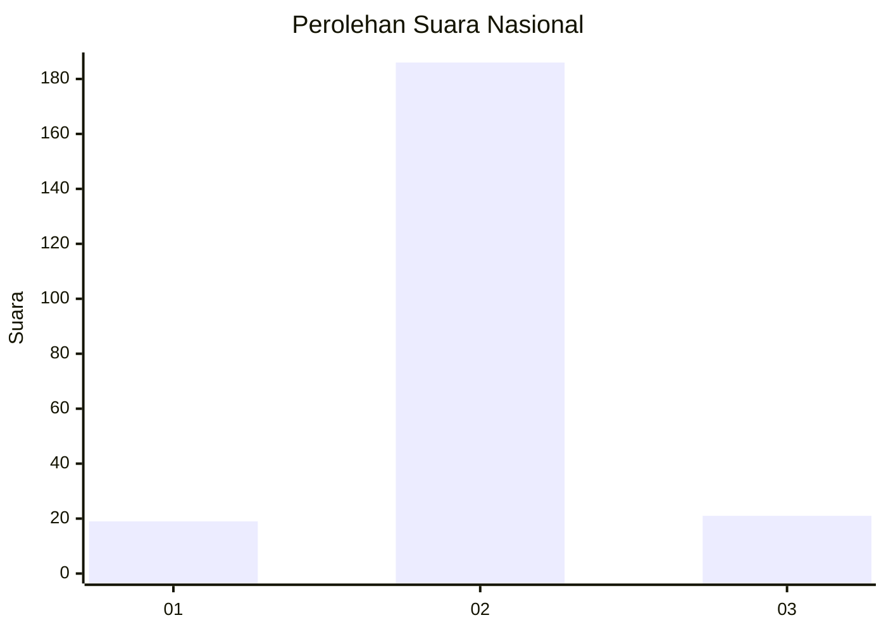
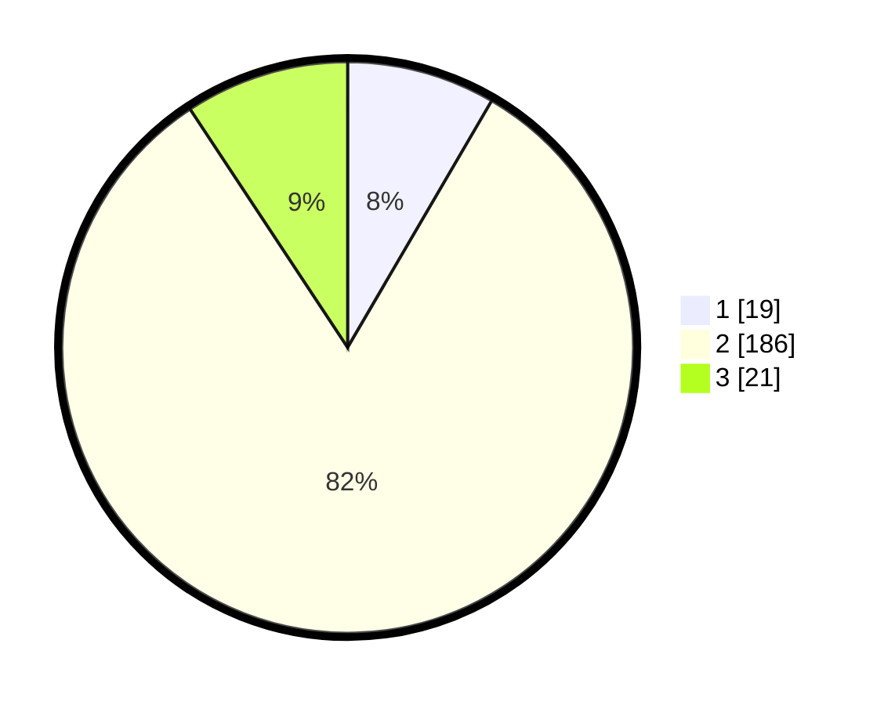

# Hasil

## Grafik

## Tabel

| No. | Nama Paslon    | Suara | Suara (raw) | Persentase |
|:--- |:-------------- | -----:| -----------:| ----------:|
| 1   | ANIES MUHAIMIN | 19    | [19][p-1]   | 8,41       |
| 2   | PRABOWO GIBRAN | 186   | [186][p-2]  | 82,30      |
| 3   | GANJAR MAHFUD  | 21    | [21][p-3]   | 9,29       |

[p-1]: https://github.com/gigit-pemilu/pemilu-2024/blob/main/pilpres/hitung-suara/sub/91-papua/sub/03-jayapura/sub/01-sentani/sub/1001-sentani-kota/sub/001-tps/sub/paslon-1.txt
[p-2]: https://github.com/gigit-pemilu/pemilu-2024/blob/main/pilpres/hitung-suara/sub/91-papua/sub/03-jayapura/sub/01-sentani/sub/1001-sentani-kota/sub/001-tps/sub/paslon-2.txt
[p-3]: https://github.com/gigit-pemilu/pemilu-2024/blob/main/pilpres/hitung-suara/sub/91-papua/sub/03-jayapura/sub/01-sentani/sub/1001-sentani-kota/sub/001-tps/sub/paslon-3.txt

## Foto C Plano

https://sirekap-obj-formc.kpu.go.id/e7ce/pemilu/ppwp/91/03/01/10/01/9103011001001-20240221-201316--57c81335-36f5-44a5-a78c-d91f653ee26b.jpg

https://sirekap-obj-formc.kpu.go.id/e7ce/pemilu/ppwp/91/03/01/10/01/9103011001001-20240221-201359--bf7ee7bc-df37-4704-bac1-61bc0cc906cb.jpg

https://sirekap-obj-formc.kpu.go.id/e7ce/pemilu/ppwp/91/03/01/10/01/9103011001001-20240221-201520--fabe5e0d-7297-4275-bae3-72069e359139.jpg

## Metadata

| Key        | Value               |
| ---------- | ------------------- |
| Time Stamp | 2024-02-21 22:00:00 |

## DATA PEMILIH TETAP

Jumlah pemilih dalam DPT: **285**.
 * L: **147**.
 * P: **138**.

## DATA PENGGUNA HAK PILIH

Jumlah pengguna hak pilih dalam DPT: **188**.
 * L: **99**.
 * P: **89**.

Jumlah pengguna hak pilih dalam DPTb: **39**.
 * L: **29**.
 * P: **10**.

Jumlah pengguna hak pilih dalam DPK: **0**.
 * L: **0**.
 * P: **0**.

Jumlah pengguna hak pilih: **227**.
 * L: **128**.
 * P: **99**.

## JUMLAH SUARA SAH DAN TIDAK SAH

JUMLAH SELURUH SUARA SAH: **226**.

JUMLAH SUARA TIDAK SAH: **2**.

JUMLAH SELURUH SUARA SAH DAN SUARA TIDAK SAH: **291**.

