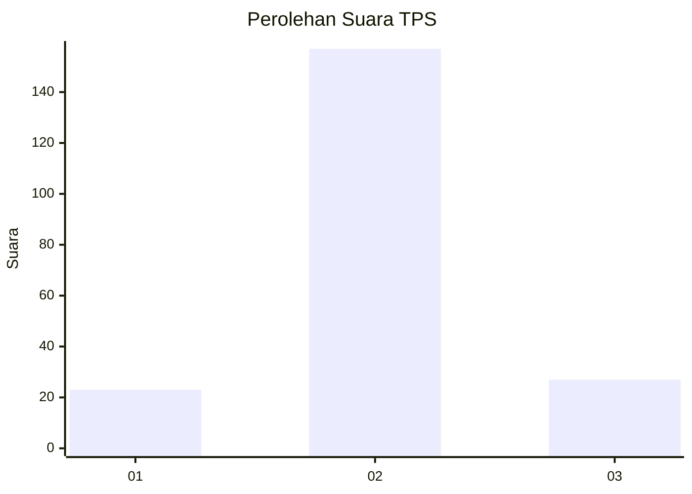
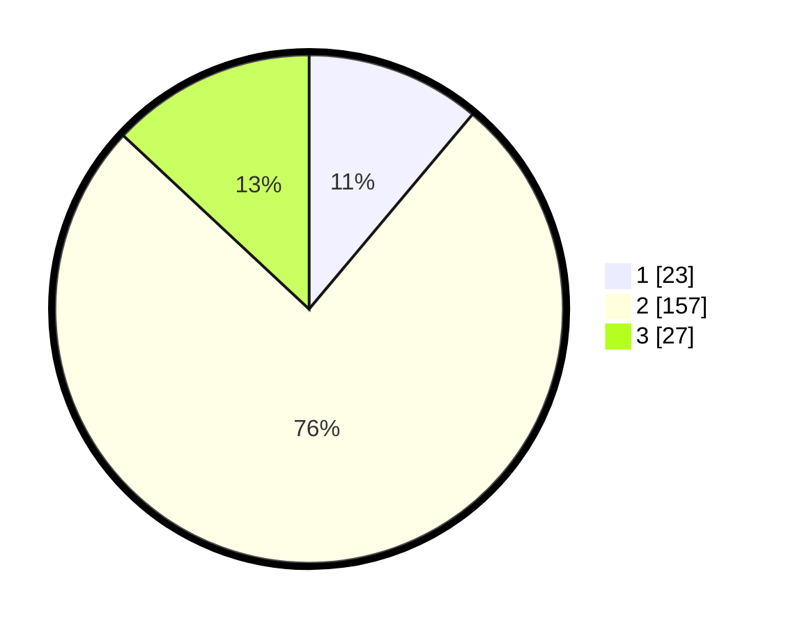

# Hasil

## Grafik

## Tabel

| No. | Nama Paslon    | Suara | Suara (raw) | Persentase |
|:--- |:-------------- | -----:| -----------:| ----------:|
| 1   | ANIES MUHAIMIN | 23    | [23][p-1]   | 11,11      |
| 2   | PRABOWO GIBRAN | 157   | [157][p-2]  | 75,85      |
| 3   | GANJAR MAHFUD  | 27    | [27][p-3]   | 13,04      |

[p-1]: https://github.com/gigit-pemilu/pemilu-2024-91-papua/blob/main/pilpres/hitung-suara/sub/91-papua/sub/03-jayapura/sub/01-sentani/sub/1001-sentani-kota/sub/002-tps/sub/paslon-1.txt
[p-2]: https://github.com/gigit-pemilu/pemilu-2024-91-papua/blob/main/pilpres/hitung-suara/sub/91-papua/sub/03-jayapura/sub/01-sentani/sub/1001-sentani-kota/sub/002-tps/sub/paslon-2.txt
[p-3]: https://github.com/gigit-pemilu/pemilu-2024-91-papua/blob/main/pilpres/hitung-suara/sub/91-papua/sub/03-jayapura/sub/01-sentani/sub/1001-sentani-kota/sub/002-tps/sub/paslon-3.txt

## Foto C Plano

https://sirekap-obj-formc.kpu.go.id/d96e/pemilu/ppwp/91/03/01/10/01/9103011001002-20240222-074344--912e14ce-7a34-49dd-bc18-b516f493f879.jpg

https://sirekap-obj-formc.kpu.go.id/d96e/pemilu/ppwp/91/03/01/10/01/9103011001002-20240222-074309--0317ff54-d066-46cf-be0e-330d60c67d1a.jpg

## Metadata

| Key        | Value               |
| ---------- | ------------------- |
| Time Stamp | 2024-02-22 08:00:00 |

