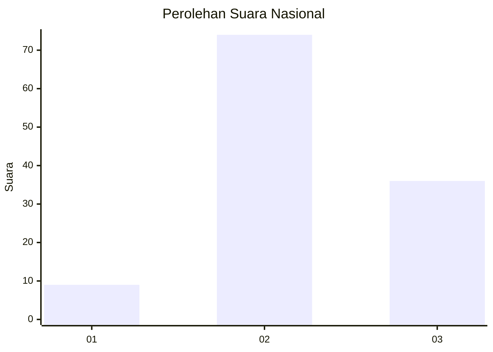
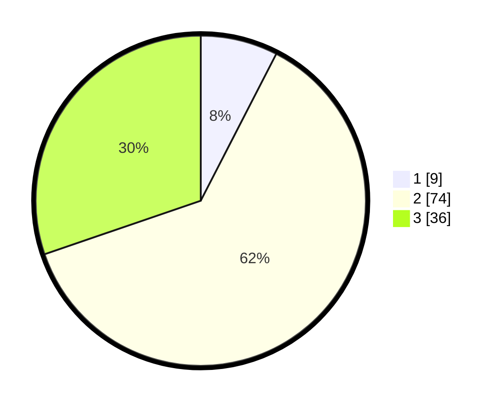

# Hasil

## Grafik

## Tabel

| No. | Nama Paslon    | Suara | Suara (raw) | Persentase |
|:--- |:-------------- | -----:| -----------:| ----------:|
| 1   | ANIES MUHAIMIN | 9     | [9][p-1]    | 7,56       |
| 2   | PRABOWO GIBRAN | 74    | [74][p-2]   | 62,18      |
| 3   | GANJAR MAHFUD  | 36    | [36][p-3]   | 30,25      |

[p-1]: https://github.com/gigit-pemilu/pemilu-2024/blob/main/pilpres/hitung-suara/sub/91-papua/sub/03-jayapura/sub/01-sentani/sub/1001-sentani-kota/sub/003-tps/sub/paslon-1.txt
[p-2]: https://github.com/gigit-pemilu/pemilu-2024/blob/main/pilpres/hitung-suara/sub/91-papua/sub/03-jayapura/sub/01-sentani/sub/1001-sentani-kota/sub/003-tps/sub/paslon-2.txt
[p-3]: https://github.com/gigit-pemilu/pemilu-2024/blob/main/pilpres/hitung-suara/sub/91-papua/sub/03-jayapura/sub/01-sentani/sub/1001-sentani-kota/sub/003-tps/sub/paslon-3.txt

## Foto C Plano

https://sirekap-obj-formc.kpu.go.id/e173/pemilu/ppwp/91/03/01/10/01/9103011001003-20240222-092908--699ea224-244d-4413-8d4d-e2885fa88b5f.jpg

https://sirekap-obj-formc.kpu.go.id/e173/pemilu/ppwp/91/03/01/10/01/9103011001003-20240222-092945--b6ccdfb8-805f-429b-bfdd-f4940acf30a5.jpg

https://sirekap-obj-formc.kpu.go.id/e173/pemilu/ppwp/91/03/01/10/01/9103011001003-20240222-093024--7ad0f34a-9c41-467b-ac33-197e333e4ba6.jpg

## Metadata

| Key        | Value               |
| ---------- | ------------------- |
| Time Stamp | 2024-02-22 10:00:00 |

## DATA PEMILIH TETAP

Jumlah pemilih dalam DPT: **281**.
 * L: **136**.
 * P: **195**.

## DATA PENGGUNA HAK PILIH

Jumlah pengguna hak pilih dalam DPT: **97**.
 * L: **43**.
 * P: **4**.

Jumlah pengguna hak pilih dalam DPTb: **2**.
 * L: **1**.
 * P: **41**.

Jumlah pengguna hak pilih dalam DPK: **23**.
 * L: **8**.
 * P: **15**.

Jumlah pengguna hak pilih: **122**.
 * L: **52**.
 * P: **70**.

## JUMLAH SUARA SAH DAN TIDAK SAH

JUMLAH SELURUH SUARA SAH: **179**.

JUMLAH SUARA TIDAK SAH: **1**.

JUMLAH SELURUH SUARA SAH DAN SUARA TIDAK SAH: **720**.

