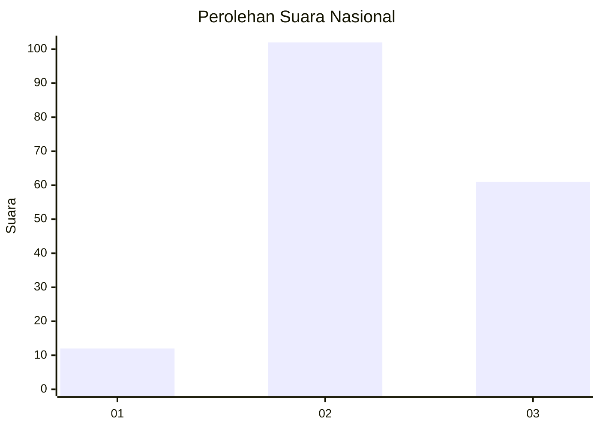
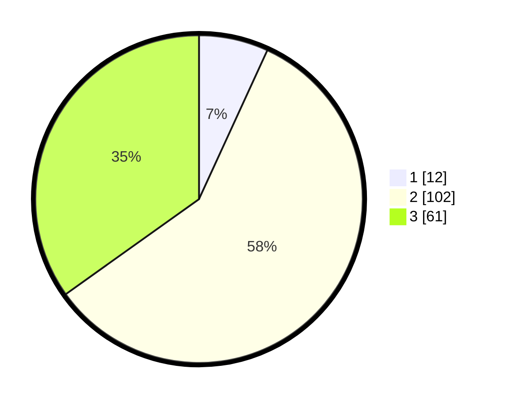

# Hasil

## Grafik

## Tabel

| No. | Nama Paslon    | Suara | Suara (raw) | Persentase |
|:--- |:-------------- | -----:| -----------:| ----------:|
| 1   | ANIES MUHAIMIN | 12    | [12][p-1]   | 6,86       |
| 2   | PRABOWO GIBRAN | 102   | [102][p-2]  | 58,29      |
| 3   | GANJAR MAHFUD  | 61    | [61][p-3]   | 34,86      |

[p-1]: https://github.com/gigit-pemilu/pemilu-2024/blob/main/pilpres/hitung-suara/sub/91-papua/sub/03-jayapura/sub/01-sentani/sub/1001-sentani-kota/sub/004-tps/sub/paslon-1.txt
[p-2]: https://github.com/gigit-pemilu/pemilu-2024/blob/main/pilpres/hitung-suara/sub/91-papua/sub/03-jayapura/sub/01-sentani/sub/1001-sentani-kota/sub/004-tps/sub/paslon-2.txt
[p-3]: https://github.com/gigit-pemilu/pemilu-2024/blob/main/pilpres/hitung-suara/sub/91-papua/sub/03-jayapura/sub/01-sentani/sub/1001-sentani-kota/sub/004-tps/sub/paslon-3.txt

## Foto C Plano

https://sirekap-obj-formc.kpu.go.id/c5df/pemilu/ppwp/91/03/01/10/01/9103011001004-20240222-125736--0488f8de-deb2-49fd-b5d8-d7e2bafe6ee3.jpg

https://sirekap-obj-formc.kpu.go.id/c5df/pemilu/ppwp/91/03/01/10/01/9103011001004-20240222-125818--00730a82-06fc-4514-af7f-9115328f5d58.jpg

https://sirekap-obj-formc.kpu.go.id/c5df/pemilu/ppwp/91/03/01/10/01/9103011001004-20240222-125902--c2015ab8-6f32-4c86-8631-6d4967fd0301.jpg

## Metadata

| Key        | Value               |
| ---------- | ------------------- |
| Time Stamp | 2024-02-22 13:00:00 |

## DATA PEMILIH TETAP

Jumlah pemilih dalam DPT: **282**.
 * L: **111**.
 * P: **172**.

## DATA PENGGUNA HAK PILIH

Jumlah pengguna hak pilih dalam DPT: **172**.
 * L: **70**.
 * P: **98**.

Jumlah pengguna hak pilih dalam DPTb: **5**.
 * L: **0**.
 * P: **1**.

Jumlah pengguna hak pilih dalam DPK: **53**.
 * L: **21**.
 * P: **32**.

Jumlah pengguna hak pilih: **209**.
 * L: **30**.
 * P: **130**.

## JUMLAH SUARA SAH DAN TIDAK SAH

JUMLAH SELURUH SUARA SAH: **175**.

JUMLAH SUARA TIDAK SAH: **21**.

JUMLAH SELURUH SUARA SAH DAN SUARA TIDAK SAH: **176**.

