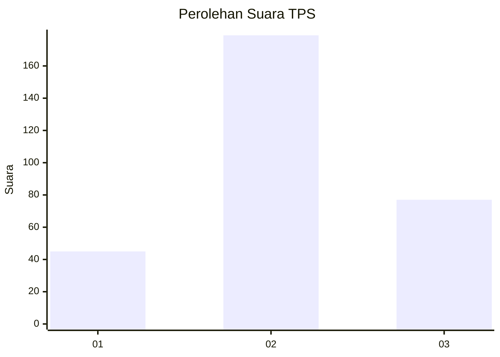
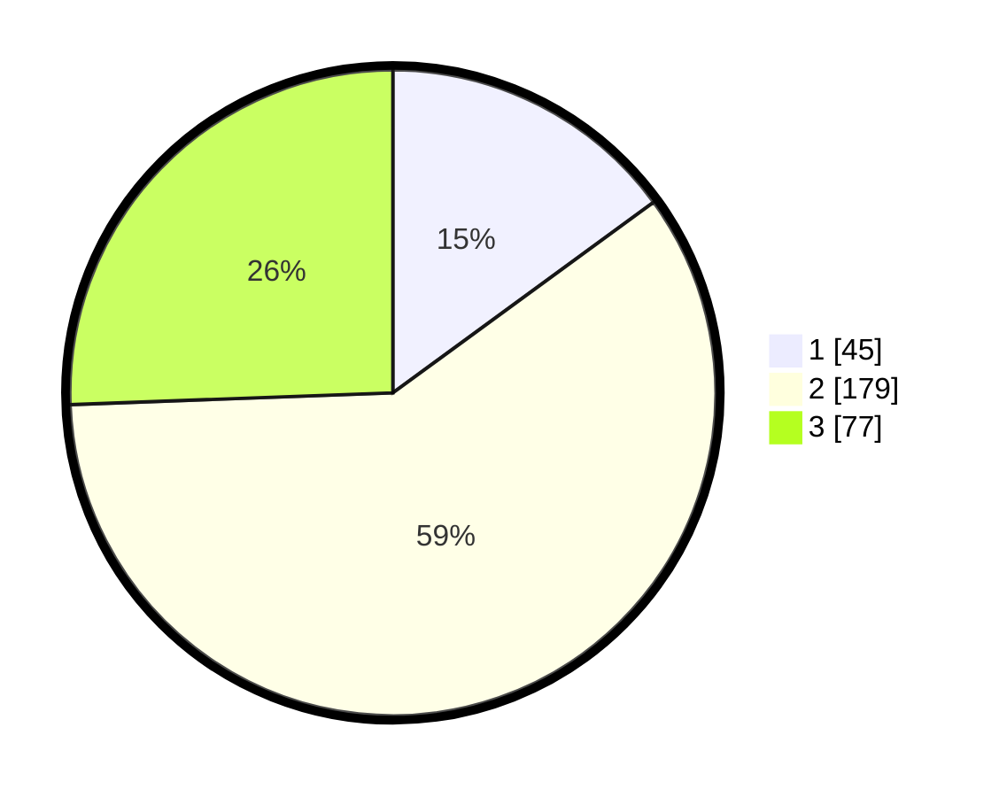

# Hasil

## Grafik

## Tabel

| No. | Nama Paslon    | Suara | Suara (raw) | Persentase |
|:--- |:-------------- | -----:| -----------:| ----------:|
| 1   | ANIES MUHAIMIN | 45    | [45][p-1]   | 14,95      |
| 2   | PRABOWO GIBRAN | 179   | [179][p-2]  | 59,47      |
| 3   | GANJAR MAHFUD  | 77    | [77][p-3]   | 25,58      |

[p-1]: https://github.com/gigit-pemilu/pemilu-2024-91-papua/blob/main/pilpres/hitung-suara/sub/91-papua/sub/03-jayapura/sub/01-sentani/sub/1001-sentani-kota/sub/005-tps/sub/paslon-1.txt
[p-2]: https://github.com/gigit-pemilu/pemilu-2024-91-papua/blob/main/pilpres/hitung-suara/sub/91-papua/sub/03-jayapura/sub/01-sentani/sub/1001-sentani-kota/sub/005-tps/sub/paslon-2.txt
[p-3]: https://github.com/gigit-pemilu/pemilu-2024-91-papua/blob/main/pilpres/hitung-suara/sub/91-papua/sub/03-jayapura/sub/01-sentani/sub/1001-sentani-kota/sub/005-tps/sub/paslon-3.txt

## Foto C Plano

https://sirekap-obj-formc.kpu.go.id/99be/pemilu/ppwp/91/03/01/10/01/9103011001005-20240222-124449--a887355d-bdfb-4781-8fe0-92bda8f08913.jpg

https://sirekap-obj-formc.kpu.go.id/99be/pemilu/ppwp/91/03/01/10/01/9103011001005-20240222-124412--57c2a7ee-b4d7-4abf-b139-f30fce4e934a.jpg

https://sirekap-obj-formc.kpu.go.id/99be/pemilu/ppwp/91/03/01/10/01/9103011001005-20240222-124327--ddece56a-9800-4ed3-8fd8-e5ac553af560.jpg

## Metadata

| Key        | Value               |
| ---------- | ------------------- |
| Time Stamp | 2024-02-22 14:00:00 |

## DATA PEMILIH TETAP

Jumlah pemilih dalam DPT: **283**.
 * L: **155**.
 * P: **128**.

## DATA PENGGUNA HAK PILIH

Jumlah pengguna hak pilih dalam DPT: **249**.
 * L: **122**.
 * P: **127**.

Jumlah pengguna hak pilih dalam DPTb: **0**.
 * L: **0**.
 * P: **0**.

Jumlah pengguna hak pilih dalam DPK: **0**.
 * L: **0**.
 * P: **0**.

Jumlah pengguna hak pilih: **249**.
 * L: **122**.
 * P: **127**.

## JUMLAH SUARA SAH DAN TIDAK SAH

JUMLAH SELURUH SUARA SAH: **246**.

JUMLAH SUARA TIDAK SAH: **3**.

JUMLAH SELURUH SUARA SAH DAN SUARA TIDAK SAH: **49**.

