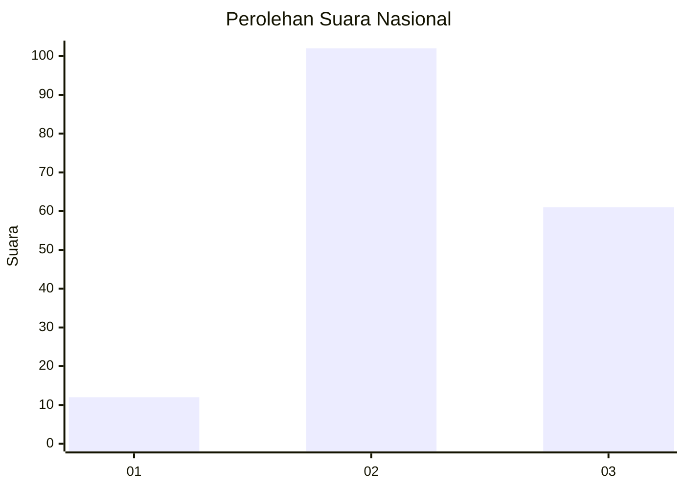
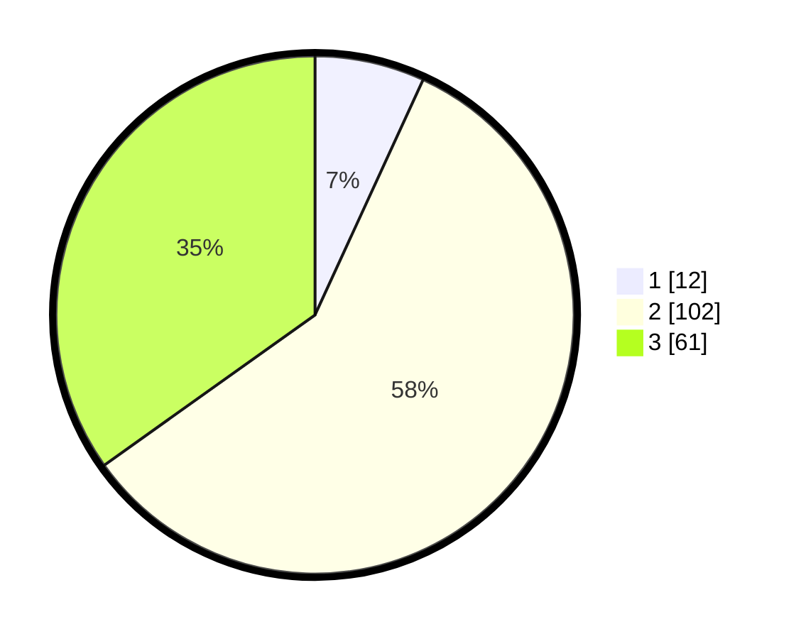

# Hasil

## Grafik

## Tabel

| No. | Nama Paslon    | Suara | Suara (raw) | Persentase |
|:--- |:-------------- | -----:| -----------:| ----------:|
| 1   | ANIES MUHAIMIN | 12    | [12][p-1]   | 6,86       |
| 2   | PRABOWO GIBRAN | 102   | [102][p-2]  | 58,29      |
| 3   | GANJAR MAHFUD  | 61    | [61][p-3]   | 34,86      |

[p-1]: https://github.com/gigit-pemilu/pemilu-2024/blob/main/pilpres/hitung-suara/sub/91-papua/sub/03-jayapura/sub/01-sentani/sub/1001-sentani-kota/sub/006-tps/sub/paslon-1.txt
[p-2]: https://github.com/gigit-pemilu/pemilu-2024/blob/main/pilpres/hitung-suara/sub/91-papua/sub/03-jayapura/sub/01-sentani/sub/1001-sentani-kota/sub/006-tps/sub/paslon-2.txt
[p-3]: https://github.com/gigit-pemilu/pemilu-2024/blob/main/pilpres/hitung-suara/sub/91-papua/sub/03-jayapura/sub/01-sentani/sub/1001-sentani-kota/sub/006-tps/sub/paslon-3.txt

## Foto C Plano

https://sirekap-obj-formc.kpu.go.id/91a3/pemilu/ppwp/91/03/01/10/01/9103011001006-20240222-145559--21e1aa4a-7dc8-4e43-b521-c561b6bf623e.jpg

https://sirekap-obj-formc.kpu.go.id/91a3/pemilu/ppwp/91/03/01/10/01/9103011001006-20240222-145634--474fb4f3-b950-41e5-8dcd-97b6f2c028bb.jpg

https://sirekap-obj-formc.kpu.go.id/91a3/pemilu/ppwp/91/03/01/10/01/9103011001006-20240222-145709--2183d277-e76a-4e31-bb52-aad86f48d522.jpg

## Metadata

| Key        | Value               |
| ---------- | ------------------- |
| Time Stamp | 2024-02-22 17:00:00 |

## DATA PEMILIH TETAP

Jumlah pemilih dalam DPT: **282**.
 * L: **112**.
 * P: **172**.

## DATA PENGGUNA HAK PILIH

Jumlah pengguna hak pilih dalam DPT: **178**.
 * L: **77**.
 * P: **998**.

Jumlah pengguna hak pilih dalam DPTb: **5**.
 * L: **1**.
 * P: **0**.

Jumlah pengguna hak pilih dalam DPK: **53**.
 * L: **21**.
 * P: **32**.

Jumlah pengguna hak pilih: **209**.
 * L: **30**.
 * P: **130**.

## JUMLAH SUARA SAH DAN TIDAK SAH

JUMLAH SELURUH SUARA SAH: **775**.

JUMLAH SUARA TIDAK SAH: **1**.

JUMLAH SELURUH SUARA SAH DAN SUARA TIDAK SAH: **176**.

