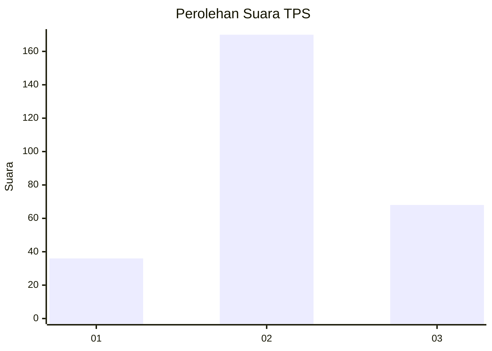
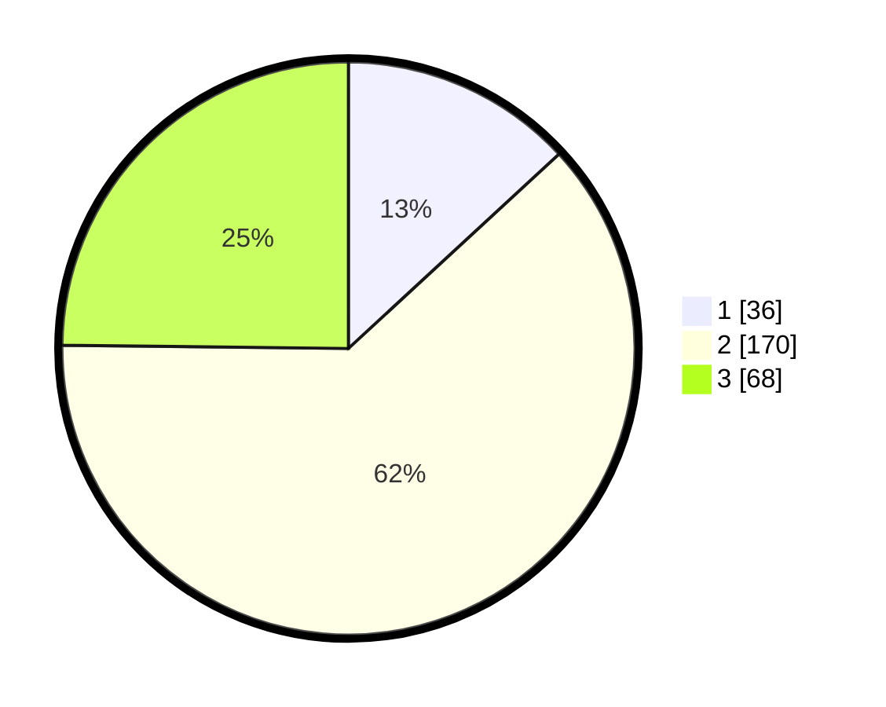

# Hasil

## Grafik

## Tabel

| No. | Nama Paslon    | Suara | Suara (raw) | Persentase |
|:--- |:-------------- | -----:| -----------:| ----------:|
| 1   | ANIES MUHAIMIN | 36    | [36][p-1]   | 13,14      |
| 2   | PRABOWO GIBRAN | 170   | [170][p-2]  | 62,04      |
| 3   | GANJAR MAHFUD  | 68    | [68][p-3]   | 24,82      |

[p-1]: https://github.com/gigit-pemilu/pemilu-2024-91-papua/blob/main/pilpres/hitung-suara/sub/91-papua/sub/03-jayapura/sub/01-sentani/sub/1001-sentani-kota/sub/008-tps/sub/paslon-1.txt
[p-2]: https://github.com/gigit-pemilu/pemilu-2024-91-papua/blob/main/pilpres/hitung-suara/sub/91-papua/sub/03-jayapura/sub/01-sentani/sub/1001-sentani-kota/sub/008-tps/sub/paslon-2.txt
[p-3]: https://github.com/gigit-pemilu/pemilu-2024-91-papua/blob/main/pilpres/hitung-suara/sub/91-papua/sub/03-jayapura/sub/01-sentani/sub/1001-sentani-kota/sub/008-tps/sub/paslon-3.txt

## Foto C Plano

https://sirekap-obj-formc.kpu.go.id/9aa8/pemilu/ppwp/91/03/01/10/01/9103011001008-20240222-150127--29c4337d-f2ae-4cb6-84fc-07255a7df6c6.jpg

https://sirekap-obj-formc.kpu.go.id/9aa8/pemilu/ppwp/91/03/01/10/01/9103011001008-20240222-150311--8d763117-c265-4bfd-8791-856481511683.jpg

https://sirekap-obj-formc.kpu.go.id/9aa8/pemilu/ppwp/91/03/01/10/01/9103011001008-20240222-150231--a2620a6a-c13b-4f53-b67f-e8b35776e725.jpg

## Metadata

| Key        | Value               |
| ---------- | ------------------- |
| Time Stamp | 2024-02-22 16:00:00 |

## DATA PEMILIH TETAP

Jumlah pemilih dalam DPT: **188**.
 * L: **89**.
 * P: **99**.

## DATA PENGGUNA HAK PILIH

Jumlah pengguna hak pilih dalam DPT: **737**.
 * L: **59**.
 * P: **72**.

Jumlah pengguna hak pilih dalam DPTb: **36**.
 * L: **17**.
 * P: **19**.

Jumlah pengguna hak pilih dalam DPK: **0**.
 * L: **0**.
 * P: **0**.

Jumlah pengguna hak pilih: **167**.
 * L: **76**.
 * P: **91**.

## JUMLAH SUARA SAH DAN TIDAK SAH

JUMLAH SELURUH SUARA SAH: **274**.

JUMLAH SUARA TIDAK SAH: **16**.

JUMLAH SELURUH SUARA SAH DAN SUARA TIDAK SAH: **290**.

