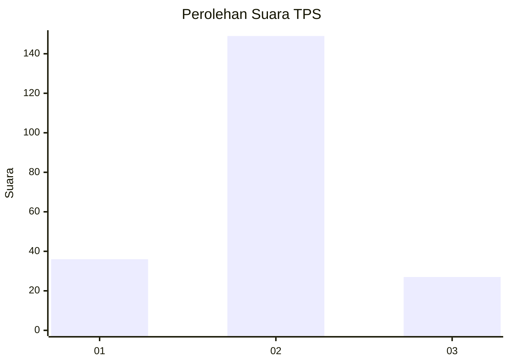
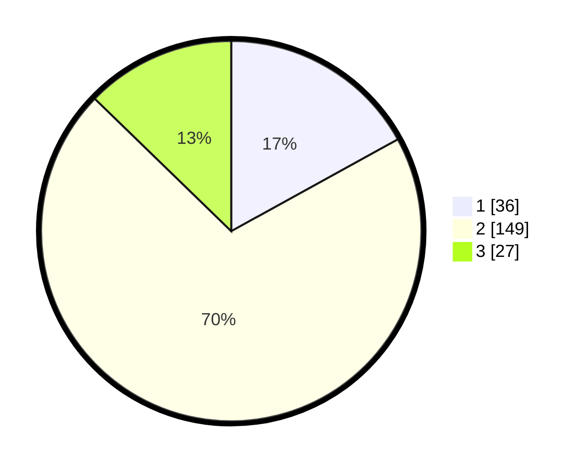

# Hasil

## Grafik

## Tabel

| No. | Nama Paslon    | Suara | Suara (raw) | Persentase |
|:--- |:-------------- | -----:| -----------:| ----------:|
| 1   | ANIES MUHAIMIN | 36    | [36][p-1]   | 16,98      |
| 2   | PRABOWO GIBRAN | 149   | [149][p-2]  | 70,28      |
| 3   | GANJAR MAHFUD  | 27    | [27][p-3]   | 12,74      |

[p-1]: https://github.com/gigit-pemilu/pemilu-2024-91-papua/blob/main/pilpres/hitung-suara/sub/91-papua/sub/03-jayapura/sub/01-sentani/sub/1001-sentani-kota/sub/009-tps/sub/paslon-1.txt
[p-2]: https://github.com/gigit-pemilu/pemilu-2024-91-papua/blob/main/pilpres/hitung-suara/sub/91-papua/sub/03-jayapura/sub/01-sentani/sub/1001-sentani-kota/sub/009-tps/sub/paslon-2.txt
[p-3]: https://github.com/gigit-pemilu/pemilu-2024-91-papua/blob/main/pilpres/hitung-suara/sub/91-papua/sub/03-jayapura/sub/01-sentani/sub/1001-sentani-kota/sub/009-tps/sub/paslon-3.txt

## Foto C Plano

https://sirekap-obj-formc.kpu.go.id/60d6/pemilu/ppwp/91/03/01/10/01/9103011001009-20240222-153303--ef5ba135-5252-4d72-8166-52a560bb2389.jpg

https://sirekap-obj-formc.kpu.go.id/60d6/pemilu/ppwp/91/03/01/10/01/9103011001009-20240222-153502--ab3ae80b-b8d1-4fb3-9b33-caebcdb80011.jpg

https://sirekap-obj-formc.kpu.go.id/60d6/pemilu/ppwp/91/03/01/10/01/9103011001009-20240222-153557--1bc8bd03-098d-4b64-b07e-5fafa4508c02.jpg

## Metadata

| Key        | Value               |
| ---------- | ------------------- |
| Time Stamp | 2024-02-22 16:00:00 |

## DATA PEMILIH TETAP

Jumlah pemilih dalam DPT: **285**.
 * L: **269**.
 * P: **116**.

## DATA PENGGUNA HAK PILIH

Jumlah pengguna hak pilih dalam DPT: **285**.
 * L: **169**.
 * P: **976**.

Jumlah pengguna hak pilih dalam DPTb: **0**.
 * L: **80**.
 * P: **800**.

Jumlah pengguna hak pilih dalam DPK: **33**.
 * L: **0**.
 * P: **0**.

Jumlah pengguna hak pilih: **603**.
 * L: **80**.
 * P: **0**.

## JUMLAH SUARA SAH DAN TIDAK SAH

JUMLAH SELURUH SUARA SAH: **242**.

JUMLAH SUARA TIDAK SAH: **16**.

JUMLAH SELURUH SUARA SAH DAN SUARA TIDAK SAH: **258**.

