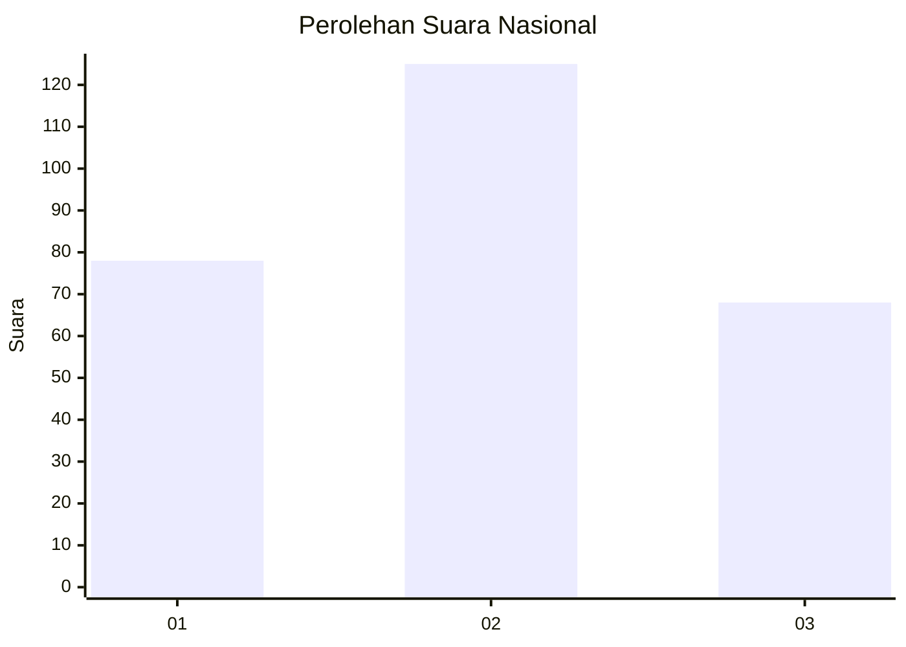
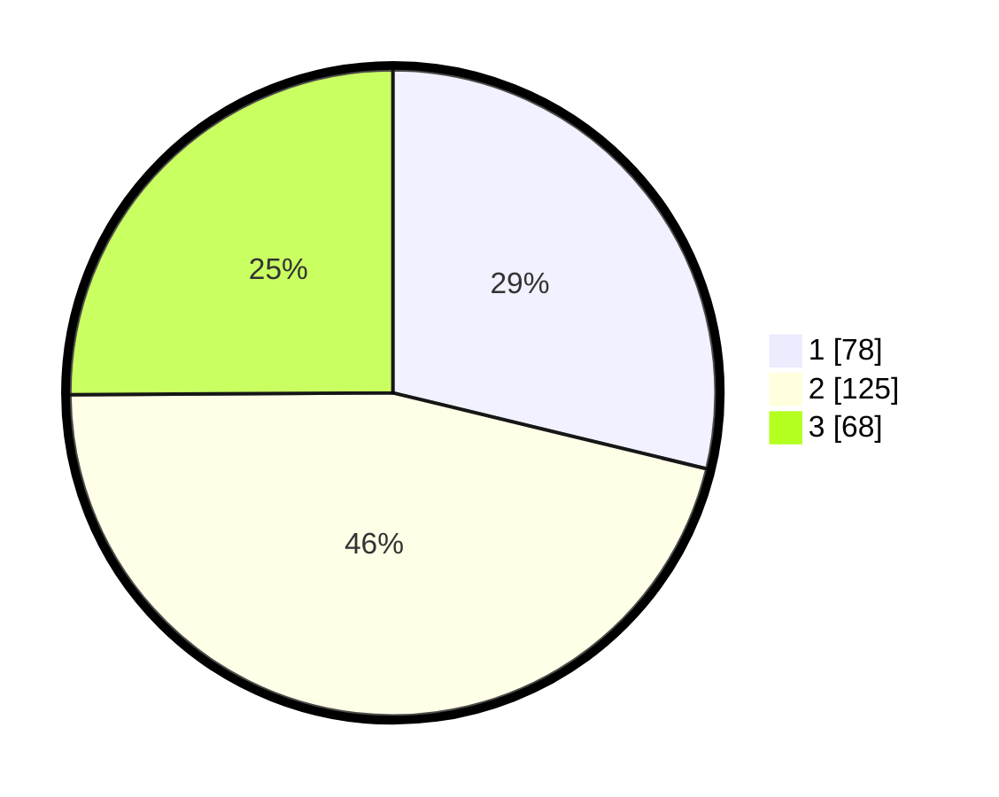

# Hasil

## Grafik

## Tabel

| No. | Nama Paslon    | Suara | Suara (raw) | Persentase |
|:--- |:-------------- | -----:| -----------:| ----------:|
| 1   | ANIES MUHAIMIN | 78    | [78][p-1]   | 28,78      |
| 2   | PRABOWO GIBRAN | 125   | [125][p-2]  | 46,13      |
| 3   | GANJAR MAHFUD  | 68    | [68][p-3]   | 25,09      |

[p-1]: https://github.com/gigit-pemilu/pemilu-2024/blob/main/pilpres/hitung-suara/sub/91-papua/sub/03-jayapura/sub/01-sentani/sub/1001-sentani-kota/sub/013-tps/sub/paslon-1.txt
[p-2]: https://github.com/gigit-pemilu/pemilu-2024/blob/main/pilpres/hitung-suara/sub/91-papua/sub/03-jayapura/sub/01-sentani/sub/1001-sentani-kota/sub/013-tps/sub/paslon-2.txt
[p-3]: https://github.com/gigit-pemilu/pemilu-2024/blob/main/pilpres/hitung-suara/sub/91-papua/sub/03-jayapura/sub/01-sentani/sub/1001-sentani-kota/sub/013-tps/sub/paslon-3.txt

## Foto C Plano

https://sirekap-obj-formc.kpu.go.id/a988/pemilu/ppwp/91/03/01/10/01/9103011001013-20240223-161644--539b091d-5bff-450c-8dd4-fd82fa880f8a.jpg

https://sirekap-obj-formc.kpu.go.id/a988/pemilu/ppwp/91/03/01/10/01/9103011001013-20240223-161758--c46b1c84-db7b-4955-9d55-943ac3ab6421.jpg

https://sirekap-obj-formc.kpu.go.id/a988/pemilu/ppwp/91/03/01/10/01/9103011001013-20240223-161831--37b20c0b-6dd0-4e69-bc63-eb24fe7c5952.jpg

## Metadata

| Key        | Value               |
| ---------- | ------------------- |
| Time Stamp | 2024-02-24 22:31:28 |

## DATA PEMILIH TETAP

Jumlah pemilih dalam DPT: **571**.
 * L: **426**.
 * P: **145**.

## DATA PENGGUNA HAK PILIH

Jumlah pengguna hak pilih dalam DPT: **209**.
 * L: **92**.
 * P: **117**.

Jumlah pengguna hak pilih dalam DPTb: **767**.
 * L: **419**.
 * P: **32**.

Jumlah pengguna hak pilih dalam DPK: **0**.
 * L: **700**.
 * P: **0**.

Jumlah pengguna hak pilih: **267**.
 * L: **0**.
 * P: **10**.

## JUMLAH SUARA SAH DAN TIDAK SAH

JUMLAH SELURUH SUARA SAH: **271**.

JUMLAH SUARA TIDAK SAH: **8**.

JUMLAH SELURUH SUARA SAH DAN SUARA TIDAK SAH: **279**.

