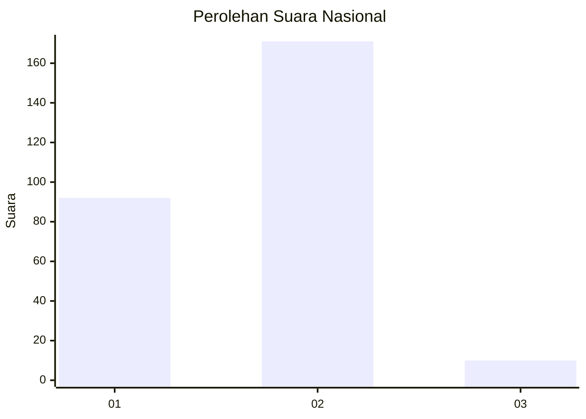
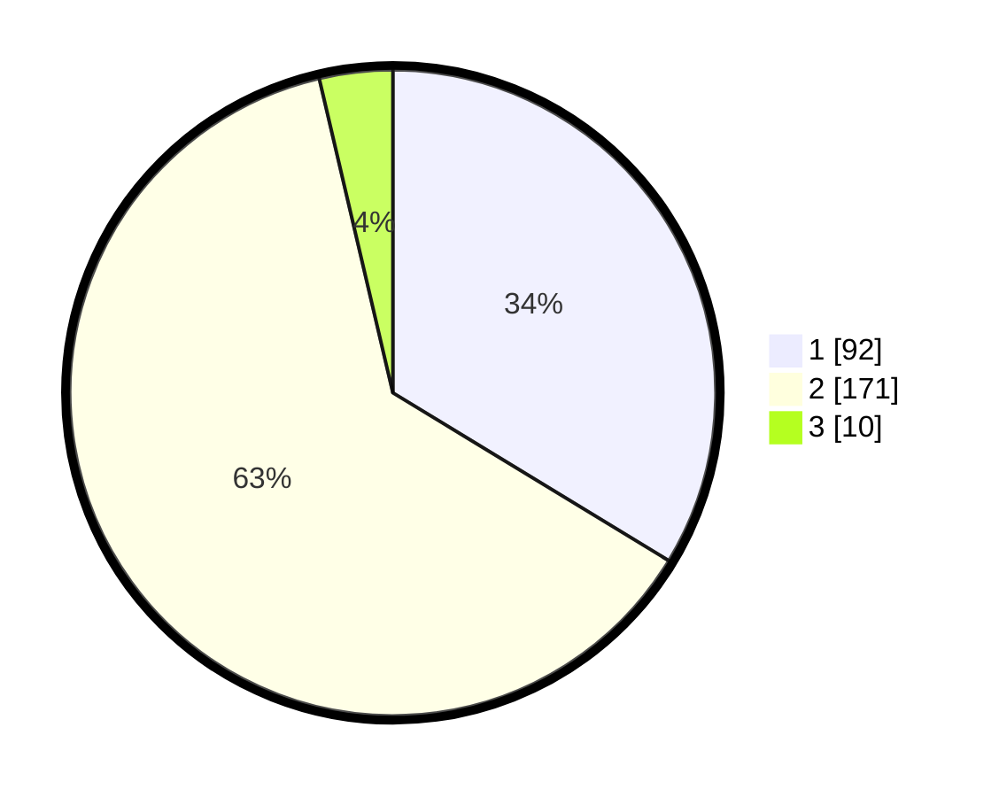

# Hasil

## Grafik

## Tabel

| No. | Nama Paslon    | Suara | Suara (raw) | Persentase |
|:--- |:-------------- | -----:| -----------:| ----------:|
| 1   | ANIES MUHAIMIN | 92    | [92][p-1]   | 33,70      |
| 2   | PRABOWO GIBRAN | 171   | [171][p-2]  | 62,64      |
| 3   | GANJAR MAHFUD  | 10    | [10][p-3]   | 3,66       |

[p-1]: https://github.com/gigit-pemilu/pemilu-2024/blob/main/pilpres/hitung-suara/sub/91-papua/sub/03-jayapura/sub/01-sentani/sub/1001-sentani-kota/sub/016-tps/sub/paslon-1.txt
[p-2]: https://github.com/gigit-pemilu/pemilu-2024/blob/main/pilpres/hitung-suara/sub/91-papua/sub/03-jayapura/sub/01-sentani/sub/1001-sentani-kota/sub/016-tps/sub/paslon-2.txt
[p-3]: https://github.com/gigit-pemilu/pemilu-2024/blob/main/pilpres/hitung-suara/sub/91-papua/sub/03-jayapura/sub/01-sentani/sub/1001-sentani-kota/sub/016-tps/sub/paslon-3.txt

## Foto C Plano

https://sirekap-obj-formc.kpu.go.id/f01a/pemilu/ppwp/91/03/01/10/01/9103011001016-20240215-043432--3f79898b-7bd9-4089-a843-f14358a3e1e9.jpg

https://sirekap-obj-formc.kpu.go.id/f01a/pemilu/ppwp/91/03/01/10/01/9103011001016-20240215-043318--e321ee9b-2d5f-497b-bfe1-6dd0836373d3.jpg

https://sirekap-obj-formc.kpu.go.id/f01a/pemilu/ppwp/91/03/01/10/01/9103011001016-20240215-043031--9c1da9b5-f0e5-460d-8d38-4acf51e49c46.jpg

## Metadata

| Key        | Value               |
| ---------- | ------------------- |
| Time Stamp | 2024-02-15 19:00:26 |

## DATA PEMILIH TETAP

Jumlah pemilih dalam DPT: **281**.
 * L: **144**.
 * P: **137**.

## DATA PENGGUNA HAK PILIH

Jumlah pengguna hak pilih dalam DPT: **281**.
 * L: **136**.
 * P: **145**.

Jumlah pengguna hak pilih dalam DPTb: **24**.
 * L: **12**.
 * P: **12**.

Jumlah pengguna hak pilih dalam DPK: **0**.
 * L: **0**.
 * P: **0**.

Jumlah pengguna hak pilih: **305**.
 * L: **148**.
 * P: **157**.

## JUMLAH SUARA SAH DAN TIDAK SAH

JUMLAH SELURUH SUARA SAH: **274**.

JUMLAH SUARA TIDAK SAH: **1**.

JUMLAH SELURUH SUARA SAH DAN SUARA TIDAK SAH: **275**.

