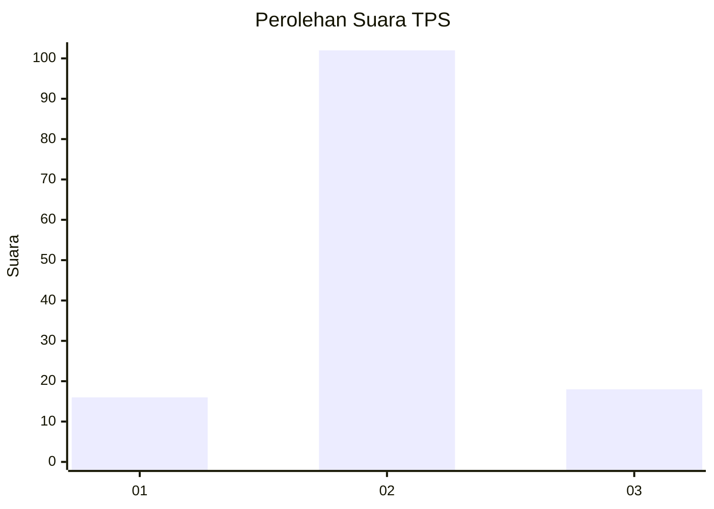
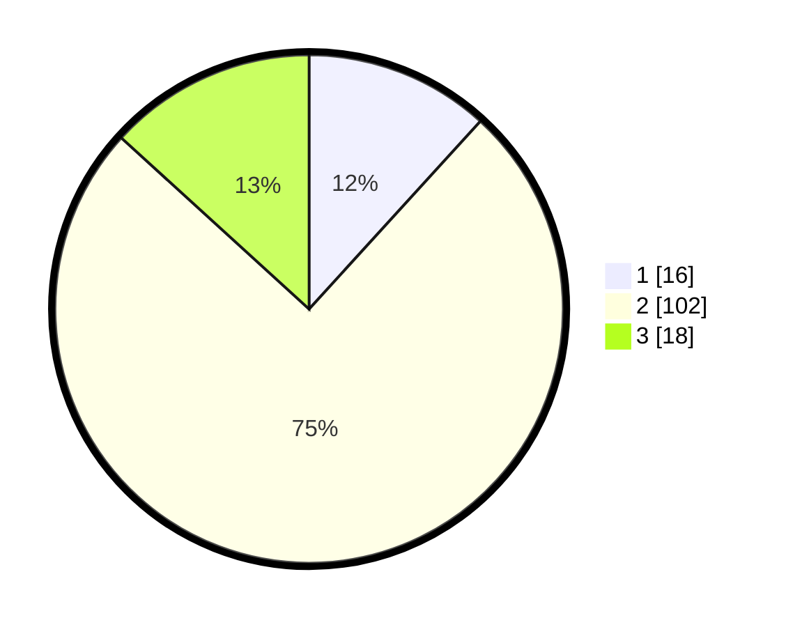

# Hasil

## Grafik

## Tabel

| No. | Nama Paslon    | Suara | Suara (raw) | Persentase |
|:--- |:-------------- | -----:| -----------:| ----------:|
| 1   | ANIES MUHAIMIN | 16    | [16][p-1]   | 11,76      |
| 2   | PRABOWO GIBRAN | 102   | [102][p-2]  | 75,00      |
| 3   | GANJAR MAHFUD  | 18    | [18][p-3]   | 13,24      |

[p-1]: https://github.com/gigit-pemilu/pemilu-2024-91-papua/blob/main/pilpres/hitung-suara/sub/91-papua/sub/03-jayapura/sub/01-sentani/sub/1001-sentani-kota/sub/024-tps/sub/paslon-1.txt
[p-2]: https://github.com/gigit-pemilu/pemilu-2024-91-papua/blob/main/pilpres/hitung-suara/sub/91-papua/sub/03-jayapura/sub/01-sentani/sub/1001-sentani-kota/sub/024-tps/sub/paslon-2.txt
[p-3]: https://github.com/gigit-pemilu/pemilu-2024-91-papua/blob/main/pilpres/hitung-suara/sub/91-papua/sub/03-jayapura/sub/01-sentani/sub/1001-sentani-kota/sub/024-tps/sub/paslon-3.txt

## Foto C Plano

https://sirekap-obj-formc.kpu.go.id/4c32/pemilu/ppwp/91/03/01/10/01/9103011001024-20240215-055528--876becc3-6c9a-4309-a10b-8af7822c98b6.jpg

https://sirekap-obj-formc.kpu.go.id/4c32/pemilu/ppwp/91/03/01/10/01/9103011001024-20240215-055629--e6e7baae-ffeb-4a8e-aae1-31908f1829a7.jpg

https://sirekap-obj-formc.kpu.go.id/4c32/pemilu/ppwp/91/03/01/10/01/9103011001024-20240215-055742--b49cea74-0c49-4676-8a2c-5a80b60eaf29.jpg

## Metadata

| Key        | Value               |
| ---------- | ------------------- |
| Time Stamp | 2024-02-24 22:31:28 |

