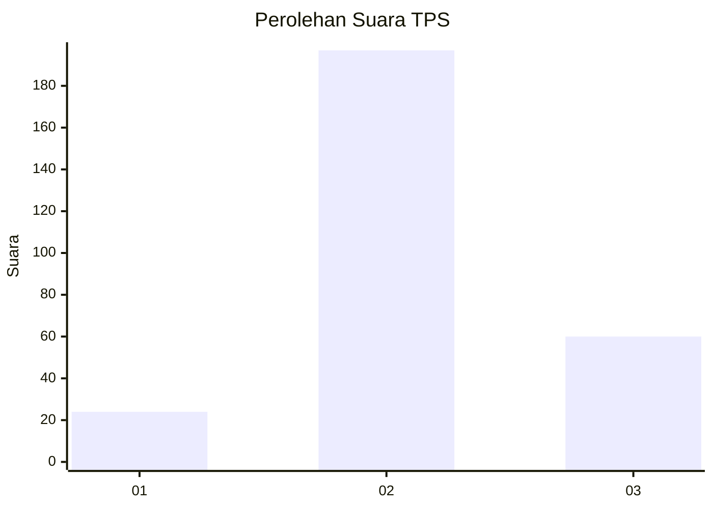
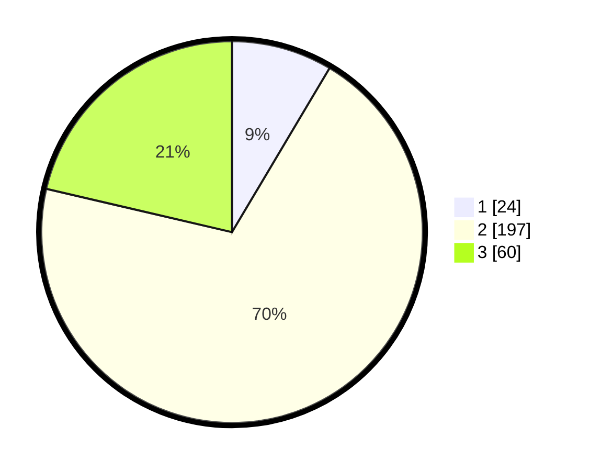

# Hasil

## Grafik

## Tabel

| No. | Nama Paslon    | Suara | Suara (raw) | Persentase |
|:--- |:-------------- | -----:| -----------:| ----------:|
| 1   | ANIES MUHAIMIN | 24    | [24][p-1]   | 8,54       |
| 2   | PRABOWO GIBRAN | 197   | [197][p-2]  | 70,11      |
| 3   | GANJAR MAHFUD  | 60    | [60][p-3]   | 21,35      |

[p-1]: https://github.com/gigit-pemilu/pemilu-2024-91-papua/blob/main/pilpres/hitung-suara/sub/91-papua/sub/03-jayapura/sub/01-sentani/sub/1001-sentani-kota/sub/050-tps/sub/paslon-1.txt
[p-2]: https://github.com/gigit-pemilu/pemilu-2024-91-papua/blob/main/pilpres/hitung-suara/sub/91-papua/sub/03-jayapura/sub/01-sentani/sub/1001-sentani-kota/sub/050-tps/sub/paslon-2.txt
[p-3]: https://github.com/gigit-pemilu/pemilu-2024-91-papua/blob/main/pilpres/hitung-suara/sub/91-papua/sub/03-jayapura/sub/01-sentani/sub/1001-sentani-kota/sub/050-tps/sub/paslon-3.txt

## Foto C Plano

https://sirekap-obj-formc.kpu.go.id/c316/pemilu/ppwp/91/03/01/10/01/9103011001050-20240215-151442--c7d3772a-5be7-4355-94b1-4cae886be77f.jpg

https://sirekap-obj-formc.kpu.go.id/c316/pemilu/ppwp/91/03/01/10/01/9103011001050-20240215-151302--45c652af-9c43-4f9e-bd0f-3f5a83342bd0.jpg

https://sirekap-obj-formc.kpu.go.id/c316/pemilu/ppwp/91/03/01/10/01/9103011001050-20240215-073841--6dd4f407-c587-460b-8e46-016a858c9a50.jpg

## Metadata

| Key        | Value               |
| ---------- | ------------------- |
| Time Stamp | 2024-02-25 13:00:00 |

