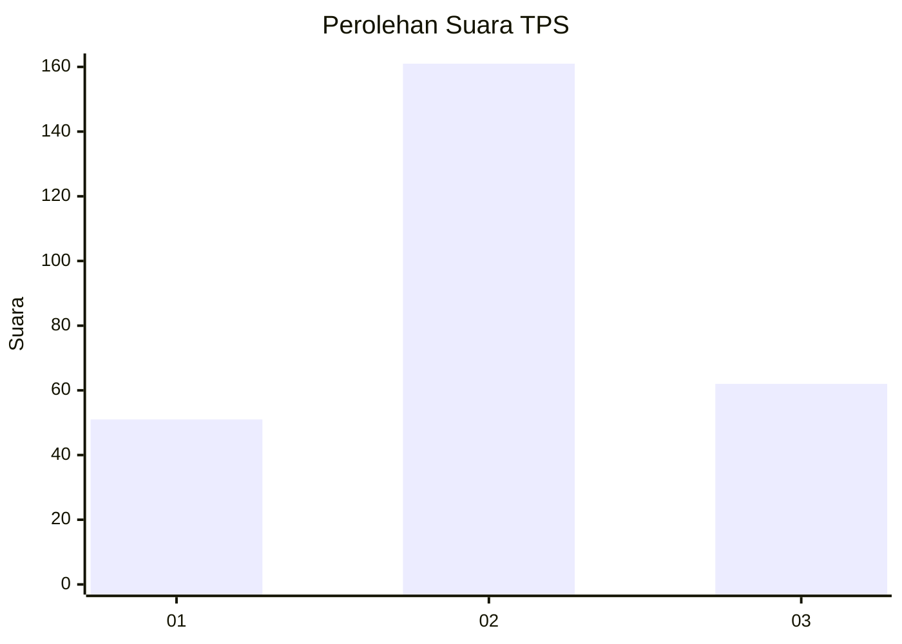
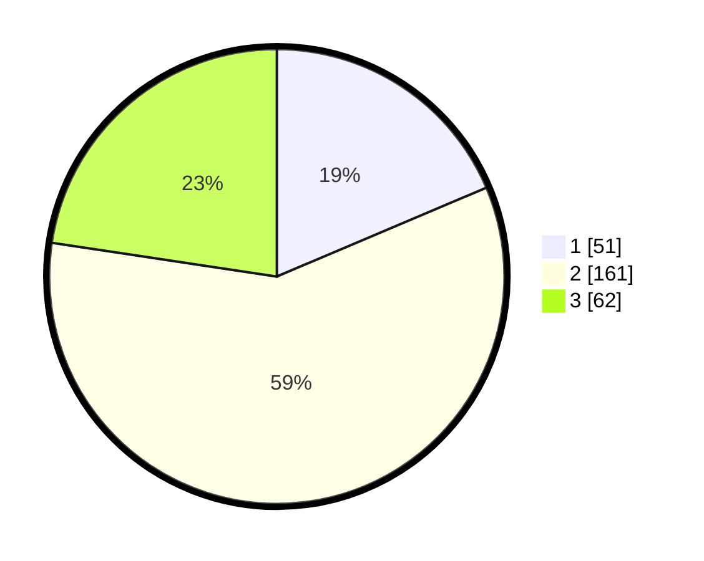

# Hasil

## Grafik

## Tabel

| No. | Nama Paslon    | Suara | Suara (raw) | Persentase |
|:--- |:-------------- | -----:| -----------:| ----------:|
| 1   | ANIES MUHAIMIN | 51    | [51][p-1]   | 18,61      |
| 2   | PRABOWO GIBRAN | 161   | [161][p-2]  | 58,76      |
| 3   | GANJAR MAHFUD  | 62    | [62][p-3]   | 22,63      |

[p-1]: https://github.com/gigit-pemilu/pemilu-2024-91-papua/blob/main/pilpres/hitung-suara/sub/91-papua/sub/03-jayapura/sub/01-sentani/sub/1001-sentani-kota/sub/055-tps/sub/paslon-1.txt
[p-2]: https://github.com/gigit-pemilu/pemilu-2024-91-papua/blob/main/pilpres/hitung-suara/sub/91-papua/sub/03-jayapura/sub/01-sentani/sub/1001-sentani-kota/sub/055-tps/sub/paslon-2.txt
[p-3]: https://github.com/gigit-pemilu/pemilu-2024-91-papua/blob/main/pilpres/hitung-suara/sub/91-papua/sub/03-jayapura/sub/01-sentani/sub/1001-sentani-kota/sub/055-tps/sub/paslon-3.txt

## Foto C Plano

https://sirekap-obj-formc.kpu.go.id/7f83/pemilu/ppwp/91/03/01/10/01/9103011001055-20240215-102419--ca980ea5-b0e6-4137-b05e-85ae791bb569.jpg

https://sirekap-obj-formc.kpu.go.id/7f83/pemilu/ppwp/91/03/01/10/01/9103011001055-20240215-102144--11551794-64d9-4322-be34-1eb99428b162.jpg

https://sirekap-obj-formc.kpu.go.id/7f83/pemilu/ppwp/91/03/01/10/01/9103011001055-20240215-102256--049d3f1b-f8e4-494a-a805-f3da62d6bee3.jpg

## Metadata

| Key        | Value               |
| ---------- | ------------------- |
| Time Stamp | 2024-02-24 22:31:28 |

