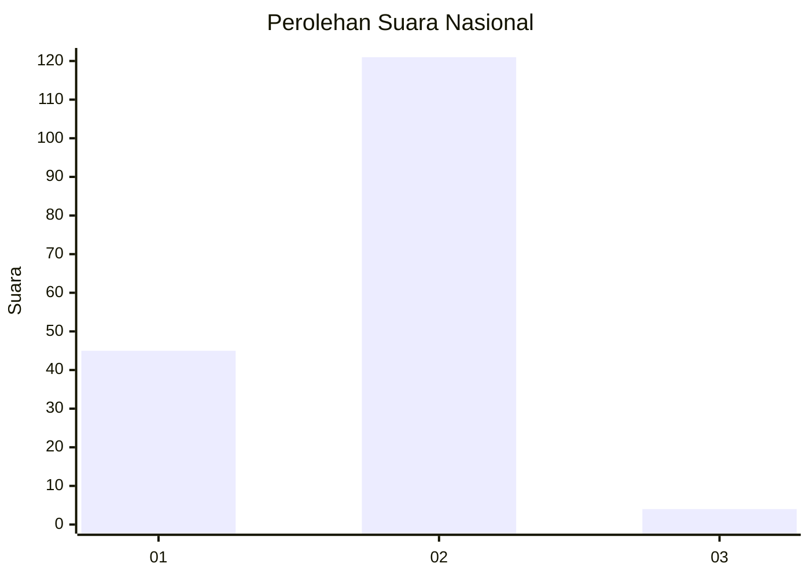
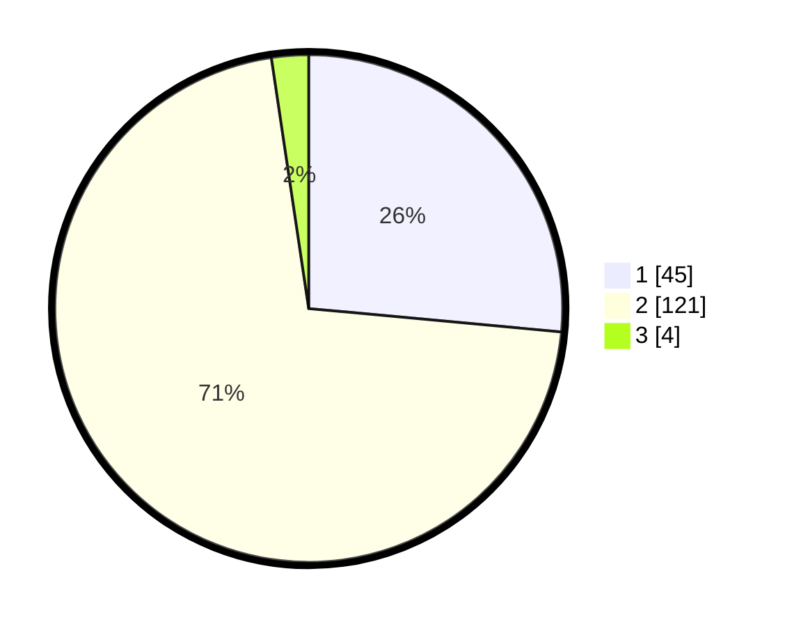

# Hasil

## Grafik

## Tabel

| No. | Nama Paslon    | Suara | Suara (raw) | Persentase |
|:--- |:-------------- | -----:| -----------:| ----------:|
| 1   | ANIES MUHAIMIN | 45    | [45][p-1]   | 26,47      |
| 2   | PRABOWO GIBRAN | 121   | [121][p-2]  | 71,18      |
| 3   | GANJAR MAHFUD  | 4     | [4][p-3]    | 2,35       |

[p-1]: https://github.com/gigit-pemilu/pemilu-2024/blob/main/pilpres/hitung-suara/sub/91-papua/sub/03-jayapura/sub/01-sentani/sub/1002-dobonsolo/sub/003-tps/sub/paslon-1.txt
[p-2]: https://github.com/gigit-pemilu/pemilu-2024/blob/main/pilpres/hitung-suara/sub/91-papua/sub/03-jayapura/sub/01-sentani/sub/1002-dobonsolo/sub/003-tps/sub/paslon-2.txt
[p-3]: https://github.com/gigit-pemilu/pemilu-2024/blob/main/pilpres/hitung-suara/sub/91-papua/sub/03-jayapura/sub/01-sentani/sub/1002-dobonsolo/sub/003-tps/sub/paslon-3.txt

## Foto C Plano

https://sirekap-obj-formc.kpu.go.id/56b5/pemilu/ppwp/91/03/01/10/02/9103011002003-20240215-035501--e42caadb-1944-4015-8298-8865e68b5eb0.jpg

https://sirekap-obj-formc.kpu.go.id/56b5/pemilu/ppwp/91/03/01/10/02/9103011002003-20240215-040132--f55bd09e-080f-41b3-a4ad-19db407dcac7.jpg

https://sirekap-obj-formc.kpu.go.id/56b5/pemilu/ppwp/91/03/01/10/02/9103011002003-20240215-035944--f945eeb0-5d0f-4dba-a9ac-7bd43ecf405c.jpg

## Metadata

| Key        | Value               |
| ---------- | ------------------- |
| Time Stamp | 2024-02-24 22:31:28 |

