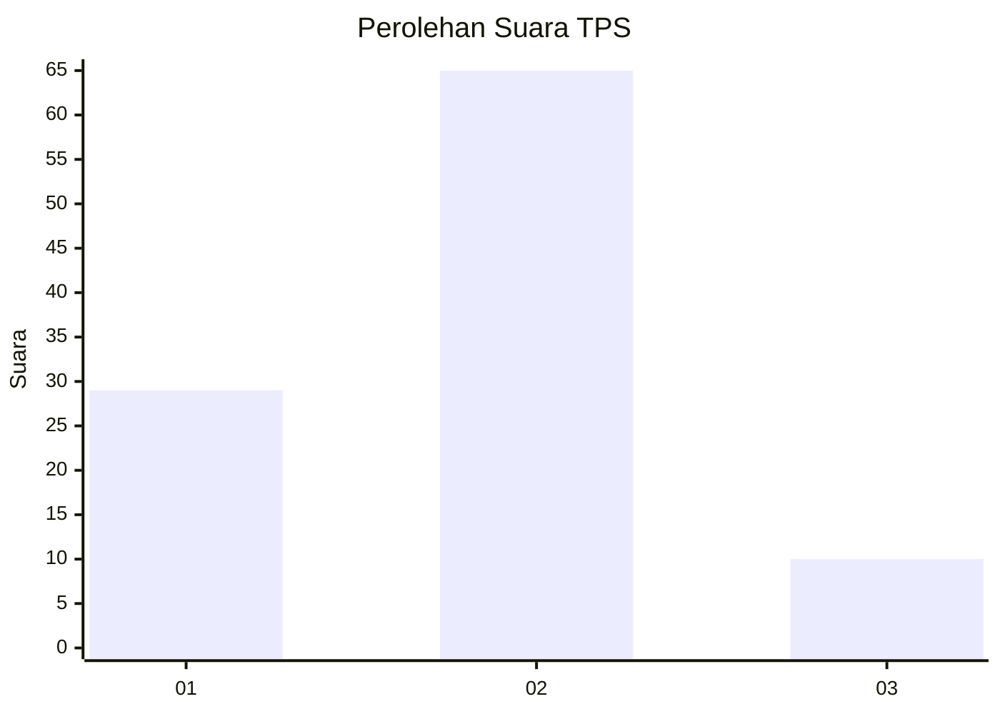
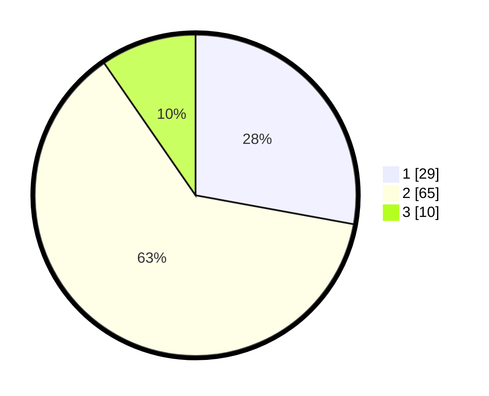

# Hasil

## Grafik

## Tabel

| No. | Nama Paslon    | Suara | Suara (raw) | Persentase |
|:--- |:-------------- | -----:| -----------:| ----------:|
| 1   | ANIES MUHAIMIN | 29    | [29][p-1]   | 27,88      |
| 2   | PRABOWO GIBRAN | 65    | [65][p-2]   | 62,50      |
| 3   | GANJAR MAHFUD  | 10    | [10][p-3]   | 9,62       |

[p-1]: https://github.com/gigit-pemilu/pemilu-2024-91-papua/blob/main/pilpres/hitung-suara/sub/91-papua/sub/03-jayapura/sub/01-sentani/sub/1002-dobonsolo/sub/011-tps/sub/paslon-1.txt
[p-2]: https://github.com/gigit-pemilu/pemilu-2024-91-papua/blob/main/pilpres/hitung-suara/sub/91-papua/sub/03-jayapura/sub/01-sentani/sub/1002-dobonsolo/sub/011-tps/sub/paslon-2.txt
[p-3]: https://github.com/gigit-pemilu/pemilu-2024-91-papua/blob/main/pilpres/hitung-suara/sub/91-papua/sub/03-jayapura/sub/01-sentani/sub/1002-dobonsolo/sub/011-tps/sub/paslon-3.txt

## Foto C Plano

https://sirekap-obj-formc.kpu.go.id/9e30/pemilu/ppwp/91/03/01/10/02/9103011002011-20240215-035826--be36189a-bb04-4a49-99a2-4bd2c4b93fb0.jpg

https://sirekap-obj-formc.kpu.go.id/9e30/pemilu/ppwp/91/03/01/10/02/9103011002011-20240217-153746--be9a61cc-7f57-442f-8ccc-dc1b4320ac20.jpg

https://sirekap-obj-formc.kpu.go.id/9e30/pemilu/ppwp/91/03/01/10/02/9103011002011-20240215-035057--430721a3-cc97-46b9-ac5e-a1c3cddfe845.jpg

## Metadata

| Key        | Value               |
| ---------- | ------------------- |
| Time Stamp | 2024-02-28 11:00:00 |

