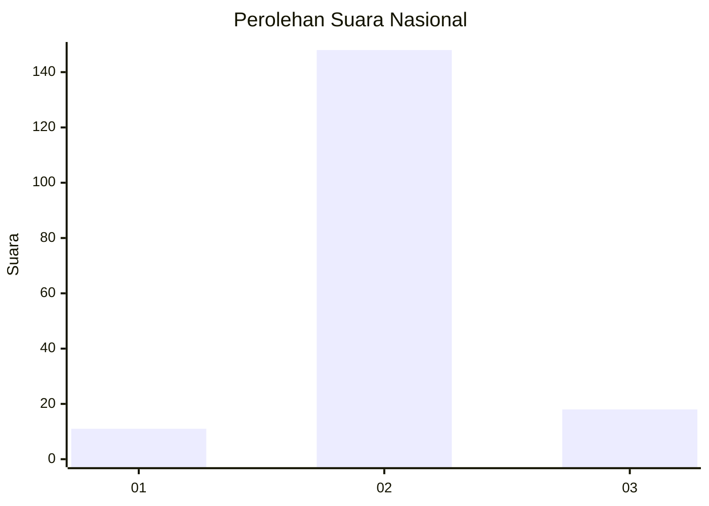
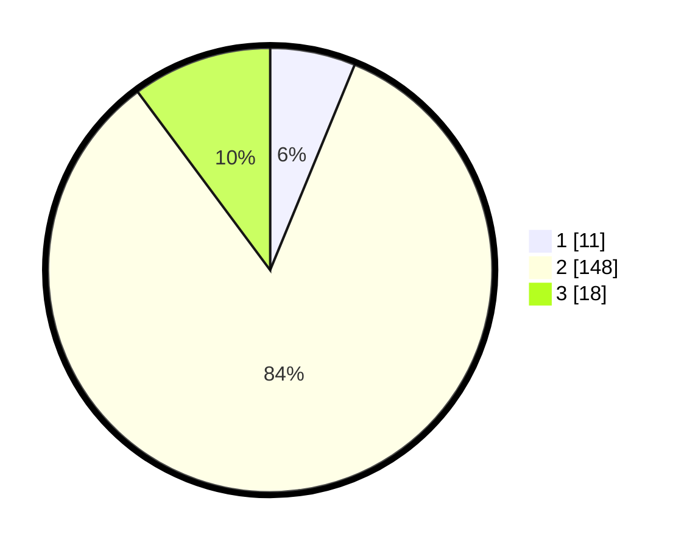

# Hasil

## Grafik

## Tabel

| No. | Nama Paslon    | Suara | Suara (raw) | Persentase |
|:--- |:-------------- | -----:| -----------:| ----------:|
| 1   | ANIES MUHAIMIN | 11    | [11][p-1]   | 6,21       |
| 2   | PRABOWO GIBRAN | 148   | [148][p-2]  | 83,62      |
| 3   | GANJAR MAHFUD  | 18    | [18][p-3]   | 10,17      |

[p-1]: https://github.com/gigit-pemilu/pemilu-2024/blob/main/pilpres/hitung-suara/sub/91-papua/sub/03-jayapura/sub/01-sentani/sub/1002-dobonsolo/sub/026-tps/sub/paslon-1.txt
[p-2]: https://github.com/gigit-pemilu/pemilu-2024/blob/main/pilpres/hitung-suara/sub/91-papua/sub/03-jayapura/sub/01-sentani/sub/1002-dobonsolo/sub/026-tps/sub/paslon-2.txt
[p-3]: https://github.com/gigit-pemilu/pemilu-2024/blob/main/pilpres/hitung-suara/sub/91-papua/sub/03-jayapura/sub/01-sentani/sub/1002-dobonsolo/sub/026-tps/sub/paslon-3.txt

## Foto C Plano

https://sirekap-obj-formc.kpu.go.id/65d6/pemilu/ppwp/91/03/01/10/02/9103011002026-20240215-040828--7ff55f07-e60d-454c-baf0-8aa1aaa7eeef.jpg

https://sirekap-obj-formc.kpu.go.id/65d6/pemilu/ppwp/91/03/01/10/02/9103011002026-20240215-041008--f1f9d28b-0c90-48ee-b406-8560240fb7ee.jpg

https://sirekap-obj-formc.kpu.go.id/65d6/pemilu/ppwp/91/03/01/10/02/9103011002026-20240215-041109--7cc1b29c-6122-4014-8809-17aaf6eb82c3.jpg

## Metadata

| Key        | Value               |
| ---------- | ------------------- |
| Time Stamp | 2024-02-25 12:00:00 |

