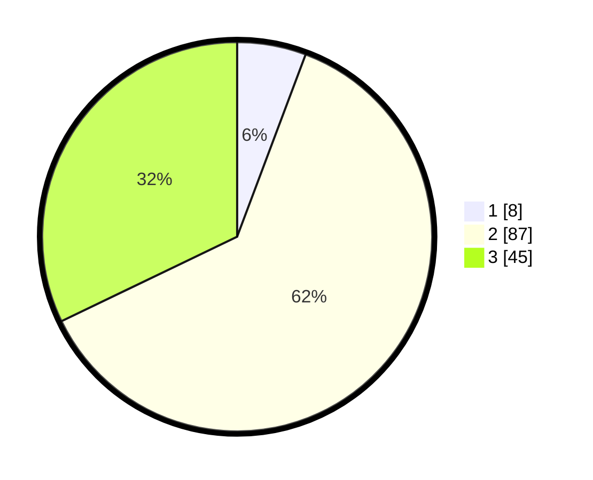

# Hasil

## Grafik

## Tabel

| No. | Nama Paslon    | Suara | Suara (raw) | Persentase |
|:--- |:-------------- | -----:| -----------:| ----------:|
| 1   | ANIES MUHAIMIN | 8     | [8][p-1]    | 5,71       |
| 2   | PRABOWO GIBRAN | 87    | [87][p-2]   | 62,14      |
| 3   | GANJAR MAHFUD  | 45    | [45][p-3]   | 32,14      |

[p-1]: https://github.com/gigit-pemilu/pemilu-2024-91-papua/blob/main/pilpres/hitung-suara/sub/91-papua/sub/03-jayapura/sub/01-sentani/sub/1003-hinekombe/sub/002-tps/sub/paslon-1.txt
[p-2]: https://github.com/gigit-pemilu/pemilu-2024-91-papua/blob/main/pilpres/hitung-suara/sub/91-papua/sub/03-jayapura/sub/01-sentani/sub/1003-hinekombe/sub/002-tps/sub/paslon-2.txt
[p-3]: https://github.com/gigit-pemilu/pemilu-2024-91-papua/blob/main/pilpres/hitung-suara/sub/91-papua/sub/03-jayapura/sub/01-sentani/sub/1003-hinekombe/sub/002-tps/sub/paslon-3.txt

## Foto C Plano

https://sirekap-obj-formc.kpu.go.id/99c2/pemilu/ppwp/91/03/01/10/03/9103011003002-20240214-221208--33c6b998-1395-43ff-95c8-b665e2fad194.jpg

https://sirekap-obj-formc.kpu.go.id/99c2/pemilu/ppwp/91/03/01/10/03/9103011003002-20240214-221505--b010d5bd-ca37-461e-8781-8a076e3ba17b.jpg

https://sirekap-obj-formc.kpu.go.id/99c2/pemilu/ppwp/91/03/01/10/03/9103011003002-20240214-221824--100f05ae-b63b-447a-a250-a8436c4593c7.jpg

## Metadata

| Key        | Value               |
| ---------- | ------------------- |
| Time Stamp | 2024-02-25 13:00:00 |

