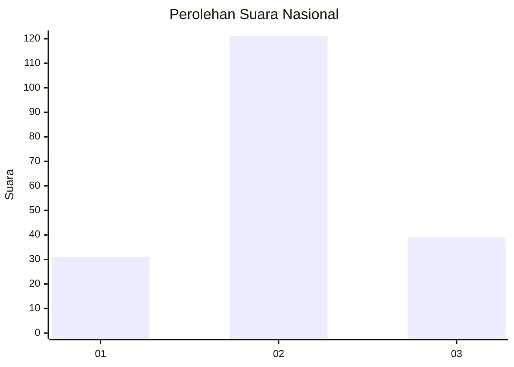
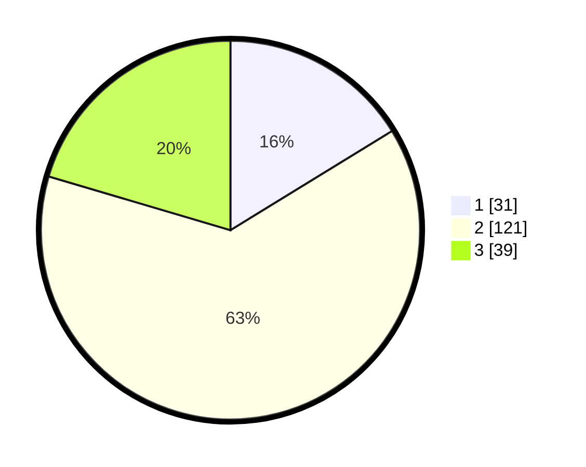

# Hasil

## Grafik

## Tabel

| No. | Nama Paslon    | Suara | Suara (raw) | Persentase |
|:--- |:-------------- | -----:| -----------:| ----------:|
| 1   | ANIES MUHAIMIN | 31    | [31][p-1]   | 16,23      |
| 2   | PRABOWO GIBRAN | 121   | [121][p-2]  | 63,35      |
| 3   | GANJAR MAHFUD  | 39    | [39][p-3]   | 20,42      |

[p-1]: https://github.com/gigit-pemilu/pemilu-2024/blob/main/pilpres/hitung-suara/sub/91-papua/sub/03-jayapura/sub/01-sentani/sub/1003-hinekombe/sub/006-tps/sub/paslon-1.txt
[p-2]: https://github.com/gigit-pemilu/pemilu-2024/blob/main/pilpres/hitung-suara/sub/91-papua/sub/03-jayapura/sub/01-sentani/sub/1003-hinekombe/sub/006-tps/sub/paslon-2.txt
[p-3]: https://github.com/gigit-pemilu/pemilu-2024/blob/main/pilpres/hitung-suara/sub/91-papua/sub/03-jayapura/sub/01-sentani/sub/1003-hinekombe/sub/006-tps/sub/paslon-3.txt

## Foto C Plano

https://sirekap-obj-formc.kpu.go.id/aa5b/pemilu/ppwp/91/03/01/10/03/9103011003006-20240215-000001--6a34eb7d-e57b-4336-ac39-d4e3955bbc3e.jpg

https://sirekap-obj-formc.kpu.go.id/aa5b/pemilu/ppwp/91/03/01/10/03/9103011003006-20240215-000142--4724d111-246c-41c1-8e23-a97ae0011247.jpg

https://sirekap-obj-formc.kpu.go.id/aa5b/pemilu/ppwp/91/03/01/10/03/9103011003006-20240215-000247--750a57df-b4b6-415a-9260-99cdb9ce544e.jpg

## Metadata

| Key        | Value               |
| ---------- | ------------------- |
| Time Stamp | 2024-02-25 13:00:00 |

