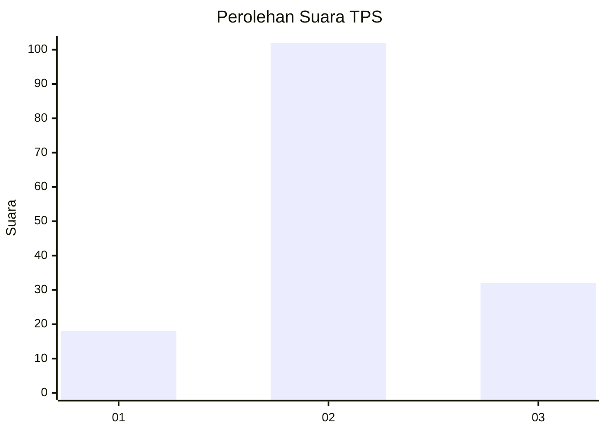
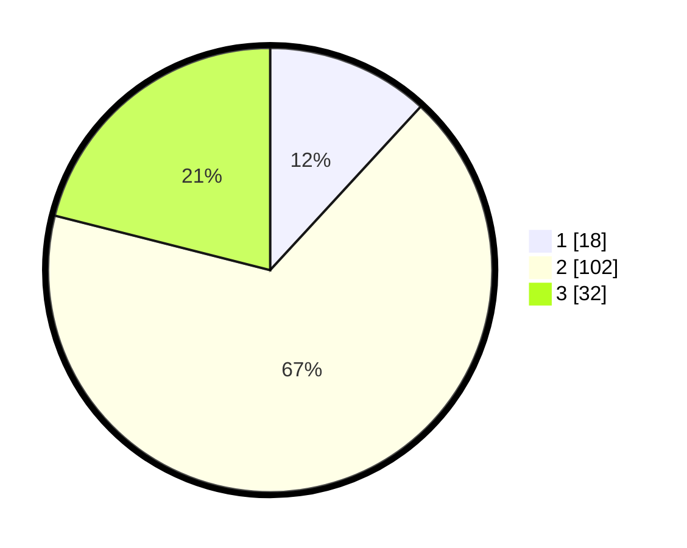

# Hasil

## Grafik

## Tabel

| No. | Nama Paslon    | Suara | Suara (raw) | Persentase |
|:--- |:-------------- | -----:| -----------:| ----------:|
| 1   | ANIES MUHAIMIN | 18    | [18][p-1]   | 11,84      |
| 2   | PRABOWO GIBRAN | 102   | [102][p-2]  | 67,11      |
| 3   | GANJAR MAHFUD  | 32    | [32][p-3]   | 21,05      |

[p-1]: https://github.com/gigit-pemilu/pemilu-2024-91-papua/blob/main/pilpres/hitung-suara/sub/91-papua/sub/03-jayapura/sub/01-sentani/sub/1003-hinekombe/sub/014-tps/sub/paslon-1.txt
[p-2]: https://github.com/gigit-pemilu/pemilu-2024-91-papua/blob/main/pilpres/hitung-suara/sub/91-papua/sub/03-jayapura/sub/01-sentani/sub/1003-hinekombe/sub/014-tps/sub/paslon-2.txt
[p-3]: https://github.com/gigit-pemilu/pemilu-2024-91-papua/blob/main/pilpres/hitung-suara/sub/91-papua/sub/03-jayapura/sub/01-sentani/sub/1003-hinekombe/sub/014-tps/sub/paslon-3.txt

## Foto C Plano

https://sirekap-obj-formc.kpu.go.id/69cb/pemilu/ppwp/91/03/01/10/03/9103011003014-20240215-105935--a43bb989-ce67-4848-990c-7ed1c8b24830.jpg

https://sirekap-obj-formc.kpu.go.id/69cb/pemilu/ppwp/91/03/01/10/03/9103011003014-20240215-105950--d95a5792-1594-47eb-aa0e-dfa7b9deb84f.jpg

https://sirekap-obj-formc.kpu.go.id/69cb/pemilu/ppwp/91/03/01/10/03/9103011003014-20240215-105959--76decfc8-7775-42ad-94ca-c71fa473396b.jpg

## Metadata

| Key        | Value               |
| ---------- | ------------------- |
| Time Stamp | 2024-02-25 12:00:00 |

