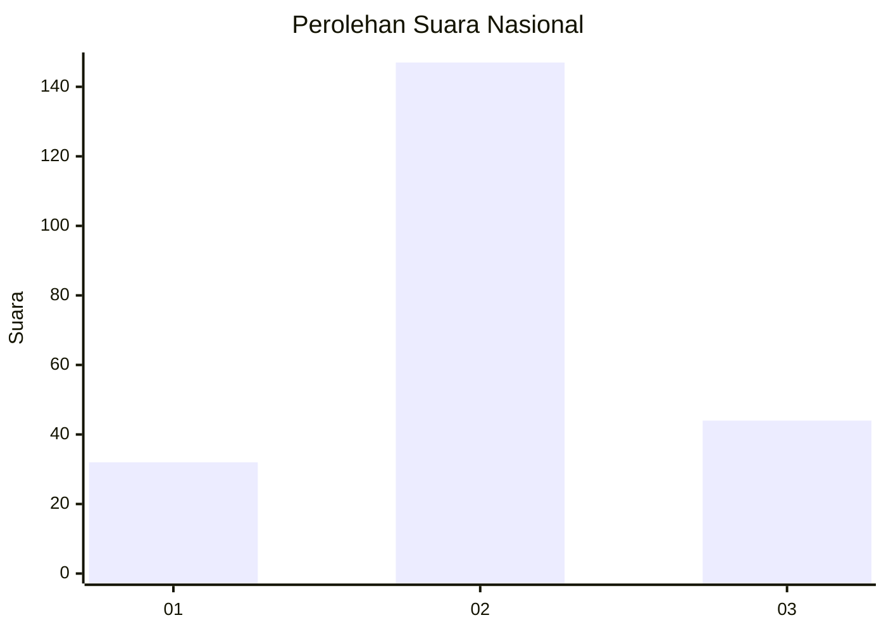
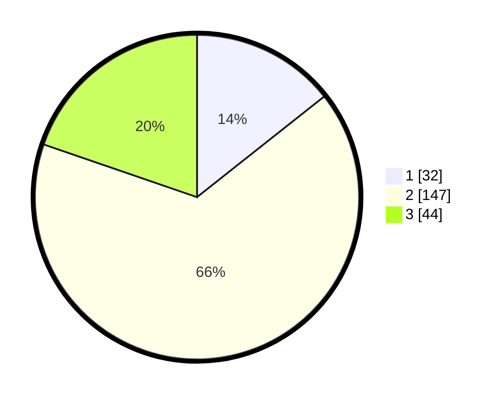

# Hasil

## Grafik

## Tabel

| No. | Nama Paslon    | Suara | Suara (raw) | Persentase |
|:--- |:-------------- | -----:| -----------:| ----------:|
| 1   | ANIES MUHAIMIN | 32    | [32][p-1]   | 14,35      |
| 2   | PRABOWO GIBRAN | 147   | [147][p-2]  | 65,92      |
| 3   | GANJAR MAHFUD  | 44    | [44][p-3]   | 19,73      |

[p-1]: https://github.com/gigit-pemilu/pemilu-2024/blob/main/pilpres/hitung-suara/sub/91-papua/sub/03-jayapura/sub/01-sentani/sub/1003-hinekombe/sub/015-tps/sub/paslon-1.txt
[p-2]: https://github.com/gigit-pemilu/pemilu-2024/blob/main/pilpres/hitung-suara/sub/91-papua/sub/03-jayapura/sub/01-sentani/sub/1003-hinekombe/sub/015-tps/sub/paslon-2.txt
[p-3]: https://github.com/gigit-pemilu/pemilu-2024/blob/main/pilpres/hitung-suara/sub/91-papua/sub/03-jayapura/sub/01-sentani/sub/1003-hinekombe/sub/015-tps/sub/paslon-3.txt

## Foto C Plano

https://sirekap-obj-formc.kpu.go.id/0e7e/pemilu/ppwp/91/03/01/10/03/9103011003015-20240214-141528--2bd6a7d8-c006-4bb9-9966-abfc782986ae.jpg

https://sirekap-obj-formc.kpu.go.id/0e7e/pemilu/ppwp/91/03/01/10/03/9103011003015-20240214-141717--b172b34e-98d9-4960-98b5-f33ac727b7bd.jpg

https://sirekap-obj-formc.kpu.go.id/0e7e/pemilu/ppwp/91/03/01/10/03/9103011003015-20240214-141826--2050ad2b-9bdd-4471-a5fd-c86181a4b414.jpg

## Metadata

| Key        | Value               |
| ---------- | ------------------- |
| Time Stamp | 2024-02-15 04:00:24 |

