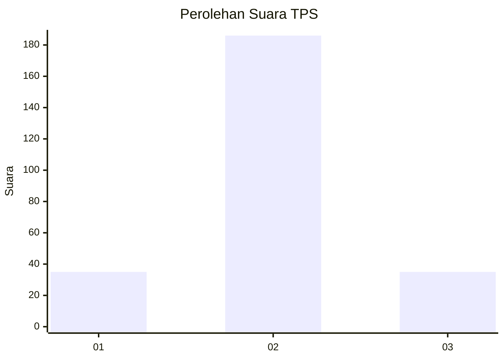
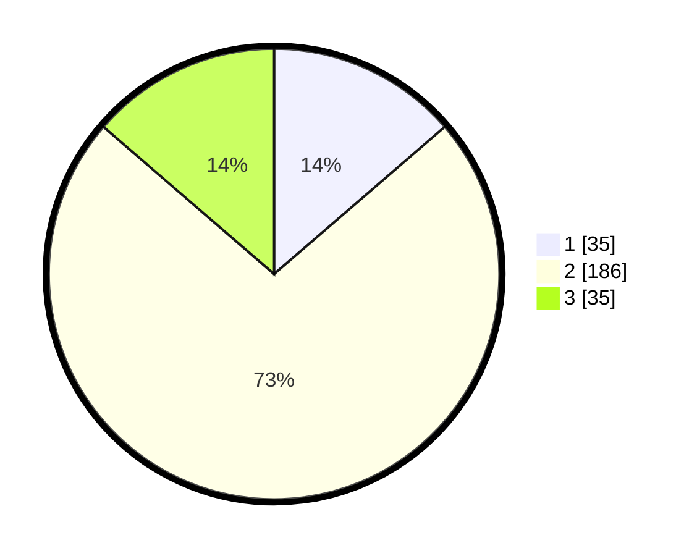

# Hasil

## Grafik

## Tabel

| No. | Nama Paslon    | Suara | Suara (raw) | Persentase |
|:--- |:-------------- | -----:| -----------:| ----------:|
| 1   | ANIES MUHAIMIN | 35    | [35][p-1]   | 13,67      |
| 2   | PRABOWO GIBRAN | 186   | [186][p-2]  | 72,66      |
| 3   | GANJAR MAHFUD  | 35    | [35][p-3]   | 13,67      |

[p-1]: https://github.com/gigit-pemilu/pemilu-2024-91-papua/blob/main/pilpres/hitung-suara/sub/91-papua/sub/03-jayapura/sub/01-sentani/sub/1003-hinekombe/sub/025-tps/sub/paslon-1.txt
[p-2]: https://github.com/gigit-pemilu/pemilu-2024-91-papua/blob/main/pilpres/hitung-suara/sub/91-papua/sub/03-jayapura/sub/01-sentani/sub/1003-hinekombe/sub/025-tps/sub/paslon-2.txt
[p-3]: https://github.com/gigit-pemilu/pemilu-2024-91-papua/blob/main/pilpres/hitung-suara/sub/91-papua/sub/03-jayapura/sub/01-sentani/sub/1003-hinekombe/sub/025-tps/sub/paslon-3.txt

## Foto C Plano

https://sirekap-obj-formc.kpu.go.id/880a/pemilu/ppwp/91/03/01/10/03/9103011003025-20240215-052332--6b6887fb-ace9-4ca2-9249-7f22abec643c.jpg

https://sirekap-obj-formc.kpu.go.id/880a/pemilu/ppwp/91/03/01/10/03/9103011003025-20240215-075049--9073431f-f76a-46ee-83a1-7ebeb5a04a49.jpg

https://sirekap-obj-formc.kpu.go.id/880a/pemilu/ppwp/91/03/01/10/03/9103011003025-20240215-075255--a4d482ba-0a44-4bdc-8b07-3ffe2915aa82.jpg

## Metadata

| Key        | Value               |
| ---------- | ------------------- |
| Time Stamp | 2024-02-25 12:00:00 |

