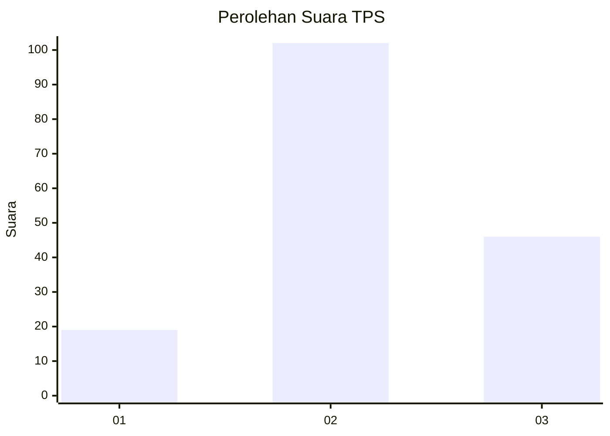
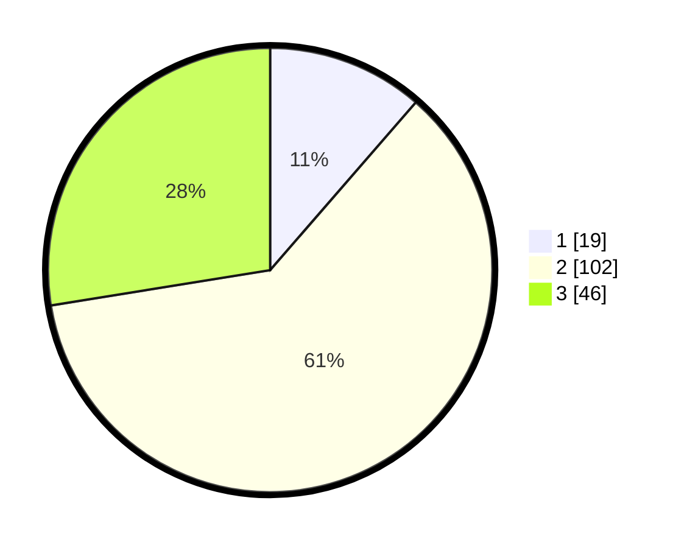

# Hasil

## Grafik

## Tabel

| No. | Nama Paslon    | Suara | Suara (raw) | Persentase |
|:--- |:-------------- | -----:| -----------:| ----------:|
| 1   | ANIES MUHAIMIN | 19    | [19][p-1]   | 11,38      |
| 2   | PRABOWO GIBRAN | 102   | [102][p-2]  | 61,08      |
| 3   | GANJAR MAHFUD  | 46    | [46][p-3]   | 27,54      |

[p-1]: https://github.com/gigit-pemilu/pemilu-2024-91-papua/blob/main/pilpres/hitung-suara/sub/91-papua/sub/03-jayapura/sub/01-sentani/sub/1003-hinekombe/sub/033-tps/sub/paslon-1.txt
[p-2]: https://github.com/gigit-pemilu/pemilu-2024-91-papua/blob/main/pilpres/hitung-suara/sub/91-papua/sub/03-jayapura/sub/01-sentani/sub/1003-hinekombe/sub/033-tps/sub/paslon-2.txt
[p-3]: https://github.com/gigit-pemilu/pemilu-2024-91-papua/blob/main/pilpres/hitung-suara/sub/91-papua/sub/03-jayapura/sub/01-sentani/sub/1003-hinekombe/sub/033-tps/sub/paslon-3.txt

## Foto C Plano

https://sirekap-obj-formc.kpu.go.id/af8c/pemilu/ppwp/91/03/01/10/03/9103011003033-20240215-074542--a0fa25ec-d9c0-4187-b754-9d036072da4c.jpg

https://sirekap-obj-formc.kpu.go.id/af8c/pemilu/ppwp/91/03/01/10/03/9103011003033-20240215-074817--c468a5fa-755f-435c-820c-aaf5c8f0c544.jpg

https://sirekap-obj-formc.kpu.go.id/af8c/pemilu/ppwp/91/03/01/10/03/9103011003033-20240215-075129--1ab5fc50-96c5-4a14-ab92-1e0c0ef480ed.jpg

## Metadata

| Key        | Value               |
| ---------- | ------------------- |
| Time Stamp | 2024-02-24 22:31:28 |

