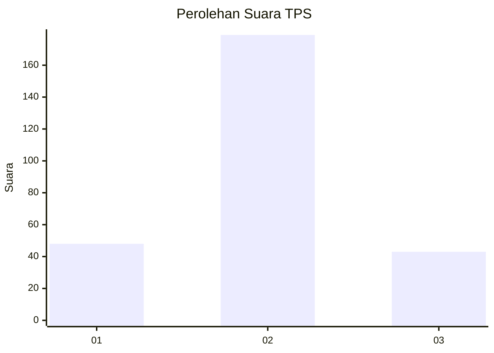
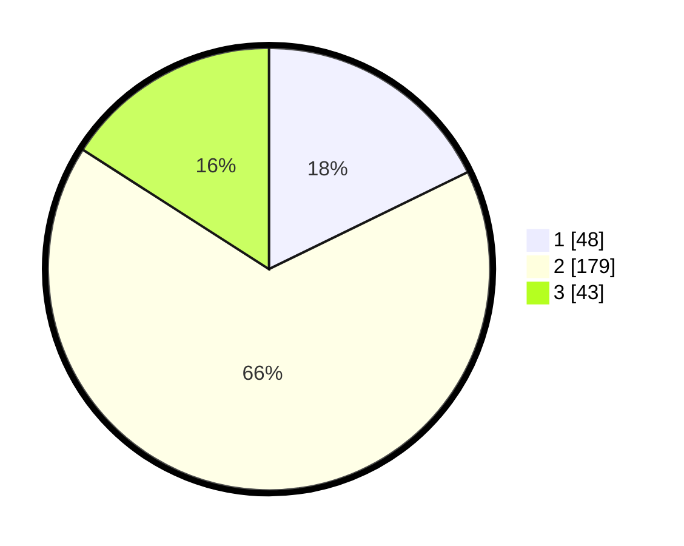

# Hasil

## Grafik

## Tabel

| No. | Nama Paslon    | Suara | Suara (raw) | Persentase |
|:--- |:-------------- | -----:| -----------:| ----------:|
| 1   | ANIES MUHAIMIN | 48    | [48][p-1]   | 17,78      |
| 2   | PRABOWO GIBRAN | 179   | [179][p-2]  | 66,30      |
| 3   | GANJAR MAHFUD  | 43    | [43][p-3]   | 15,93      |

[p-1]: https://github.com/gigit-pemilu/pemilu-2024-91-papua/blob/main/pilpres/hitung-suara/sub/91-papua/sub/03-jayapura/sub/01-sentani/sub/1003-hinekombe/sub/038-tps/sub/paslon-1.txt
[p-2]: https://github.com/gigit-pemilu/pemilu-2024-91-papua/blob/main/pilpres/hitung-suara/sub/91-papua/sub/03-jayapura/sub/01-sentani/sub/1003-hinekombe/sub/038-tps/sub/paslon-2.txt
[p-3]: https://github.com/gigit-pemilu/pemilu-2024-91-papua/blob/main/pilpres/hitung-suara/sub/91-papua/sub/03-jayapura/sub/01-sentani/sub/1003-hinekombe/sub/038-tps/sub/paslon-3.txt

## Foto C Plano

https://sirekap-obj-formc.kpu.go.id/6278/pemilu/ppwp/91/03/01/10/03/9103011003038-20240215-065248--bfe25b22-3274-4137-8500-11a77f3e1908.jpg

https://sirekap-obj-formc.kpu.go.id/6278/pemilu/ppwp/91/03/01/10/03/9103011003038-20240215-065513--99ec7410-365c-4035-9cc7-5dda21e8eebd.jpg

https://sirekap-obj-formc.kpu.go.id/6278/pemilu/ppwp/91/03/01/10/03/9103011003038-20240215-065338--683ed9ac-61de-4907-9c30-edb60cc4ca44.jpg

## Metadata

| Key        | Value               |
| ---------- | ------------------- |
| Time Stamp | 2024-02-15 16:00:26 |

