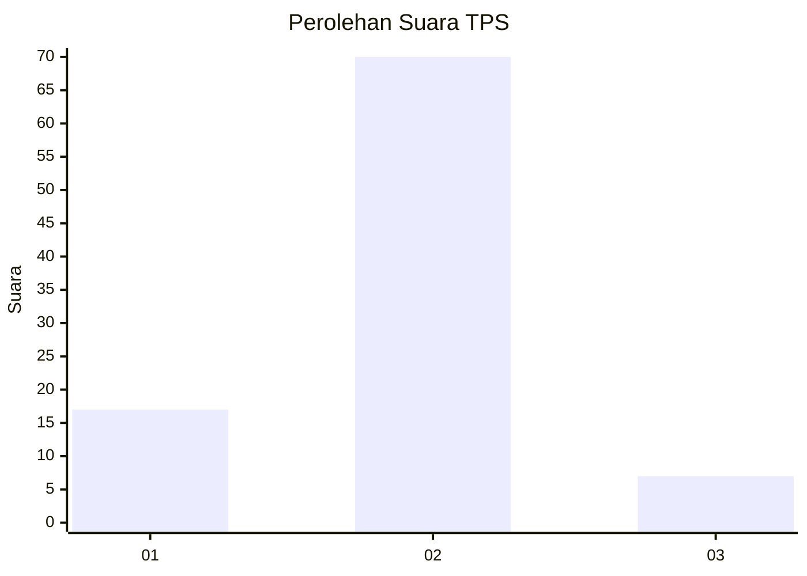
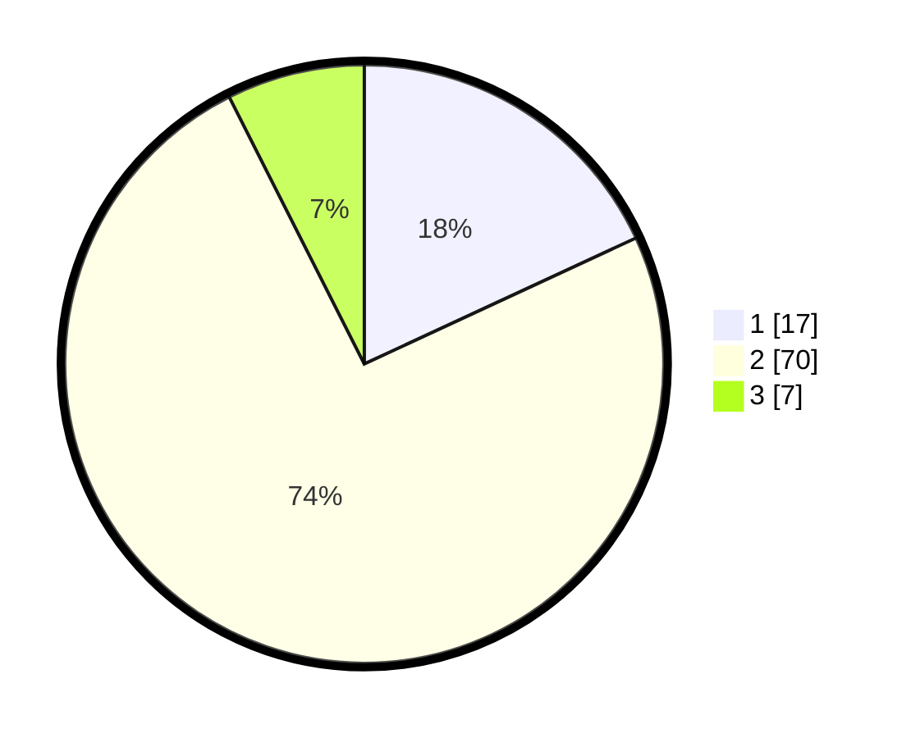

# Hasil

## Grafik

## Tabel

| No. | Nama Paslon    | Suara | Suara (raw) | Persentase |
|:--- |:-------------- | -----:| -----------:| ----------:|
| 1   | ANIES MUHAIMIN | 17    | [17][p-1]   | 18,09      |
| 2   | PRABOWO GIBRAN | 70    | [70][p-2]   | 74,47      |
| 3   | GANJAR MAHFUD  | 7     | [7][p-3]    | 7,45       |

[p-1]: https://github.com/gigit-pemilu/pemilu-2024-91-papua/blob/main/pilpres/hitung-suara/sub/91-papua/sub/03-jayapura/sub/01-sentani/sub/1003-hinekombe/sub/050-tps/sub/paslon-1.txt
[p-2]: https://github.com/gigit-pemilu/pemilu-2024-91-papua/blob/main/pilpres/hitung-suara/sub/91-papua/sub/03-jayapura/sub/01-sentani/sub/1003-hinekombe/sub/050-tps/sub/paslon-2.txt
[p-3]: https://github.com/gigit-pemilu/pemilu-2024-91-papua/blob/main/pilpres/hitung-suara/sub/91-papua/sub/03-jayapura/sub/01-sentani/sub/1003-hinekombe/sub/050-tps/sub/paslon-3.txt

## Foto C Plano

https://sirekap-obj-formc.kpu.go.id/06cb/pemilu/ppwp/91/03/01/10/03/9103011003050-20240215-003248--2b7ef920-447f-4cca-ac63-02d6f51690bb.jpg

https://sirekap-obj-formc.kpu.go.id/06cb/pemilu/ppwp/91/03/01/10/03/9103011003050-20240215-000912--88fd5498-6a76-44c7-b15e-a33a72376f4a.jpg

https://sirekap-obj-formc.kpu.go.id/06cb/pemilu/ppwp/91/03/01/10/03/9103011003050-20240215-001048--716e1a6f-1991-4666-93e1-e722413204b7.jpg

## Metadata

| Key        | Value               |
| ---------- | ------------------- |
| Time Stamp | 2024-02-25 12:00:00 |

