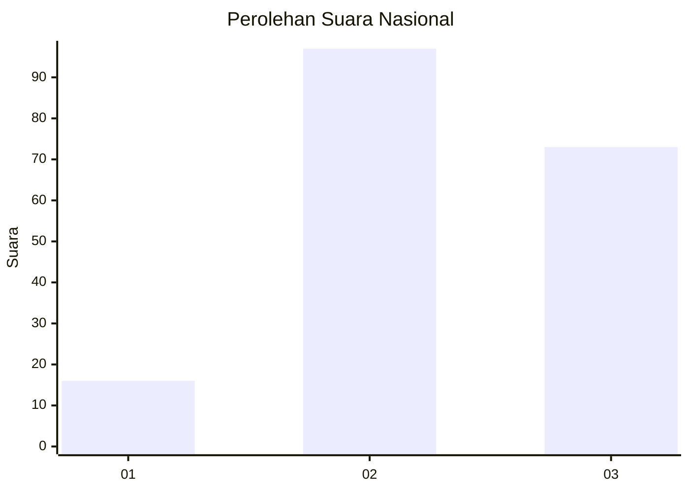
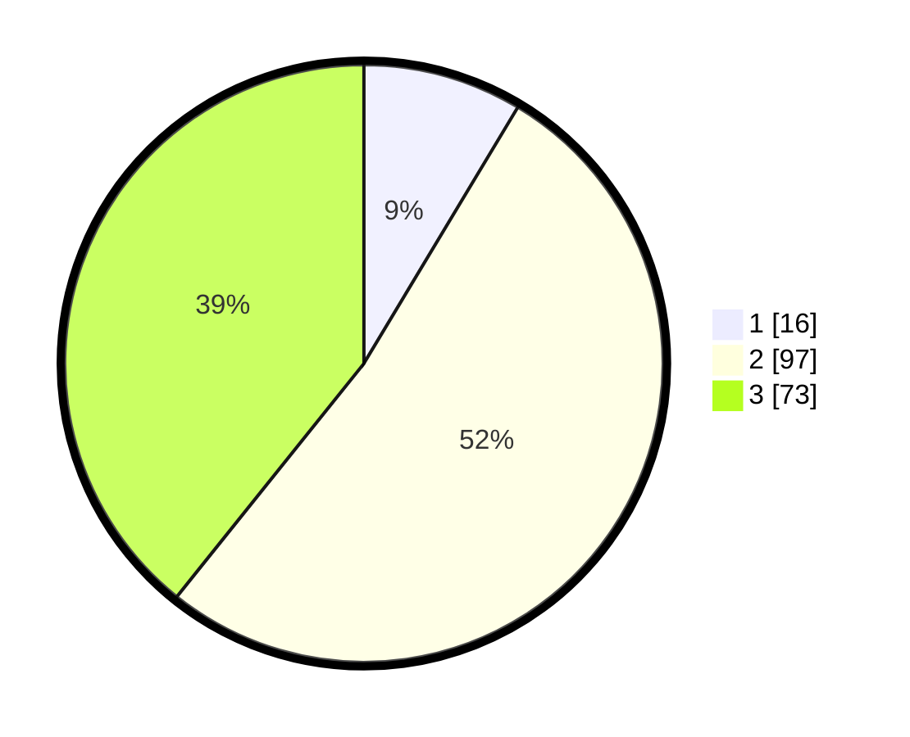

# Hasil

## Grafik

## Tabel

| No. | Nama Paslon    | Suara | Suara (raw) | Persentase |
|:--- |:-------------- | -----:| -----------:| ----------:|
| 1   | ANIES MUHAIMIN | 16    | [16][p-1]   | 8,60       |
| 2   | PRABOWO GIBRAN | 97    | [97][p-2]   | 52,15      |
| 3   | GANJAR MAHFUD  | 73    | [73][p-3]   | 39,25      |

[p-1]: https://github.com/gigit-pemilu/pemilu-2024/blob/main/pilpres/hitung-suara/sub/91-papua/sub/03-jayapura/sub/01-sentani/sub/2004-sereh/sub/006-tps/sub/paslon-1.txt
[p-2]: https://github.com/gigit-pemilu/pemilu-2024/blob/main/pilpres/hitung-suara/sub/91-papua/sub/03-jayapura/sub/01-sentani/sub/2004-sereh/sub/006-tps/sub/paslon-2.txt
[p-3]: https://github.com/gigit-pemilu/pemilu-2024/blob/main/pilpres/hitung-suara/sub/91-papua/sub/03-jayapura/sub/01-sentani/sub/2004-sereh/sub/006-tps/sub/paslon-3.txt

## Foto C Plano

https://sirekap-obj-formc.kpu.go.id/84d4/pemilu/ppwp/91/03/01/20/04/9103012004006-20240221-093502--2d35e925-b655-4a69-8d60-d94129c4c7ad.jpg

https://sirekap-obj-formc.kpu.go.id/84d4/pemilu/ppwp/91/03/01/20/04/9103012004006-20240221-093636--09b72cdf-ec40-464a-b329-cf489d3c0809.jpg

https://sirekap-obj-formc.kpu.go.id/84d4/pemilu/ppwp/91/03/01/20/04/9103012004006-20240221-093715--ef4a5a79-b8e0-4013-95ad-6a702664d3d2.jpg

## Metadata

| Key        | Value               |
| ---------- | ------------------- |
| Time Stamp | 2024-02-21 11:00:00 |

## DATA PEMILIH TETAP

Jumlah pemilih dalam DPT: **238**.
 * L: **0**.
 * P: **100**.

## DATA PENGGUNA HAK PILIH

Jumlah pengguna hak pilih dalam DPT: **239**.
 * L: **150**.
 * P: **139**.

Jumlah pengguna hak pilih dalam DPTb: **88**.
 * L: **45**.
 * P: **2**.

Jumlah pengguna hak pilih dalam DPK: **44**.
 * L: **888**.
 * P: **847**.

Jumlah pengguna hak pilih: **287**.
 * L: **150**.
 * P: **139**.

## JUMLAH SUARA SAH DAN TIDAK SAH

JUMLAH SELURUH SUARA SAH: **286**.

JUMLAH SUARA TIDAK SAH: **7**.

JUMLAH SELURUH SUARA SAH DAN SUARA TIDAK SAH: **293**.

