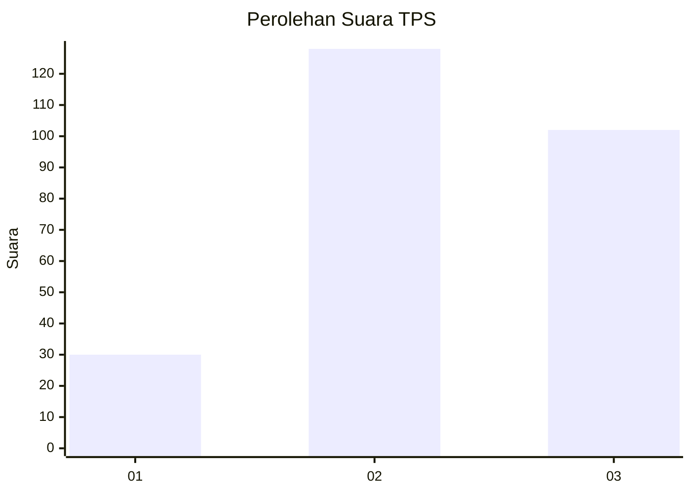
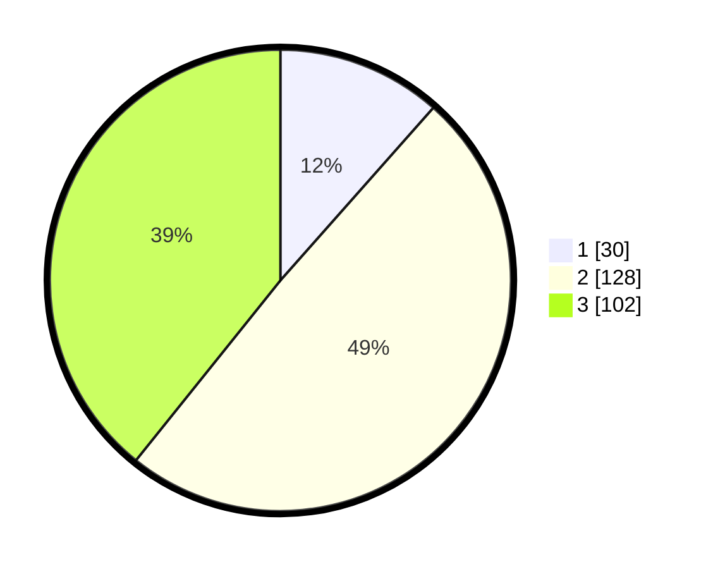

# Hasil

## Grafik

## Tabel

| No. | Nama Paslon    | Suara | Suara (raw) | Persentase |
|:--- |:-------------- | -----:| -----------:| ----------:|
| 1   | ANIES MUHAIMIN | 30    | [30][p-1]   | 11,54      |
| 2   | PRABOWO GIBRAN | 128   | [128][p-2]  | 49,23      |
| 3   | GANJAR MAHFUD  | 102   | [102][p-3]  | 39,23      |

[p-1]: https://github.com/gigit-pemilu/pemilu-2024-91-papua/blob/main/pilpres/hitung-suara/sub/91-papua/sub/03-jayapura/sub/01-sentani/sub/2004-sereh/sub/010-tps/sub/paslon-1.txt
[p-2]: https://github.com/gigit-pemilu/pemilu-2024-91-papua/blob/main/pilpres/hitung-suara/sub/91-papua/sub/03-jayapura/sub/01-sentani/sub/2004-sereh/sub/010-tps/sub/paslon-2.txt
[p-3]: https://github.com/gigit-pemilu/pemilu-2024-91-papua/blob/main/pilpres/hitung-suara/sub/91-papua/sub/03-jayapura/sub/01-sentani/sub/2004-sereh/sub/010-tps/sub/paslon-3.txt

## Foto C Plano

https://sirekap-obj-formc.kpu.go.id/78e7/pemilu/ppwp/91/03/01/20/04/9103012004010-20240221-132307--9ee523d7-e744-400b-aa35-6854dbad6205.jpg

https://sirekap-obj-formc.kpu.go.id/78e7/pemilu/ppwp/91/03/01/20/04/9103012004010-20240221-132131--992a5dc8-55df-4b7a-a161-4418020ec8be.jpg

https://sirekap-obj-formc.kpu.go.id/78e7/pemilu/ppwp/91/03/01/20/04/9103012004010-20240221-132223--9746b94b-28e6-467d-9e87-3d21fda2a9e9.jpg

## Metadata

| Key        | Value               |
| ---------- | ------------------- |
| Time Stamp | 2024-02-22 10:00:00 |

## DATA PEMILIH TETAP

Jumlah pemilih dalam DPT: **276**.
 * L: **723**.
 * P: **143**.

## DATA PENGGUNA HAK PILIH

Jumlah pengguna hak pilih dalam DPT: **276**.
 * L: **133**.
 * P: **143**.

Jumlah pengguna hak pilih dalam DPTb: **400**.
 * L: **240**.
 * P: **800**.

Jumlah pengguna hak pilih dalam DPK: **226**.
 * L: **804**.
 * P: **82**.

Jumlah pengguna hak pilih: **282**.
 * L: **137**.
 * P: **145**.

## JUMLAH SUARA SAH DAN TIDAK SAH

JUMLAH SELURUH SUARA SAH: **260**.

JUMLAH SUARA TIDAK SAH: **20**.

JUMLAH SELURUH SUARA SAH DAN SUARA TIDAK SAH: **280**.

