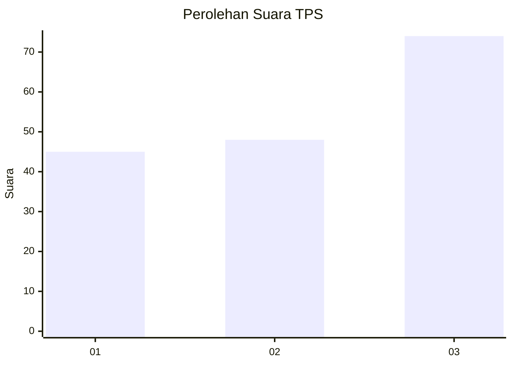
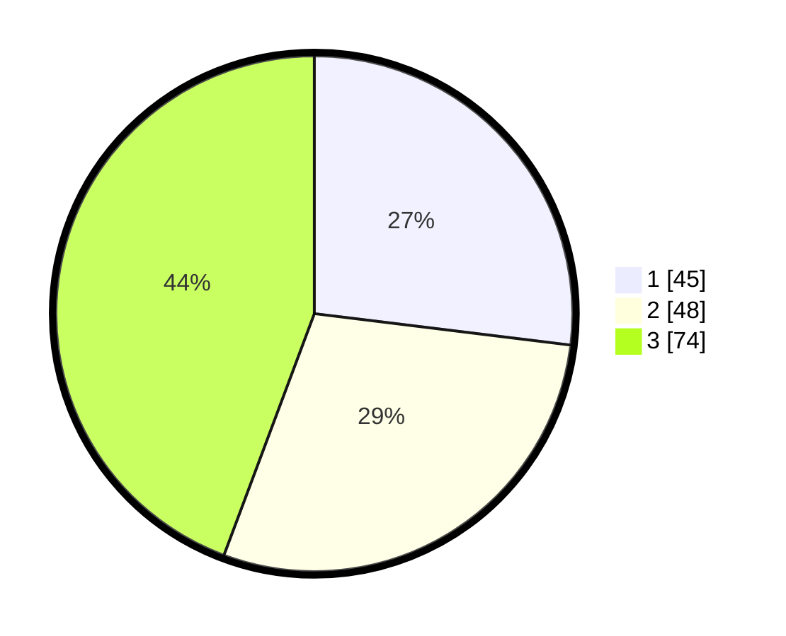

# Hasil

## Grafik

## Tabel

| No. | Nama Paslon    | Suara | Suara (raw) | Persentase |
|:--- |:-------------- | -----:| -----------:| ----------:|
| 1   | ANIES MUHAIMIN | 45    | [45][p-1]   | 26,95      |
| 2   | PRABOWO GIBRAN | 48    | [48][p-2]   | 28,74      |
| 3   | GANJAR MAHFUD  | 74    | [74][p-3]   | 44,31      |

[p-1]: https://github.com/gigit-pemilu/pemilu-2024-91-papua/blob/main/pilpres/hitung-suara/sub/91-papua/sub/03-jayapura/sub/01-sentani/sub/2004-sereh/sub/012-tps/sub/paslon-1.txt
[p-2]: https://github.com/gigit-pemilu/pemilu-2024-91-papua/blob/main/pilpres/hitung-suara/sub/91-papua/sub/03-jayapura/sub/01-sentani/sub/2004-sereh/sub/012-tps/sub/paslon-2.txt
[p-3]: https://github.com/gigit-pemilu/pemilu-2024-91-papua/blob/main/pilpres/hitung-suara/sub/91-papua/sub/03-jayapura/sub/01-sentani/sub/2004-sereh/sub/012-tps/sub/paslon-3.txt

## Foto C Plano

https://sirekap-obj-formc.kpu.go.id/becf/pemilu/ppwp/91/03/01/20/04/9103012004012-20240221-153727--7794f2af-92f6-4a7b-be39-8329868986b9.jpg

https://sirekap-obj-formc.kpu.go.id/becf/pemilu/ppwp/91/03/01/20/04/9103012004012-20240221-153759--71bde477-9c3a-4bbc-9d8d-b754d0e834ff.jpg

https://sirekap-obj-formc.kpu.go.id/becf/pemilu/ppwp/91/03/01/20/04/9103012004012-20240221-153646--b0dd5cb1-2d90-4984-aea2-bf8f61d41922.jpg

## Metadata

| Key        | Value               |
| ---------- | ------------------- |
| Time Stamp | 2024-02-21 16:00:00 |

## DATA PEMILIH TETAP

Jumlah pemilih dalam DPT: **215**.
 * L: **156**.
 * P: **533**.

## DATA PENGGUNA HAK PILIH

Jumlah pengguna hak pilih dalam DPT: **100**.
 * L: **55**.
 * P: **25**.

Jumlah pengguna hak pilih dalam DPTb: **77**.
 * L: **554**.
 * P: **53**.

Jumlah pengguna hak pilih dalam DPK: **385**.
 * L: **223**.
 * P: **73**.

Jumlah pengguna hak pilih: **173**.
 * L: **807**.
 * P: **207**.

## JUMLAH SUARA SAH DAN TIDAK SAH

JUMLAH SELURUH SUARA SAH: **255**.

JUMLAH SUARA TIDAK SAH: **177**.

JUMLAH SELURUH SUARA SAH DAN SUARA TIDAK SAH: **302**.

