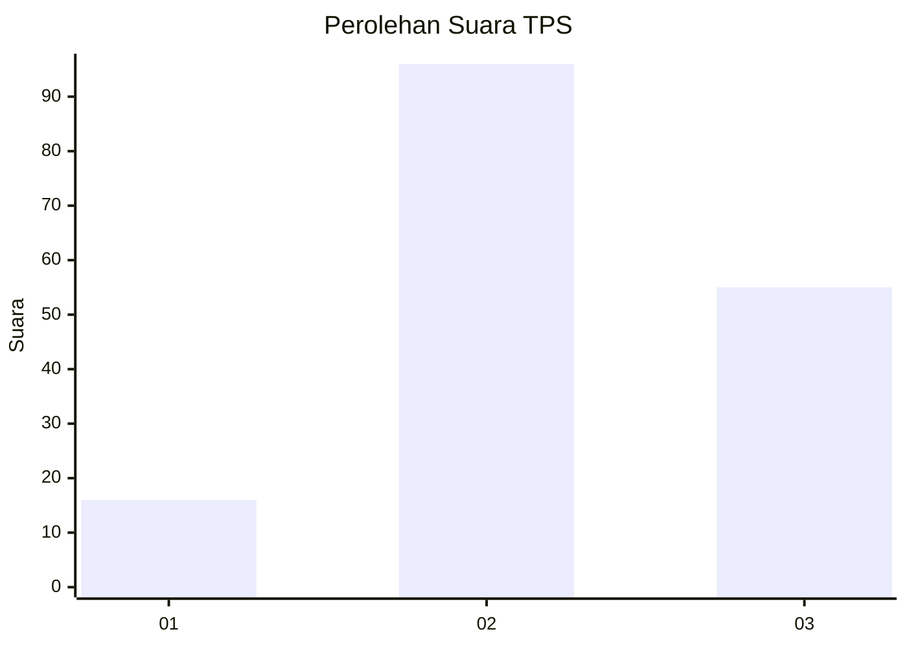
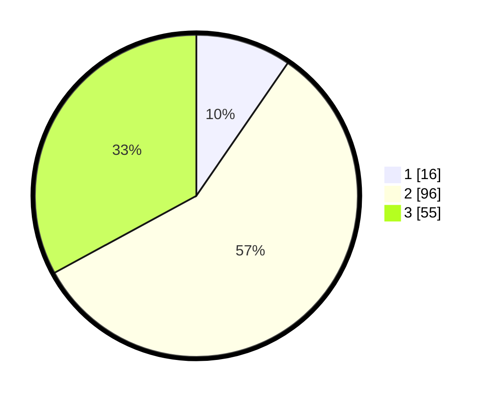

# Hasil

## Grafik

## Tabel

| No. | Nama Paslon    | Suara | Suara (raw) | Persentase |
|:--- |:-------------- | -----:| -----------:| ----------:|
| 1   | ANIES MUHAIMIN | 16    | [16][p-1]   | 9,58       |
| 2   | PRABOWO GIBRAN | 96    | [96][p-2]   | 57,49      |
| 3   | GANJAR MAHFUD  | 55    | [55][p-3]   | 32,93      |

[p-1]: https://github.com/gigit-pemilu/pemilu-2024-91-papua/blob/main/pilpres/hitung-suara/sub/91-papua/sub/03-jayapura/sub/01-sentani/sub/2005-yobeh/sub/001-tps/sub/paslon-1.txt
[p-2]: https://github.com/gigit-pemilu/pemilu-2024-91-papua/blob/main/pilpres/hitung-suara/sub/91-papua/sub/03-jayapura/sub/01-sentani/sub/2005-yobeh/sub/001-tps/sub/paslon-2.txt
[p-3]: https://github.com/gigit-pemilu/pemilu-2024-91-papua/blob/main/pilpres/hitung-suara/sub/91-papua/sub/03-jayapura/sub/01-sentani/sub/2005-yobeh/sub/001-tps/sub/paslon-3.txt

## Foto C Plano

https://sirekap-obj-formc.kpu.go.id/2d0b/pemilu/ppwp/91/03/01/20/05/9103012005001-20240214-230832--a63f4100-4c2b-4623-a15b-ed7e76cf65e6.jpg

https://sirekap-obj-formc.kpu.go.id/2d0b/pemilu/ppwp/91/03/01/20/05/9103012005001-20240214-230137--37a06e17-9955-4ae1-a4e7-cf300c167c61.jpg

https://sirekap-obj-formc.kpu.go.id/2d0b/pemilu/ppwp/91/03/01/20/05/9103012005001-20240214-230746--ddcb0552-46b2-4738-a488-fcc4f1ffe882.jpg

## Metadata

| Key        | Value               |
| ---------- | ------------------- |
| Time Stamp | 2024-02-24 22:31:28 |

