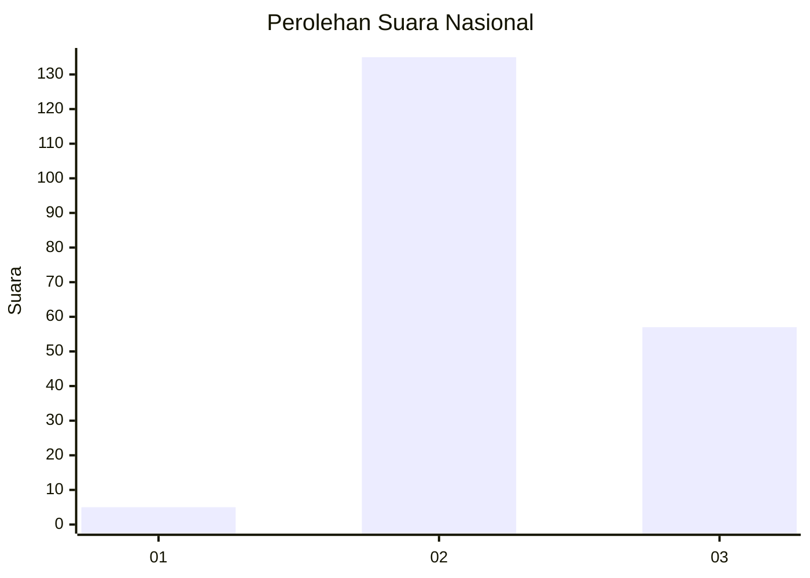

# Hasil

## Grafik

## Tabel

| No. | Nama Paslon    | Suara | Suara (raw) | Persentase |
|:--- |:-------------- | -----:| -----------:| ----------:|
| 1   | ANIES MUHAIMIN | 5     | [5][p-1]    | 2,54       |
| 2   | PRABOWO GIBRAN | 135   | [135][p-2]  | 68,53      |
| 3   | GANJAR MAHFUD  | 57    | [57][p-3]   | 28,93      |

[p-1]: https://github.com/gigit-pemilu/pemilu-2024/blob/main/pilpres/hitung-suara/sub/91-papua/sub/03-jayapura/sub/01-sentani/sub/2006-ilfele/sub/001-tps/sub/paslon-1.txt
[p-2]: https://github.com/gigit-pemilu/pemilu-2024/blob/main/pilpres/hitung-suara/sub/91-papua/sub/03-jayapura/sub/01-sentani/sub/2006-ilfele/sub/001-tps/sub/paslon-2.txt
[p-3]: https://github.com/gigit-pemilu/pemilu-2024/blob/main/pilpres/hitung-suara/sub/91-papua/sub/03-jayapura/sub/01-sentani/sub/2006-ilfele/sub/001-tps/sub/paslon-3.txt

## Foto C Plano

https://sirekap-obj-formc.kpu.go.id/950b/pemilu/ppwp/91/03/01/20/06/9103012006001-20240219-103211--259529a8-f9ec-4e04-adef-2505679dbd38.jpg

https://sirekap-obj-formc.kpu.go.id/950b/pemilu/ppwp/91/03/01/20/06/9103012006001-20240219-102148--57603303-7d06-4b8d-9429-6220e8c73b5d.jpg

https://sirekap-obj-formc.kpu.go.id/950b/pemilu/ppwp/91/03/01/20/06/9103012006001-20240218-130050--f49fa677-9c2f-4027-a2ad-1c1983b32809.jpg

## Metadata

| Key        | Value               |
| ---------- | ------------------- |
| Time Stamp | 2024-02-25 13:00:00 |

