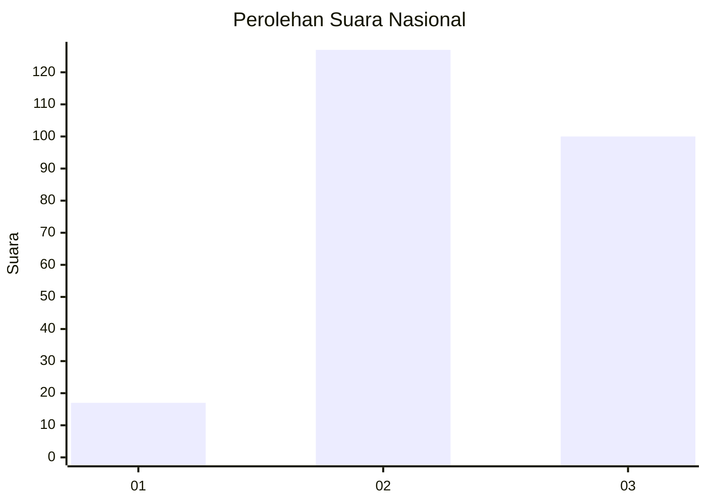
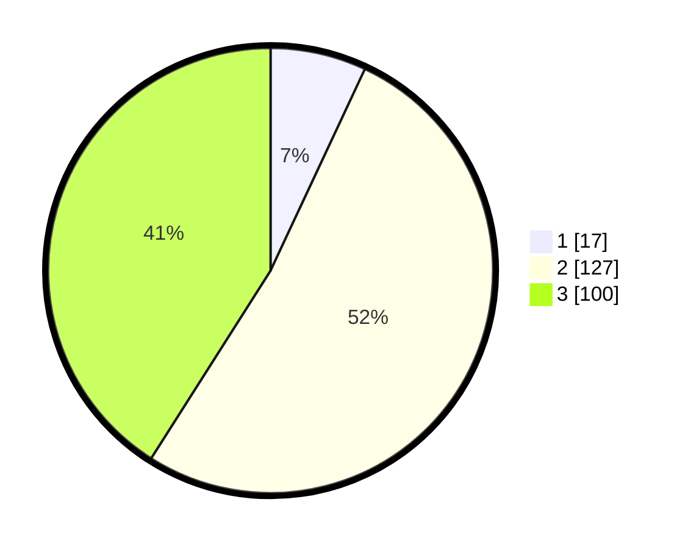

# Hasil

## Grafik

## Tabel

| No. | Nama Paslon    | Suara | Suara (raw) | Persentase |
|:--- |:-------------- | -----:| -----------:| ----------:|
| 1   | ANIES MUHAIMIN | 17    | [17][p-1]   | 6,97       |
| 2   | PRABOWO GIBRAN | 127   | [127][p-2]  | 52,05      |
| 3   | GANJAR MAHFUD  | 100   | [100][p-3]  | 40,98      |

[p-1]: https://github.com/gigit-pemilu/pemilu-2024/blob/main/pilpres/hitung-suara/sub/91-papua/sub/03-jayapura/sub/01-sentani/sub/3007-desa-adat-yoboi/sub/004-tps/sub/paslon-1.txt
[p-2]: https://github.com/gigit-pemilu/pemilu-2024/blob/main/pilpres/hitung-suara/sub/91-papua/sub/03-jayapura/sub/01-sentani/sub/3007-desa-adat-yoboi/sub/004-tps/sub/paslon-2.txt
[p-3]: https://github.com/gigit-pemilu/pemilu-2024/blob/main/pilpres/hitung-suara/sub/91-papua/sub/03-jayapura/sub/01-sentani/sub/3007-desa-adat-yoboi/sub/004-tps/sub/paslon-3.txt

## Foto C Plano

https://sirekap-obj-formc.kpu.go.id/c63f/pemilu/ppwp/91/03/01/30/07/9103013007004-20240215-141010--e7d7e795-5b87-47ed-9b94-a2354beb9467.jpg

https://sirekap-obj-formc.kpu.go.id/c63f/pemilu/ppwp/91/03/01/30/07/9103013007004-20240215-141624--69fa7b24-3176-4852-acb9-732725f985d0.jpg

https://sirekap-obj-formc.kpu.go.id/c63f/pemilu/ppwp/91/03/01/30/07/9103013007004-20240215-142414--5e8649e4-02ca-4874-a46a-f936fb2264ac.jpg

## Metadata

| Key        | Value               |
| ---------- | ------------------- |
| Time Stamp | 2024-02-25 11:00:00 |

