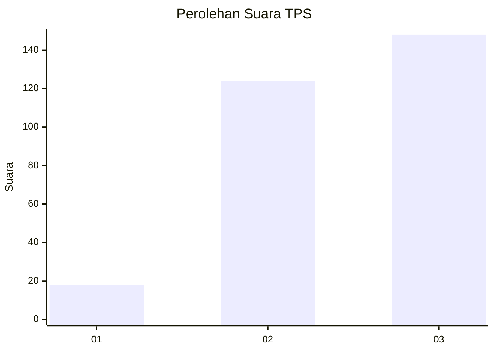
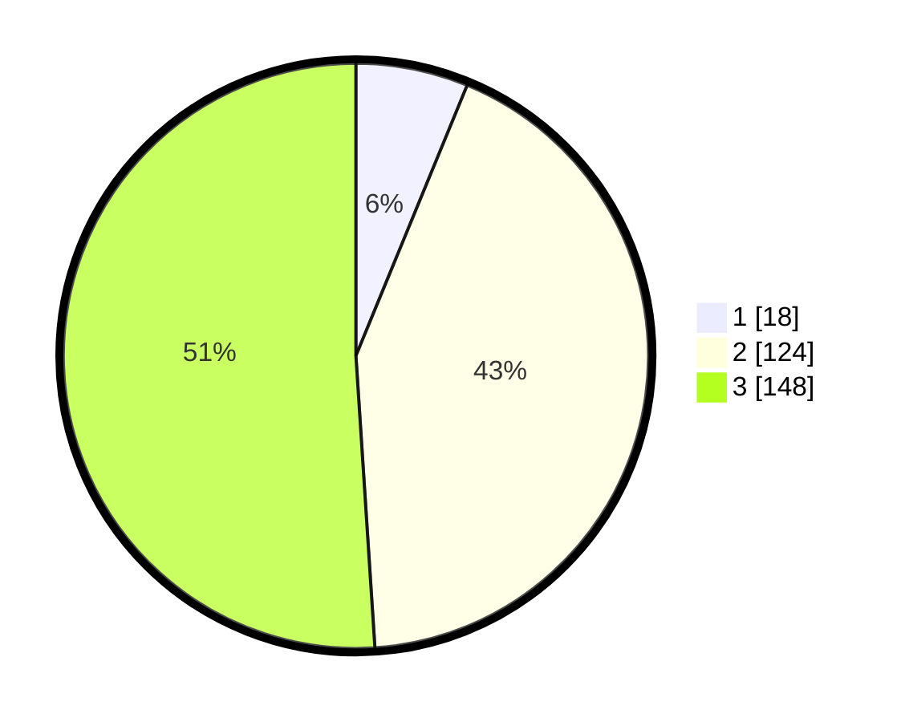

# Hasil

## Grafik

## Tabel

| No. | Nama Paslon    | Suara | Suara (raw) | Persentase |
|:--- |:-------------- | -----:| -----------:| ----------:|
| 1   | ANIES MUHAIMIN | 18    | [18][p-1]   | 6,21       |
| 2   | PRABOWO GIBRAN | 124   | [124][p-2]  | 42,76      |
| 3   | GANJAR MAHFUD  | 148   | [148][p-3]  | 51,03      |

[p-1]: https://github.com/gigit-pemilu/pemilu-2024-91-papua/blob/main/pilpres/hitung-suara/sub/91-papua/sub/03-jayapura/sub/01-sentani/sub/3010-desa-adat-heaiseai-yomo-heai/sub/002-tps/sub/paslon-1.txt
[p-2]: https://github.com/gigit-pemilu/pemilu-2024-91-papua/blob/main/pilpres/hitung-suara/sub/91-papua/sub/03-jayapura/sub/01-sentani/sub/3010-desa-adat-heaiseai-yomo-heai/sub/002-tps/sub/paslon-2.txt
[p-3]: https://github.com/gigit-pemilu/pemilu-2024-91-papua/blob/main/pilpres/hitung-suara/sub/91-papua/sub/03-jayapura/sub/01-sentani/sub/3010-desa-adat-heaiseai-yomo-heai/sub/002-tps/sub/paslon-3.txt

## Foto C Plano

https://sirekap-obj-formc.kpu.go.id/d430/pemilu/ppwp/91/03/01/30/10/9103013010002-20240215-104247--beae8599-7ec8-4685-af1d-dede7c42d87d.jpg

https://sirekap-obj-formc.kpu.go.id/d430/pemilu/ppwp/91/03/01/30/10/9103013010002-20240215-104136--da143ad6-5cb9-4f1e-a6f7-338e6ccb702a.jpg

https://sirekap-obj-formc.kpu.go.id/d430/pemilu/ppwp/91/03/01/30/10/9103013010002-20240215-104336--5bf68204-055d-4b4c-8a65-7c779336dc6a.jpg

## Metadata

| Key        | Value               |
| ---------- | ------------------- |
| Time Stamp | 2024-02-25 12:00:00 |

