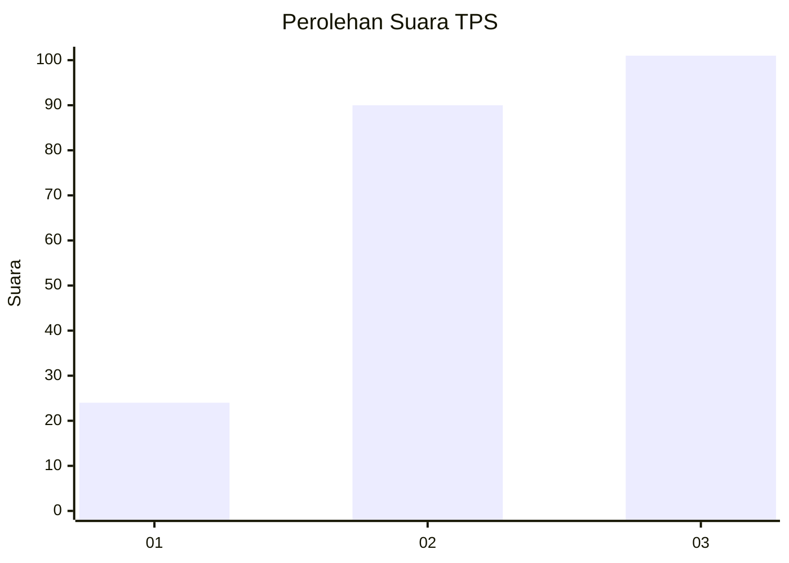
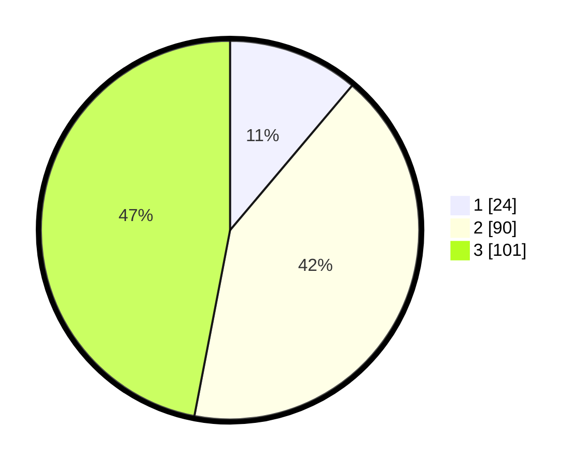

# Hasil

## Grafik

## Tabel

| No. | Nama Paslon    | Suara | Suara (raw) | Persentase |
|:--- |:-------------- | -----:| -----------:| ----------:|
| 1   | ANIES MUHAIMIN | 24    | [24][p-1]   | 11,16      |
| 2   | PRABOWO GIBRAN | 90    | [90][p-2]   | 41,86      |
| 3   | GANJAR MAHFUD  | 101   | [101][p-3]  | 46,98      |

[p-1]: https://github.com/gigit-pemilu/pemilu-2024-91-papua/blob/main/pilpres/hitung-suara/sub/91-papua/sub/03-jayapura/sub/01-sentani/sub/3010-desa-adat-heaiseai-yomo-heai/sub/003-tps/sub/paslon-1.txt
[p-2]: https://github.com/gigit-pemilu/pemilu-2024-91-papua/blob/main/pilpres/hitung-suara/sub/91-papua/sub/03-jayapura/sub/01-sentani/sub/3010-desa-adat-heaiseai-yomo-heai/sub/003-tps/sub/paslon-2.txt
[p-3]: https://github.com/gigit-pemilu/pemilu-2024-91-papua/blob/main/pilpres/hitung-suara/sub/91-papua/sub/03-jayapura/sub/01-sentani/sub/3010-desa-adat-heaiseai-yomo-heai/sub/003-tps/sub/paslon-3.txt

## Foto C Plano

https://sirekap-obj-formc.kpu.go.id/d244/pemilu/ppwp/91/03/01/30/10/9103013010003-20240215-093307--89339f2e-f2f0-4829-a42c-30aa03057448.jpg

https://sirekap-obj-formc.kpu.go.id/d244/pemilu/ppwp/91/03/01/30/10/9103013010003-20240215-093539--fa1cc9c6-0d59-4edc-b4df-b2ca03b37bb1.jpg

https://sirekap-obj-formc.kpu.go.id/d244/pemilu/ppwp/91/03/01/30/10/9103013010003-20240215-093837--c5203353-fe54-40c1-89c4-d75f098874a9.jpg

## Metadata

| Key        | Value               |
| ---------- | ------------------- |
| Time Stamp | 2024-02-24 23:00:00 |

