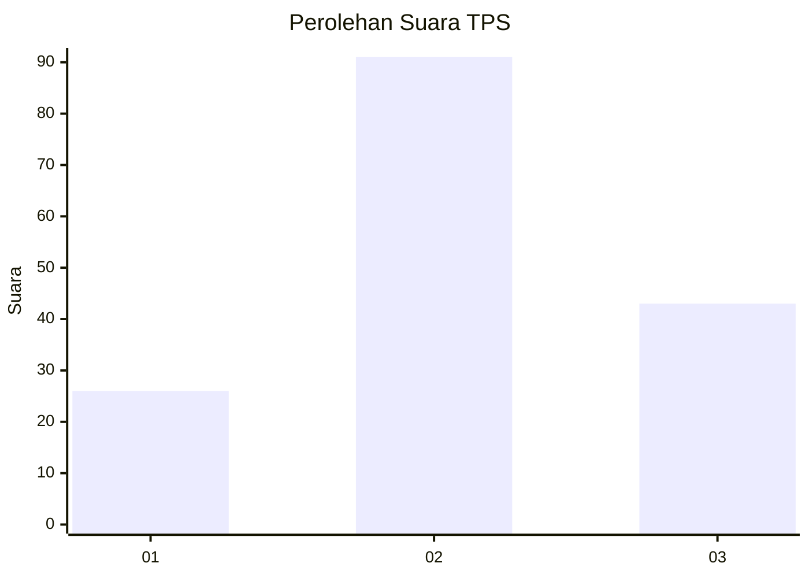
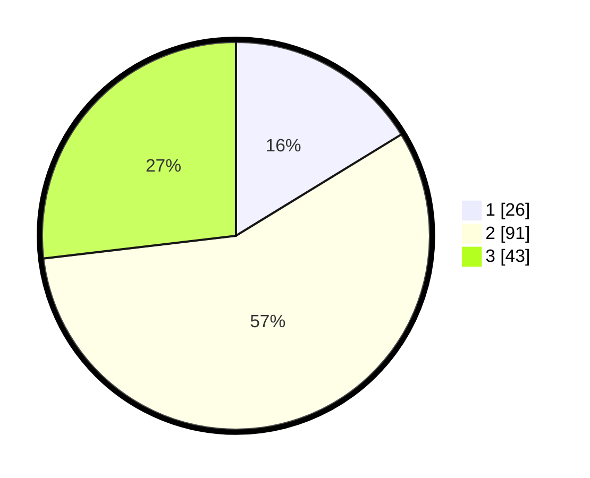

# Hasil

## Grafik

## Tabel

| No. | Nama Paslon    | Suara | Suara (raw) | Persentase |
|:--- |:-------------- | -----:| -----------:| ----------:|
| 1   | ANIES MUHAIMIN | 26    | [26][p-1]   | 16,25      |
| 2   | PRABOWO GIBRAN | 91    | [91][p-2]   | 56,88      |
| 3   | GANJAR MAHFUD  | 43    | [43][p-3]   | 26,88      |

[p-1]: https://github.com/gigit-pemilu/pemilu-2024-91-papua/blob/main/pilpres/hitung-suara/sub/91-papua/sub/03-jayapura/sub/02-sentani-timur/sub/2001-nolokla/sub/009-tps/sub/paslon-1.txt
[p-2]: https://github.com/gigit-pemilu/pemilu-2024-91-papua/blob/main/pilpres/hitung-suara/sub/91-papua/sub/03-jayapura/sub/02-sentani-timur/sub/2001-nolokla/sub/009-tps/sub/paslon-2.txt
[p-3]: https://github.com/gigit-pemilu/pemilu-2024-91-papua/blob/main/pilpres/hitung-suara/sub/91-papua/sub/03-jayapura/sub/02-sentani-timur/sub/2001-nolokla/sub/009-tps/sub/paslon-3.txt

## Foto C Plano

https://sirekap-obj-formc.kpu.go.id/9931/pemilu/ppwp/91/03/02/20/01/9103022001009-20240226-085521--4fae182d-01d6-435a-a044-eb164b1c8856.jpg

https://sirekap-obj-formc.kpu.go.id/9931/pemilu/ppwp/91/03/02/20/01/9103022001009-20240226-085432--20dbc275-e40f-4ab8-bc64-86935ae22128.jpg

https://sirekap-obj-formc.kpu.go.id/9931/pemilu/ppwp/91/03/02/20/01/9103022001009-20240226-085759--a3cdca05-bb7e-4c8d-a610-789ab106a853.jpg

## Metadata

| Key        | Value               |
| ---------- | ------------------- |
| Time Stamp | 2024-02-28 11:00:00 |

