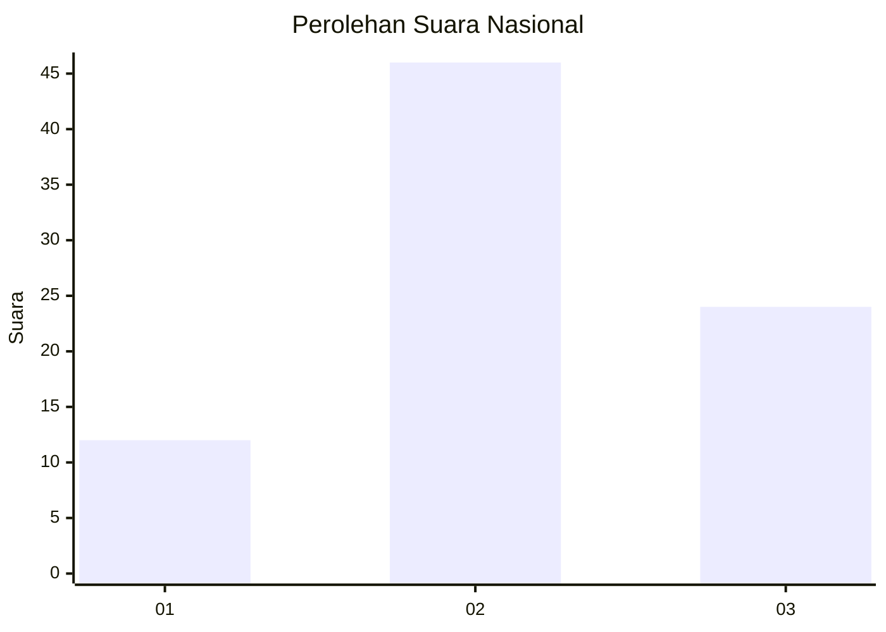
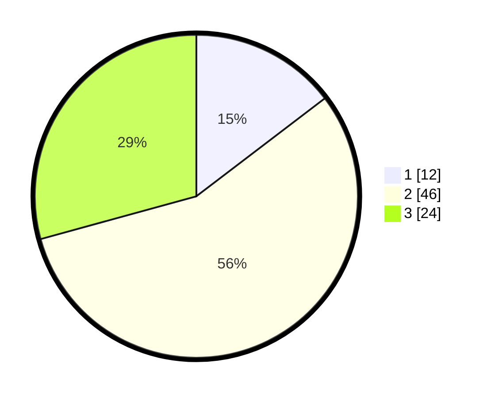

# Hasil

## Grafik

## Tabel

| No. | Nama Paslon    | Suara | Suara (raw) | Persentase |
|:--- |:-------------- | -----:| -----------:| ----------:|
| 1   | ANIES MUHAIMIN | 12    | [12][p-1]   | 14,63      |
| 2   | PRABOWO GIBRAN | 46    | [46][p-2]   | 56,10      |
| 3   | GANJAR MAHFUD  | 24    | [24][p-3]   | 29,27      |

[p-1]: https://github.com/gigit-pemilu/pemilu-2024/blob/main/pilpres/hitung-suara/sub/91-papua/sub/03-jayapura/sub/02-sentani-timur/sub/2001-nolokla/sub/011-tps/sub/paslon-1.txt
[p-2]: https://github.com/gigit-pemilu/pemilu-2024/blob/main/pilpres/hitung-suara/sub/91-papua/sub/03-jayapura/sub/02-sentani-timur/sub/2001-nolokla/sub/011-tps/sub/paslon-2.txt
[p-3]: https://github.com/gigit-pemilu/pemilu-2024/blob/main/pilpres/hitung-suara/sub/91-papua/sub/03-jayapura/sub/02-sentani-timur/sub/2001-nolokla/sub/011-tps/sub/paslon-3.txt

## Foto C Plano

https://sirekap-obj-formc.kpu.go.id/2867/pemilu/ppwp/91/03/02/20/01/9103022001011-20240216-172943--4b28b912-c884-4160-8e7f-bc0dcd8b14ed.jpg

https://sirekap-obj-formc.kpu.go.id/2867/pemilu/ppwp/91/03/02/20/01/9103022001011-20240216-172816--f2ec0f6e-20e7-44e8-8e89-7e4119030bf7.jpg

https://sirekap-obj-formc.kpu.go.id/2867/pemilu/ppwp/91/03/02/20/01/9103022001011-20240216-175141--7a7ccbc0-5556-4656-a020-f2ea320db6fb.jpg

## Metadata

| Key        | Value               |
| ---------- | ------------------- |
| Time Stamp | 2024-02-25 12:00:00 |

## DATA PEMILIH TETAP

Jumlah pemilih dalam DPT: **140**.
 * L: **68**.
 * P: **72**.

## DATA PENGGUNA HAK PILIH

Jumlah pengguna hak pilih dalam DPT: **69**.
 * L: **33**.
 * P: **36**.

Jumlah pengguna hak pilih dalam DPTb: **0**.
 * L: **0**.
 * P: **0**.

Jumlah pengguna hak pilih dalam DPK: **13**.
 * L: **11**.
 * P: **2**.

Jumlah pengguna hak pilih: **82**.
 * L: **44**.
 * P: **38**.

## JUMLAH SUARA SAH DAN TIDAK SAH

JUMLAH SELURUH SUARA SAH: **82**.

JUMLAH SUARA TIDAK SAH: **0**.

JUMLAH SELURUH SUARA SAH DAN SUARA TIDAK SAH: **82**.

