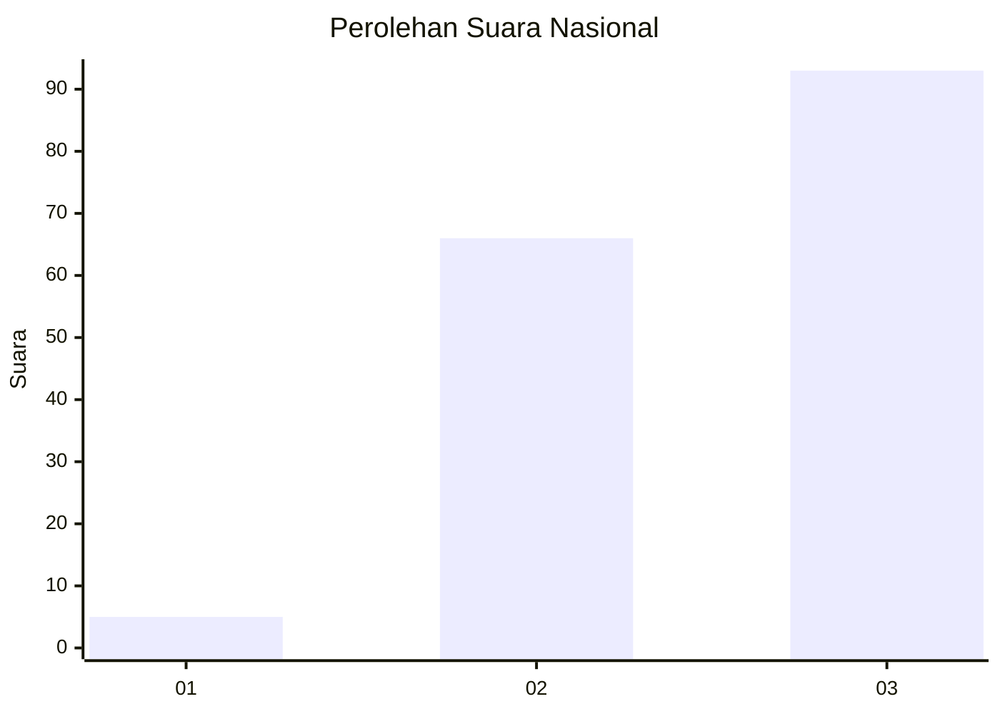
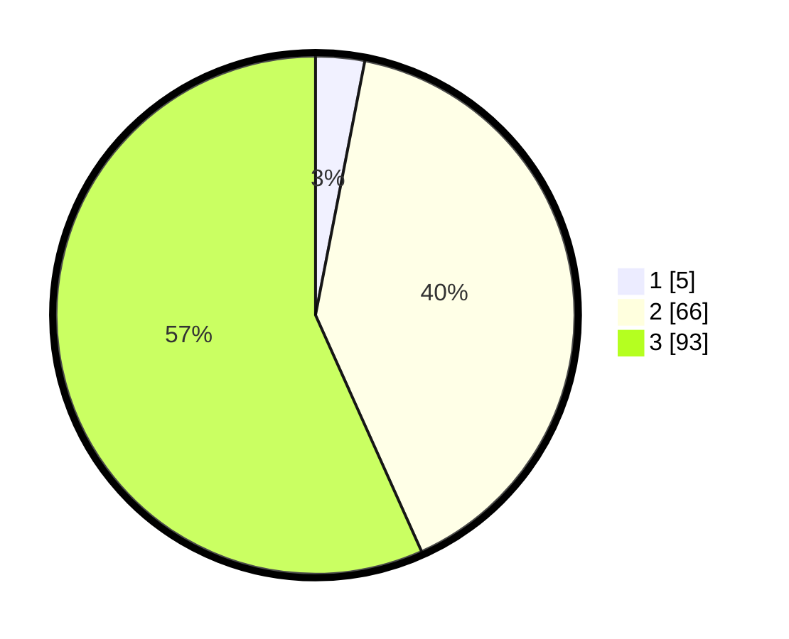

# Hasil

## Grafik

## Tabel

| No. | Nama Paslon    | Suara | Suara (raw) | Persentase |
|:--- |:-------------- | -----:| -----------:| ----------:|
| 1   | ANIES MUHAIMIN | 5     | [5][p-1]    | 3,05       |
| 2   | PRABOWO GIBRAN | 66    | [66][p-2]   | 40,24      |
| 3   | GANJAR MAHFUD  | 93    | [93][p-3]   | 56,71      |

[p-1]: https://github.com/gigit-pemilu/pemilu-2024/blob/main/pilpres/hitung-suara/sub/91-papua/sub/03-jayapura/sub/02-sentani-timur/sub/2004-asei-besar/sub/001-tps/sub/paslon-1.txt
[p-2]: https://github.com/gigit-pemilu/pemilu-2024/blob/main/pilpres/hitung-suara/sub/91-papua/sub/03-jayapura/sub/02-sentani-timur/sub/2004-asei-besar/sub/001-tps/sub/paslon-2.txt
[p-3]: https://github.com/gigit-pemilu/pemilu-2024/blob/main/pilpres/hitung-suara/sub/91-papua/sub/03-jayapura/sub/02-sentani-timur/sub/2004-asei-besar/sub/001-tps/sub/paslon-3.txt

## Foto C Plano

https://sirekap-obj-formc.kpu.go.id/afb4/pemilu/ppwp/91/03/02/20/04/9103022004001-20240227-133937--8b1f4cee-7026-46c6-b749-06466698f284.jpg

https://sirekap-obj-formc.kpu.go.id/afb4/pemilu/ppwp/91/03/02/20/04/9103022004001-20240227-134016--180d61e2-aeb3-41dc-a224-4c8b7601d6dd.jpg

https://sirekap-obj-formc.kpu.go.id/afb4/pemilu/ppwp/91/03/02/20/04/9103022004001-20240227-134117--51bccba0-bd16-47bf-8924-51c96f3200a0.jpg

## Metadata

| Key        | Value               |
| ---------- | ------------------- |
| Time Stamp | 2024-02-28 11:00:00 |

