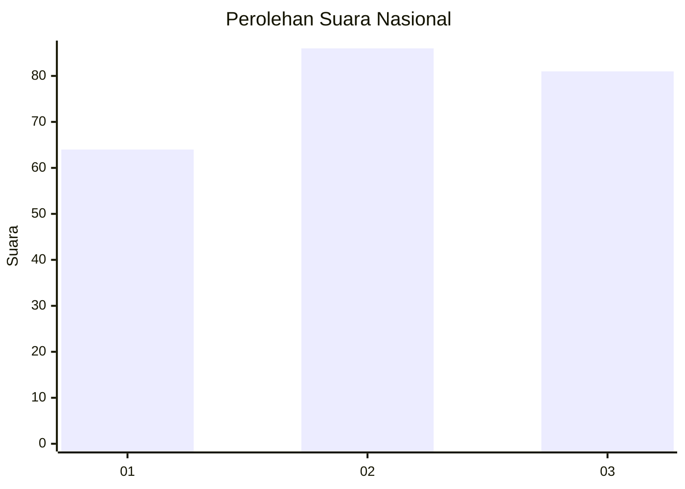
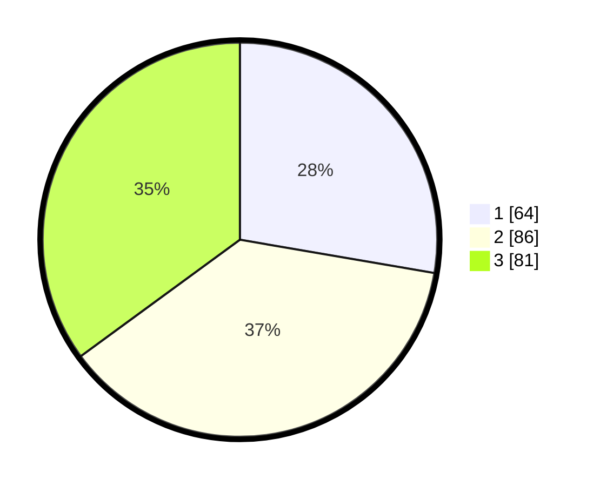

# Hasil

## Grafik

## Tabel

| No. | Nama Paslon    | Suara | Suara (raw) | Persentase |
|:--- |:-------------- | -----:| -----------:| ----------:|
| 1   | ANIES MUHAIMIN | 64    | [64][p-1]   | 27,71      |
| 2   | PRABOWO GIBRAN | 86    | [86][p-2]   | 37,23      |
| 3   | GANJAR MAHFUD  | 81    | [81][p-3]   | 35,06      |

[p-1]: https://github.com/gigit-pemilu/pemilu-2024/blob/main/pilpres/hitung-suara/sub/91-papua/sub/03-jayapura/sub/02-sentani-timur/sub/3007-desa-adat-yokiwa/sub/001-tps/sub/paslon-1.txt
[p-2]: https://github.com/gigit-pemilu/pemilu-2024/blob/main/pilpres/hitung-suara/sub/91-papua/sub/03-jayapura/sub/02-sentani-timur/sub/3007-desa-adat-yokiwa/sub/001-tps/sub/paslon-2.txt
[p-3]: https://github.com/gigit-pemilu/pemilu-2024/blob/main/pilpres/hitung-suara/sub/91-papua/sub/03-jayapura/sub/02-sentani-timur/sub/3007-desa-adat-yokiwa/sub/001-tps/sub/paslon-3.txt

## Foto C Plano

https://sirekap-obj-formc.kpu.go.id/66d3/pemilu/ppwp/91/03/02/30/07/9103023007001-20240215-040742--8adf30e9-7e26-413d-8981-703933ca3016.jpg

https://sirekap-obj-formc.kpu.go.id/66d3/pemilu/ppwp/91/03/02/30/07/9103023007001-20240215-041310--8eaf048a-9fd7-4375-81ea-b857f549c290.jpg

https://sirekap-obj-formc.kpu.go.id/66d3/pemilu/ppwp/91/03/02/30/07/9103023007001-20240215-042201--c652e5cd-b940-4eda-b5df-a423b9cc9a32.jpg

## Metadata

| Key        | Value               |
| ---------- | ------------------- |
| Time Stamp | 2024-02-25 11:00:00 |

