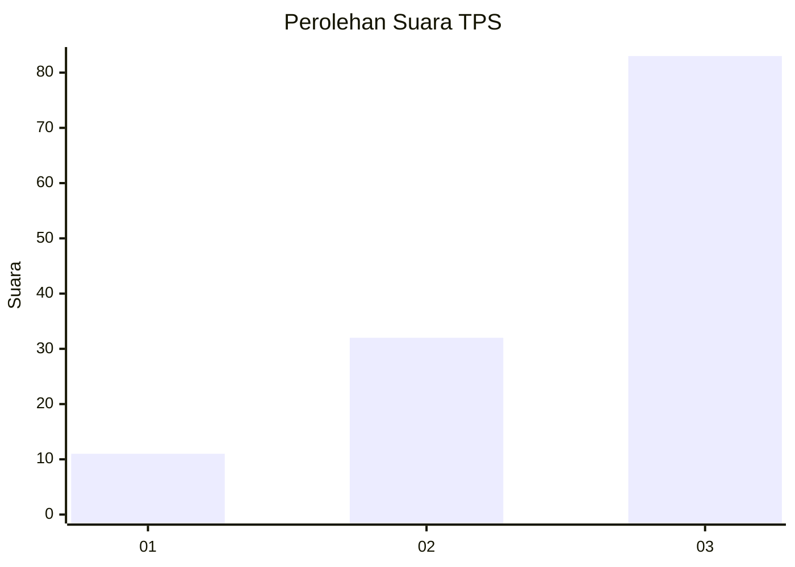
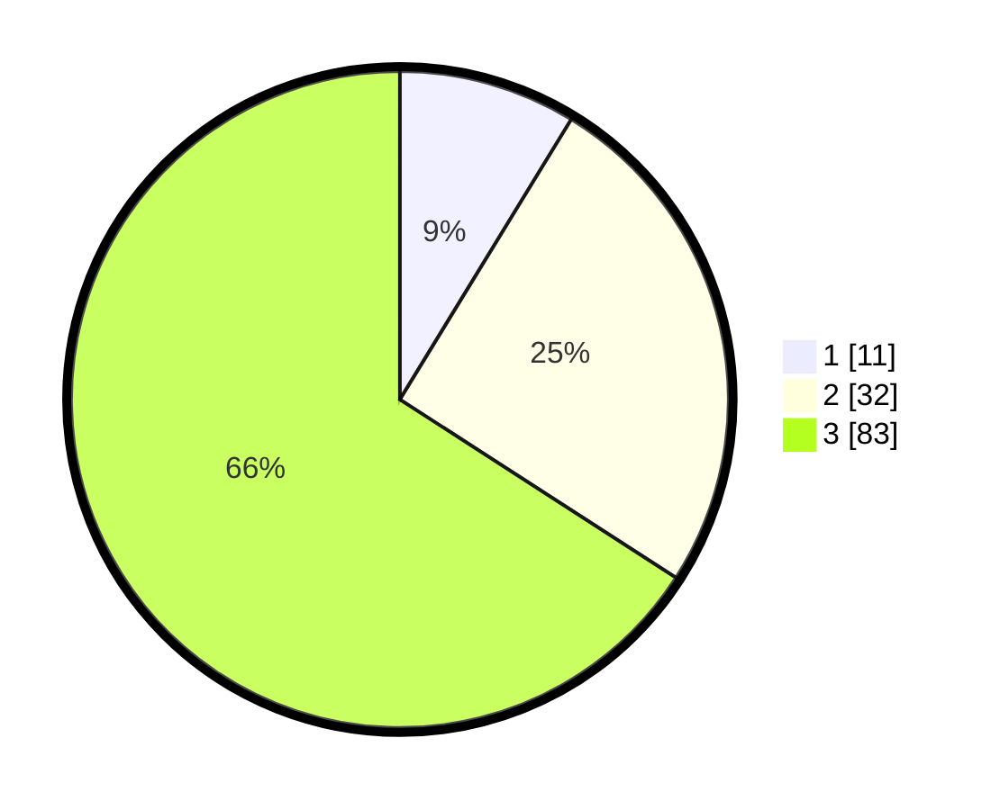

# Hasil

## Grafik

## Tabel

| No. | Nama Paslon    | Suara | Suara (raw) | Persentase |
|:--- |:-------------- | -----:| -----------:| ----------:|
| 1   | ANIES MUHAIMIN | 11    | [11][p-1]   | 8,73       |
| 2   | PRABOWO GIBRAN | 32    | [32][p-2]   | 25,40      |
| 3   | GANJAR MAHFUD  | 83    | [83][p-3]   | 65,87      |

[p-1]: https://github.com/gigit-pemilu/pemilu-2024-91-papua/blob/main/pilpres/hitung-suara/sub/91-papua/sub/03-jayapura/sub/05-kemtuk/sub/2001-sama/sub/002-tps/sub/paslon-1.txt
[p-2]: https://github.com/gigit-pemilu/pemilu-2024-91-papua/blob/main/pilpres/hitung-suara/sub/91-papua/sub/03-jayapura/sub/05-kemtuk/sub/2001-sama/sub/002-tps/sub/paslon-2.txt
[p-3]: https://github.com/gigit-pemilu/pemilu-2024-91-papua/blob/main/pilpres/hitung-suara/sub/91-papua/sub/03-jayapura/sub/05-kemtuk/sub/2001-sama/sub/002-tps/sub/paslon-3.txt

## Foto C Plano

https://sirekap-obj-formc.kpu.go.id/98ad/pemilu/ppwp/91/03/05/20/01/9103052001002-20240224-023645--d5181c6b-626c-408c-b45c-818517542283.jpg

https://sirekap-obj-formc.kpu.go.id/98ad/pemilu/ppwp/91/03/05/20/01/9103052001002-20240224-024106--6d50834f-6f0b-48ed-8f96-0e181f37240c.jpg

https://sirekap-obj-formc.kpu.go.id/98ad/pemilu/ppwp/91/03/05/20/01/9103052001002-20240224-023919--5c96bc45-10aa-429b-90e0-6f7bfd052977.jpg

## Metadata

| Key        | Value               |
| ---------- | ------------------- |
| Time Stamp | 2024-02-25 11:00:00 |

## DATA PEMILIH TETAP

Jumlah pemilih dalam DPT: **170**.
 * L: **88**.
 * P: **82**.

## DATA PENGGUNA HAK PILIH

Jumlah pengguna hak pilih dalam DPT: **128**.
 * L: **65**.
 * P: **63**.

Jumlah pengguna hak pilih dalam DPTb: **0**.
 * L: **0**.
 * P: **0**.

Jumlah pengguna hak pilih dalam DPK: **1**.
 * L: **0**.
 * P: **1**.

Jumlah pengguna hak pilih: **129**.
 * L: **65**.
 * P: **64**.

## JUMLAH SUARA SAH DAN TIDAK SAH

JUMLAH SELURUH SUARA SAH: **126**.

JUMLAH SUARA TIDAK SAH: **3**.

JUMLAH SELURUH SUARA SAH DAN SUARA TIDAK SAH: **129**.

