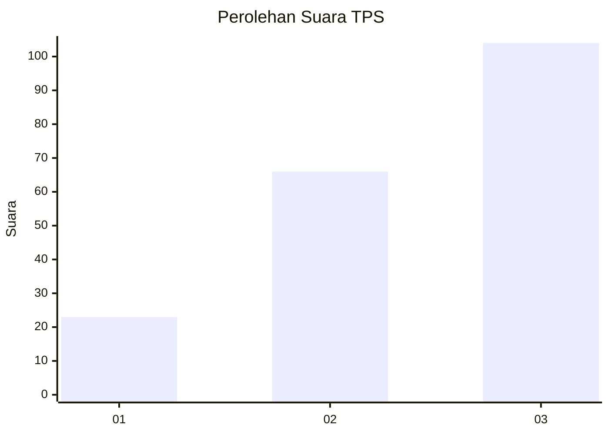
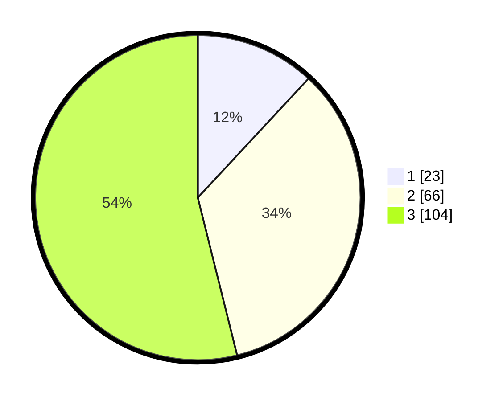

# Hasil

## Grafik

## Tabel

| No. | Nama Paslon    | Suara | Suara (raw) | Persentase |
|:--- |:-------------- | -----:| -----------:| ----------:|
| 1   | ANIES MUHAIMIN | 23    | [23][p-1]   | 11,92      |
| 2   | PRABOWO GIBRAN | 66    | [66][p-2]   | 34,20      |
| 3   | GANJAR MAHFUD  | 104   | [104][p-3]  | 53,89      |

[p-1]: https://github.com/gigit-pemilu/pemilu-2024-91-papua/blob/main/pilpres/hitung-suara/sub/91-papua/sub/03-jayapura/sub/05-kemtuk/sub/2002-manda-yawan/sub/001-tps/sub/paslon-1.txt
[p-2]: https://github.com/gigit-pemilu/pemilu-2024-91-papua/blob/main/pilpres/hitung-suara/sub/91-papua/sub/03-jayapura/sub/05-kemtuk/sub/2002-manda-yawan/sub/001-tps/sub/paslon-2.txt
[p-3]: https://github.com/gigit-pemilu/pemilu-2024-91-papua/blob/main/pilpres/hitung-suara/sub/91-papua/sub/03-jayapura/sub/05-kemtuk/sub/2002-manda-yawan/sub/001-tps/sub/paslon-3.txt

## Foto C Plano

https://sirekap-obj-formc.kpu.go.id/0e71/pemilu/ppwp/91/03/05/20/02/9103052002001-20240227-142901--94b5bd58-0af9-4274-84ab-316de18dc676.jpg

https://sirekap-obj-formc.kpu.go.id/0e71/pemilu/ppwp/91/03/05/20/02/9103052002001-20240227-143446--b925d8fa-4a88-4747-af8c-e73997a3c4bb.jpg

https://sirekap-obj-formc.kpu.go.id/0e71/pemilu/ppwp/91/03/05/20/02/9103052002001-20240227-143726--2e00dbab-c4ec-425b-b1fe-2f8e95c9b1f2.jpg

## Metadata

| Key        | Value               |
| ---------- | ------------------- |
| Time Stamp | 2024-02-28 11:00:00 |

