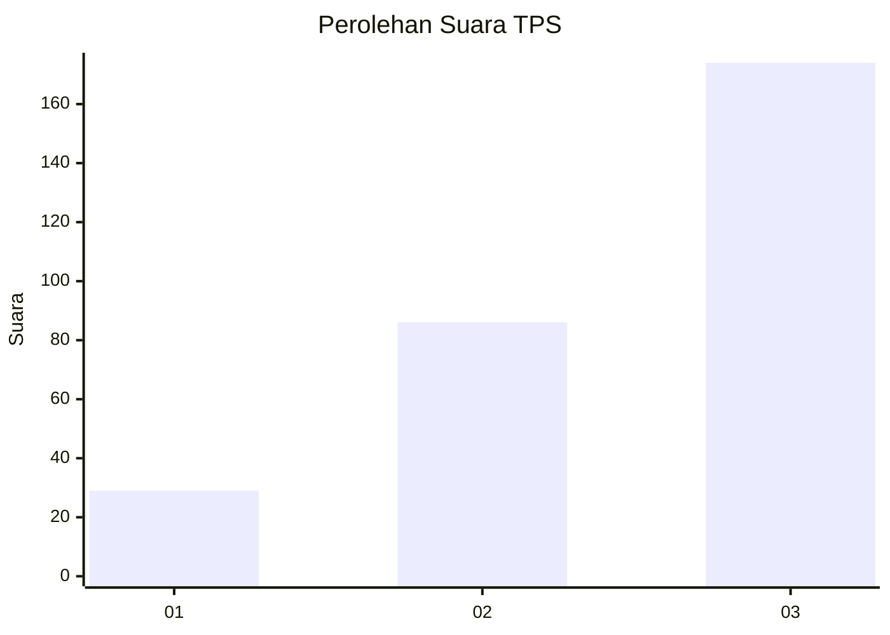
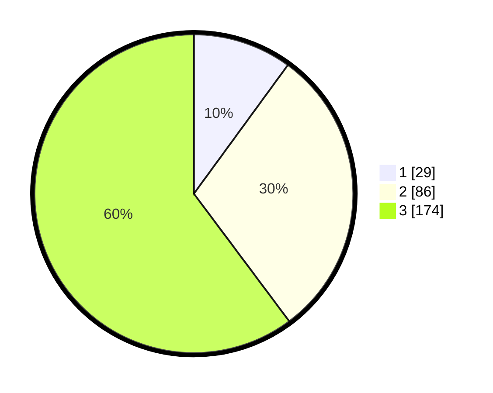

# Hasil

## Grafik

## Tabel

| No. | Nama Paslon    | Suara | Suara (raw) | Persentase |
|:--- |:-------------- | -----:| -----------:| ----------:|
| 1   | ANIES MUHAIMIN | 29    | [29][p-1]   | 10,03      |
| 2   | PRABOWO GIBRAN | 86    | [86][p-2]   | 29,76      |
| 3   | GANJAR MAHFUD  | 174   | [174][p-3]  | 60,21      |

[p-1]: https://github.com/gigit-pemilu/pemilu-2024-91-papua/blob/main/pilpres/hitung-suara/sub/91-papua/sub/03-jayapura/sub/05-kemtuk/sub/2004-mamei/sub/001-tps/sub/paslon-1.txt
[p-2]: https://github.com/gigit-pemilu/pemilu-2024-91-papua/blob/main/pilpres/hitung-suara/sub/91-papua/sub/03-jayapura/sub/05-kemtuk/sub/2004-mamei/sub/001-tps/sub/paslon-2.txt
[p-3]: https://github.com/gigit-pemilu/pemilu-2024-91-papua/blob/main/pilpres/hitung-suara/sub/91-papua/sub/03-jayapura/sub/05-kemtuk/sub/2004-mamei/sub/001-tps/sub/paslon-3.txt

## Foto C Plano

https://sirekap-obj-formc.kpu.go.id/f025/pemilu/ppwp/91/03/05/20/04/9103052004001-20240223-154750--feafb534-b0a9-4ca3-913f-580aae6f06d9.jpg

https://sirekap-obj-formc.kpu.go.id/f025/pemilu/ppwp/91/03/05/20/04/9103052004001-20240223-155310--76d27c8f-17c2-43ca-bc94-52b076f9809c.jpg

https://sirekap-obj-formc.kpu.go.id/f025/pemilu/ppwp/91/03/05/20/04/9103052004001-20240226-121712--ada4664a-4e93-4225-aeae-2e0f0618ca52.jpg

## Metadata

| Key        | Value               |
| ---------- | ------------------- |
| Time Stamp | 2024-02-26 23:00:00 |

