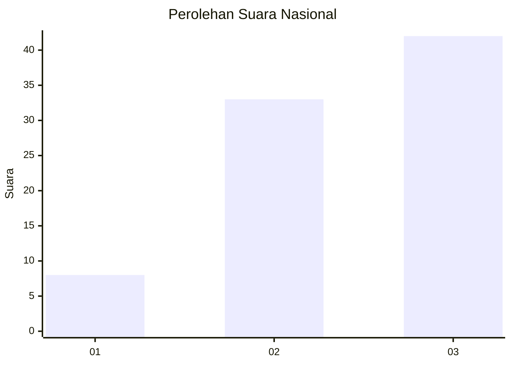
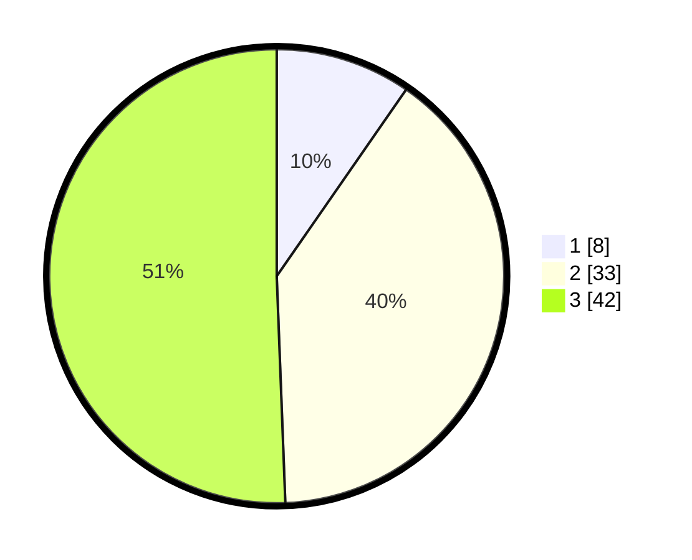

# Hasil

## Grafik

## Tabel

| No. | Nama Paslon    | Suara | Suara (raw) | Persentase |
|:--- |:-------------- | -----:| -----------:| ----------:|
| 1   | ANIES MUHAIMIN | 8     | [8][p-1]    | 9,64       |
| 2   | PRABOWO GIBRAN | 33    | [33][p-2]   | 39,76      |
| 3   | GANJAR MAHFUD  | 42    | [42][p-3]   | 50,60      |

[p-1]: https://github.com/gigit-pemilu/pemilu-2024/blob/main/pilpres/hitung-suara/sub/91-papua/sub/03-jayapura/sub/06-kemtuk-gresi/sub/1015-hatib/sub/001-tps/sub/paslon-1.txt
[p-2]: https://github.com/gigit-pemilu/pemilu-2024/blob/main/pilpres/hitung-suara/sub/91-papua/sub/03-jayapura/sub/06-kemtuk-gresi/sub/1015-hatib/sub/001-tps/sub/paslon-2.txt
[p-3]: https://github.com/gigit-pemilu/pemilu-2024/blob/main/pilpres/hitung-suara/sub/91-papua/sub/03-jayapura/sub/06-kemtuk-gresi/sub/1015-hatib/sub/001-tps/sub/paslon-3.txt

## Foto C Plano

https://sirekap-obj-formc.kpu.go.id/3451/pemilu/ppwp/91/03/06/10/15/9103061015001-20240223-145510--480f629f-9d23-44f0-9c96-e4b7e04138e4.jpg

https://sirekap-obj-formc.kpu.go.id/3451/pemilu/ppwp/91/03/06/10/15/9103061015001-20240223-150219--ad21c82e-f7fd-4b7d-b1e5-24b0b5f70de1.jpg

https://sirekap-obj-formc.kpu.go.id/3451/pemilu/ppwp/91/03/06/10/15/9103061015001-20240223-150409--2b9e27da-8f3c-44f9-99c9-624a4a29b7d2.jpg

## Metadata

| Key        | Value               |
| ---------- | ------------------- |
| Time Stamp | 2024-02-24 22:31:28 |

## DATA PEMILIH TETAP

Jumlah pemilih dalam DPT: **88**.
 * L: **44**.
 * P: **44**.

## DATA PENGGUNA HAK PILIH

Jumlah pengguna hak pilih dalam DPT: **86**.
 * L: **44**.
 * P: **42**.

Jumlah pengguna hak pilih dalam DPTb: **0**.
 * L: **0**.
 * P: **0**.

Jumlah pengguna hak pilih dalam DPK: **0**.
 * L: **0**.
 * P: **0**.

Jumlah pengguna hak pilih: **86**.
 * L: **44**.
 * P: **42**.

## JUMLAH SUARA SAH DAN TIDAK SAH

JUMLAH SELURUH SUARA SAH: **83**.

JUMLAH SUARA TIDAK SAH: **3**.

JUMLAH SELURUH SUARA SAH DAN SUARA TIDAK SAH: **86**.

