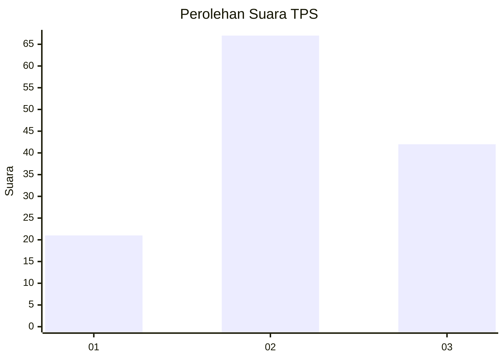
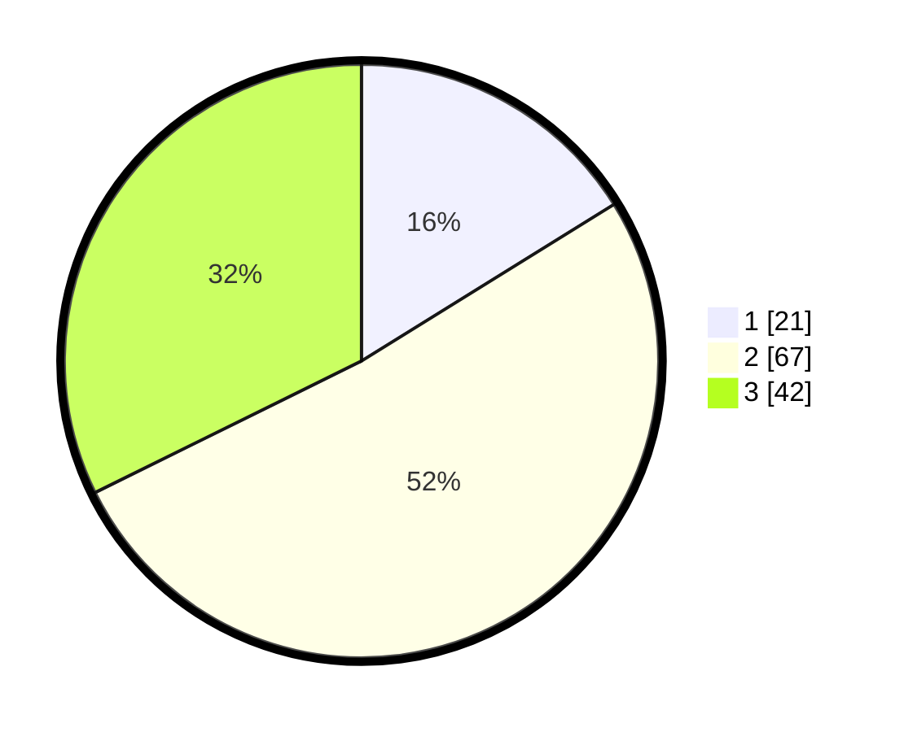

# Hasil

## Grafik

## Tabel

| No. | Nama Paslon    | Suara | Suara (raw) | Persentase |
|:--- |:-------------- | -----:| -----------:| ----------:|
| 1   | ANIES MUHAIMIN | 21    | [21][p-1]   | 16,15      |
| 2   | PRABOWO GIBRAN | 67    | [67][p-2]   | 51,54      |
| 3   | GANJAR MAHFUD  | 42    | [42][p-3]   | 32,31      |

[p-1]: https://github.com/gigit-pemilu/pemilu-2024-91-papua/blob/main/pilpres/hitung-suara/sub/91-papua/sub/03-jayapura/sub/06-kemtuk-gresi/sub/1015-hatib/sub/002-tps/sub/paslon-1.txt
[p-2]: https://github.com/gigit-pemilu/pemilu-2024-91-papua/blob/main/pilpres/hitung-suara/sub/91-papua/sub/03-jayapura/sub/06-kemtuk-gresi/sub/1015-hatib/sub/002-tps/sub/paslon-2.txt
[p-3]: https://github.com/gigit-pemilu/pemilu-2024-91-papua/blob/main/pilpres/hitung-suara/sub/91-papua/sub/03-jayapura/sub/06-kemtuk-gresi/sub/1015-hatib/sub/002-tps/sub/paslon-3.txt

## Foto C Plano

https://sirekap-obj-formc.kpu.go.id/a495/pemilu/ppwp/91/03/06/10/15/9103061015002-20240223-155005--529f90c9-1e9b-4ce5-8ed3-3c3e2d2fe8f0.jpg

https://sirekap-obj-formc.kpu.go.id/a495/pemilu/ppwp/91/03/06/10/15/9103061015002-20240223-161935--8560cc97-d64a-47b7-81cb-71782ce24c54.jpg

https://sirekap-obj-formc.kpu.go.id/a495/pemilu/ppwp/91/03/06/10/15/9103061015002-20240223-163635--3b72165f-94c2-4e4f-932c-3fe31b9151e3.jpg

## Metadata

| Key        | Value               |
| ---------- | ------------------- |
| Time Stamp | 2024-02-24 22:31:28 |

## DATA PEMILIH TETAP

Jumlah pemilih dalam DPT: **240**.
 * L: **129**.
 * P: **111**.

## DATA PENGGUNA HAK PILIH

Jumlah pengguna hak pilih dalam DPT: **133**.
 * L: **73**.
 * P: **60**.

Jumlah pengguna hak pilih dalam DPTb: **0**.
 * L: **0**.
 * P: **0**.

Jumlah pengguna hak pilih dalam DPK: **0**.
 * L: **0**.
 * P: **0**.

Jumlah pengguna hak pilih: **133**.
 * L: **73**.
 * P: **60**.

## JUMLAH SUARA SAH DAN TIDAK SAH

JUMLAH SELURUH SUARA SAH: **132**.

JUMLAH SUARA TIDAK SAH: **1**.

JUMLAH SELURUH SUARA SAH DAN SUARA TIDAK SAH: **133**.

