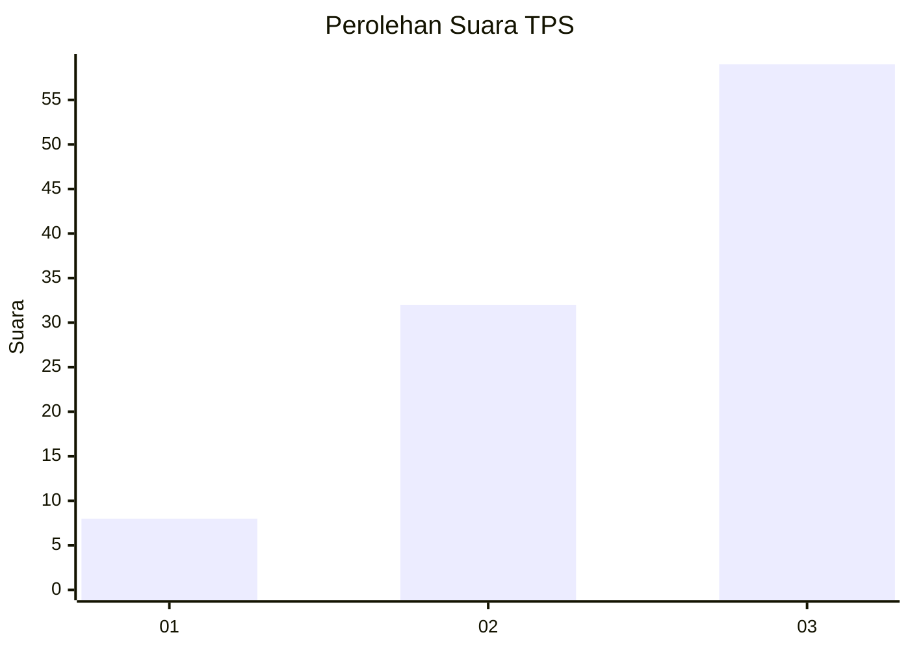
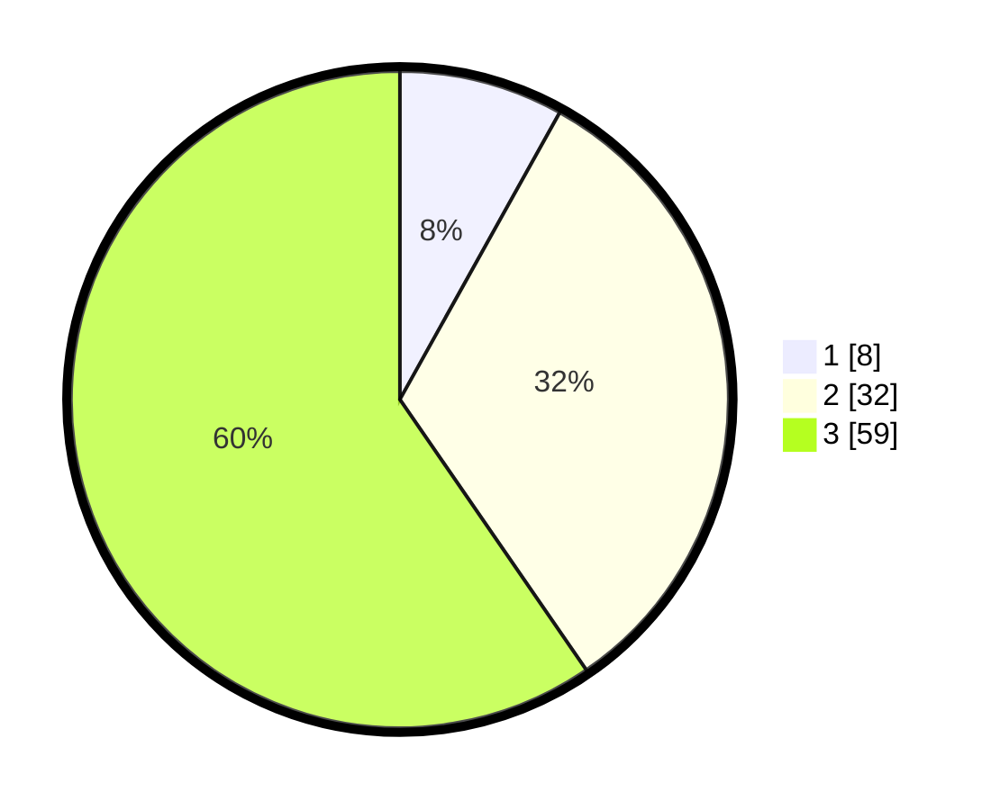

# Hasil

## Grafik

## Tabel

| No. | Nama Paslon    | Suara | Suara (raw) | Persentase |
|:--- |:-------------- | -----:| -----------:| ----------:|
| 1   | ANIES MUHAIMIN | 8     | [8][p-1]    | 8,08       |
| 2   | PRABOWO GIBRAN | 32    | [32][p-2]   | 32,32      |
| 3   | GANJAR MAHFUD  | 59    | [59][p-3]   | 59,60      |

[p-1]: https://github.com/gigit-pemilu/pemilu-2024-91-papua/blob/main/pilpres/hitung-suara/sub/91-papua/sub/03-jayapura/sub/06-kemtuk-gresi/sub/2001-domoikati/sub/002-tps/sub/paslon-1.txt
[p-2]: https://github.com/gigit-pemilu/pemilu-2024-91-papua/blob/main/pilpres/hitung-suara/sub/91-papua/sub/03-jayapura/sub/06-kemtuk-gresi/sub/2001-domoikati/sub/002-tps/sub/paslon-2.txt
[p-3]: https://github.com/gigit-pemilu/pemilu-2024-91-papua/blob/main/pilpres/hitung-suara/sub/91-papua/sub/03-jayapura/sub/06-kemtuk-gresi/sub/2001-domoikati/sub/002-tps/sub/paslon-3.txt

## Foto C Plano

https://sirekap-obj-formc.kpu.go.id/3764/pemilu/ppwp/91/03/06/20/01/9103062001002-20240226-093651--0d4575b6-4679-4f9d-957a-45111edc993c.jpg

https://sirekap-obj-formc.kpu.go.id/3764/pemilu/ppwp/91/03/06/20/01/9103062001002-20240226-094031--7d2bf9cf-6878-4ffc-9171-8d9a6968eea5.jpg

https://sirekap-obj-formc.kpu.go.id/3764/pemilu/ppwp/91/03/06/20/01/9103062001002-20240226-094246--ef402a73-4249-4161-b66d-8009217c6e42.jpg

## Metadata

| Key        | Value               |
| ---------- | ------------------- |
| Time Stamp | 2024-02-26 10:00:00 |

## DATA PEMILIH TETAP

Jumlah pemilih dalam DPT: **153**.
 * L: **78**.
 * P: **75**.

## DATA PENGGUNA HAK PILIH

Jumlah pengguna hak pilih dalam DPT: **99**.
 * L: **46**.
 * P: **53**.

Jumlah pengguna hak pilih dalam DPTb: **0**.
 * L: **0**.
 * P: **0**.

Jumlah pengguna hak pilih dalam DPK: **0**.
 * L: **0**.
 * P: **0**.

Jumlah pengguna hak pilih: **99**.
 * L: **46**.
 * P: **53**.

## JUMLAH SUARA SAH DAN TIDAK SAH

JUMLAH SELURUH SUARA SAH: **99**.

JUMLAH SUARA TIDAK SAH: **0**.

JUMLAH SELURUH SUARA SAH DAN SUARA TIDAK SAH: **99**.

