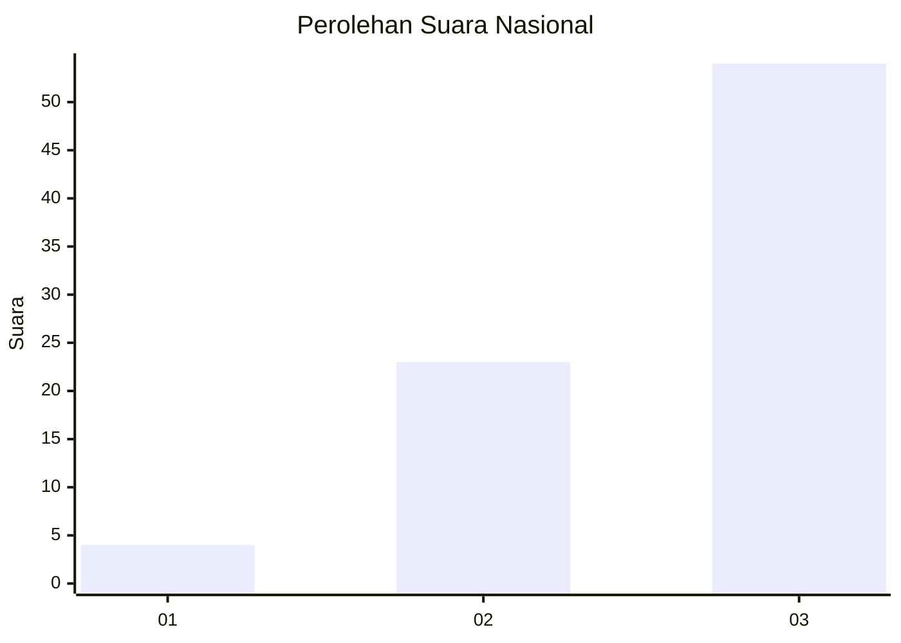
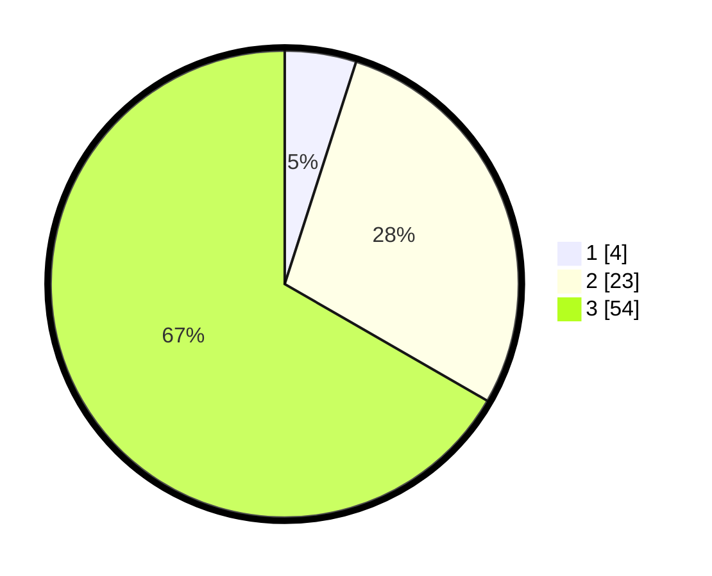

# Hasil

## Grafik

## Tabel

| No. | Nama Paslon    | Suara | Suara (raw) | Persentase |
|:--- |:-------------- | -----:| -----------:| ----------:|
| 1   | ANIES MUHAIMIN | 4     | [4][p-1]    | 4,94       |
| 2   | PRABOWO GIBRAN | 23    | [23][p-2]   | 28,40      |
| 3   | GANJAR MAHFUD  | 54    | [54][p-3]   | 66,67      |

[p-1]: https://github.com/gigit-pemilu/pemilu-2024/blob/main/pilpres/hitung-suara/sub/91-papua/sub/03-jayapura/sub/06-kemtuk-gresi/sub/2002-dementin/sub/001-tps/sub/paslon-1.txt
[p-2]: https://github.com/gigit-pemilu/pemilu-2024/blob/main/pilpres/hitung-suara/sub/91-papua/sub/03-jayapura/sub/06-kemtuk-gresi/sub/2002-dementin/sub/001-tps/sub/paslon-2.txt
[p-3]: https://github.com/gigit-pemilu/pemilu-2024/blob/main/pilpres/hitung-suara/sub/91-papua/sub/03-jayapura/sub/06-kemtuk-gresi/sub/2002-dementin/sub/001-tps/sub/paslon-3.txt

## Foto C Plano

https://sirekap-obj-formc.kpu.go.id/aa23/pemilu/ppwp/91/03/06/20/02/9103062002001-20240224-101709--908e04c6-79d7-4fc9-92af-60496ff4e788.jpg

https://sirekap-obj-formc.kpu.go.id/aa23/pemilu/ppwp/91/03/06/20/02/9103062002001-20240224-102108--b9efee7f-b343-448a-81de-bafb68abdb99.jpg

https://sirekap-obj-formc.kpu.go.id/aa23/pemilu/ppwp/91/03/06/20/02/9103062002001-20240224-102318--897ac04a-13a9-4935-82dd-c02e61e3f524.jpg

## Metadata

| Key        | Value               |
| ---------- | ------------------- |
| Time Stamp | 2024-02-24 22:31:28 |

## DATA PEMILIH TETAP

Jumlah pemilih dalam DPT: **83**.
 * L: **36**.
 * P: **47**.

## DATA PENGGUNA HAK PILIH

Jumlah pengguna hak pilih dalam DPT: **83**.
 * L: **36**.
 * P: **47**.

Jumlah pengguna hak pilih dalam DPTb: **0**.
 * L: **0**.
 * P: **0**.

Jumlah pengguna hak pilih dalam DPK: **0**.
 * L: **0**.
 * P: **0**.

Jumlah pengguna hak pilih: **82**.
 * L: **36**.
 * P: **46**.

## JUMLAH SUARA SAH DAN TIDAK SAH

JUMLAH SELURUH SUARA SAH: **81**.

JUMLAH SUARA TIDAK SAH: **1**.

JUMLAH SELURUH SUARA SAH DAN SUARA TIDAK SAH: **82**.

