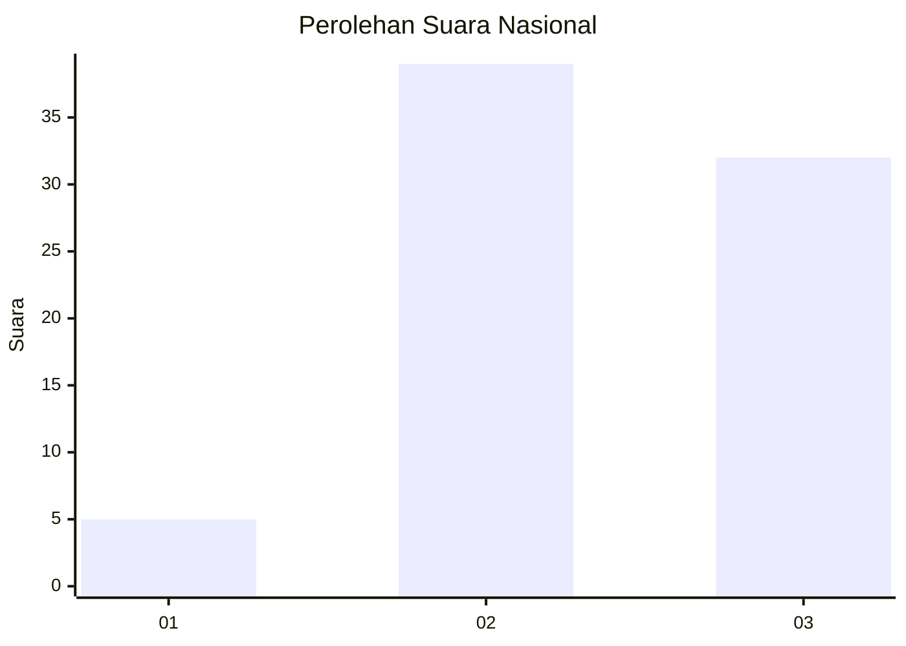
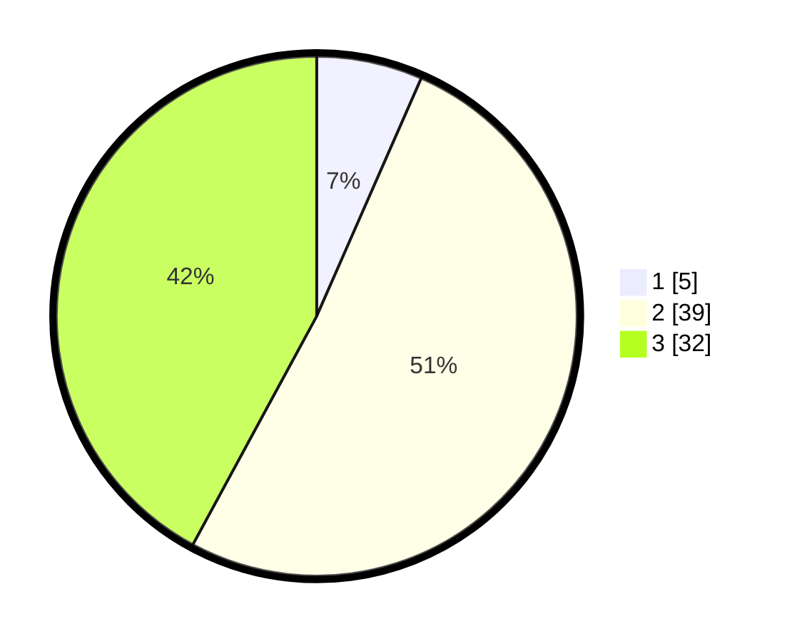

# Hasil

## Grafik

## Tabel

| No. | Nama Paslon    | Suara | Suara (raw) | Persentase |
|:--- |:-------------- | -----:| -----------:| ----------:|
| 1   | ANIES MUHAIMIN | 5     | [5][p-1]    | 6,58       |
| 2   | PRABOWO GIBRAN | 39    | [39][p-2]   | 51,32      |
| 3   | GANJAR MAHFUD  | 32    | [32][p-3]   | 42,11      |

[p-1]: https://github.com/gigit-pemilu/pemilu-2024/blob/main/pilpres/hitung-suara/sub/91-papua/sub/03-jayapura/sub/07-nimboran/sub/2001-gemebs/sub/002-tps/sub/paslon-1.txt
[p-2]: https://github.com/gigit-pemilu/pemilu-2024/blob/main/pilpres/hitung-suara/sub/91-papua/sub/03-jayapura/sub/07-nimboran/sub/2001-gemebs/sub/002-tps/sub/paslon-2.txt
[p-3]: https://github.com/gigit-pemilu/pemilu-2024/blob/main/pilpres/hitung-suara/sub/91-papua/sub/03-jayapura/sub/07-nimboran/sub/2001-gemebs/sub/002-tps/sub/paslon-3.txt

## Foto C Plano

https://sirekap-obj-formc.kpu.go.id/b244/pemilu/ppwp/91/03/07/20/01/9103072001002-20240219-154259--fbf978a0-683f-440a-a20e-b5d63b117125.jpg

https://sirekap-obj-formc.kpu.go.id/b244/pemilu/ppwp/91/03/07/20/01/9103072001002-20240219-154301--293cdd9d-25ea-4e2c-84b0-6628089f7cf4.jpg

https://sirekap-obj-formc.kpu.go.id/b244/pemilu/ppwp/91/03/07/20/01/9103072001002-20240219-154300--e00b34c6-2a09-49ce-ba87-0852cc5c4fcf.jpg

## Metadata

| Key        | Value               |
| ---------- | ------------------- |
| Time Stamp | 2024-02-21 16:00:00 |

## DATA PEMILIH TETAP

Jumlah pemilih dalam DPT: **109**.
 * L: **76**.
 * P: **33**.

## DATA PENGGUNA HAK PILIH

Jumlah pengguna hak pilih dalam DPT: **63**.
 * L: **36**.
 * P: **27**.

Jumlah pengguna hak pilih dalam DPTb: **10**.
 * L: **6**.
 * P: **4**.

Jumlah pengguna hak pilih dalam DPK: **3**.
 * L: **0**.
 * P: **3**.

Jumlah pengguna hak pilih: **76**.
 * L: **42**.
 * P: **34**.

## JUMLAH SUARA SAH DAN TIDAK SAH

JUMLAH SELURUH SUARA SAH: **76**.

JUMLAH SUARA TIDAK SAH: **0**.

JUMLAH SELURUH SUARA SAH DAN SUARA TIDAK SAH: **76**.

