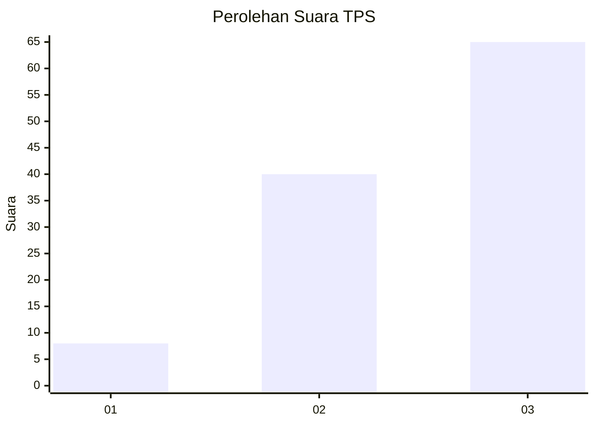
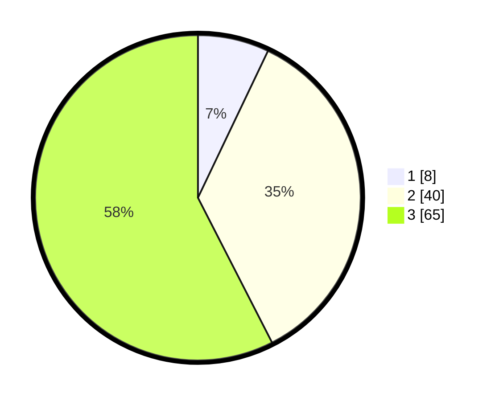

# Hasil

## Grafik

## Tabel

| No. | Nama Paslon    | Suara | Suara (raw) | Persentase |
|:--- |:-------------- | -----:| -----------:| ----------:|
| 1   | ANIES MUHAIMIN | 8     | [8][p-1]    | 7,08       |
| 2   | PRABOWO GIBRAN | 40    | [40][p-2]   | 35,40      |
| 3   | GANJAR MAHFUD  | 65    | [65][p-3]   | 57,52      |

[p-1]: https://github.com/gigit-pemilu/pemilu-2024-91-papua/blob/main/pilpres/hitung-suara/sub/91-papua/sub/03-jayapura/sub/07-nimboran/sub/2017-kuwase/sub/001-tps/sub/paslon-1.txt
[p-2]: https://github.com/gigit-pemilu/pemilu-2024-91-papua/blob/main/pilpres/hitung-suara/sub/91-papua/sub/03-jayapura/sub/07-nimboran/sub/2017-kuwase/sub/001-tps/sub/paslon-2.txt
[p-3]: https://github.com/gigit-pemilu/pemilu-2024-91-papua/blob/main/pilpres/hitung-suara/sub/91-papua/sub/03-jayapura/sub/07-nimboran/sub/2017-kuwase/sub/001-tps/sub/paslon-3.txt

## Foto C Plano

https://sirekap-obj-formc.kpu.go.id/6aa5/pemilu/ppwp/91/03/07/20/17/9103072017001-20240218-183700--27d976e3-9690-4e60-846b-1b18244c9912.jpg

https://sirekap-obj-formc.kpu.go.id/6aa5/pemilu/ppwp/91/03/07/20/17/9103072017001-20240218-182852--77561721-ec13-4406-9061-b394db2e972d.jpg

https://sirekap-obj-formc.kpu.go.id/6aa5/pemilu/ppwp/91/03/07/20/17/9103072017001-20240218-164724--df9e8f8a-b430-404c-b1a2-a39633bd1dd6.jpg

## Metadata

| Key        | Value               |
| ---------- | ------------------- |
| Time Stamp | 2024-02-19 06:16:00 |

