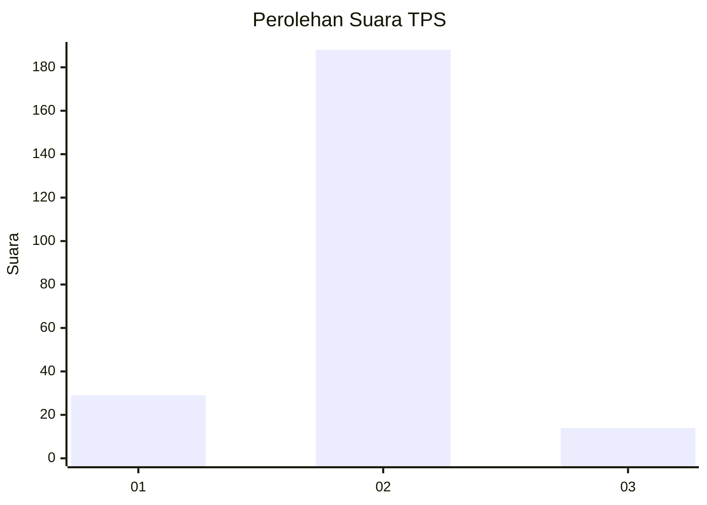
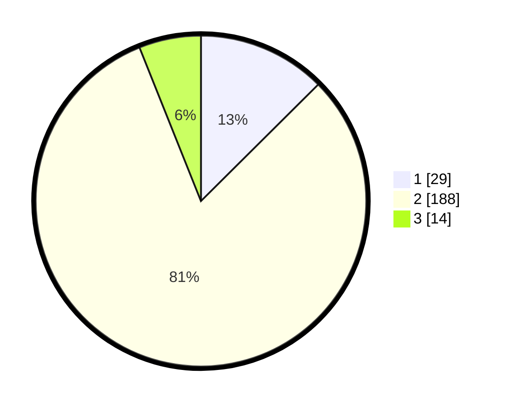

# Hasil

## Grafik

## Tabel

| No. | Nama Paslon    | Suara | Suara (raw) | Persentase |
|:--- |:-------------- | -----:| -----------:| ----------:|
| 1   | ANIES MUHAIMIN | 29    | [29][p-1]   | 12,55      |
| 2   | PRABOWO GIBRAN | 188   | [188][p-2]  | 81,39      |
| 3   | GANJAR MAHFUD  | 14    | [14][p-3]   | 6,06       |

[p-1]: https://github.com/gigit-pemilu/pemilu-2024-91-papua/blob/main/pilpres/hitung-suara/sub/91-papua/sub/03-jayapura/sub/08-nimbokrang/sub/2002-benyom-jaya-i/sub/001-tps/sub/paslon-1.txt
[p-2]: https://github.com/gigit-pemilu/pemilu-2024-91-papua/blob/main/pilpres/hitung-suara/sub/91-papua/sub/03-jayapura/sub/08-nimbokrang/sub/2002-benyom-jaya-i/sub/001-tps/sub/paslon-2.txt
[p-3]: https://github.com/gigit-pemilu/pemilu-2024-91-papua/blob/main/pilpres/hitung-suara/sub/91-papua/sub/03-jayapura/sub/08-nimbokrang/sub/2002-benyom-jaya-i/sub/001-tps/sub/paslon-3.txt

## Foto C Plano

https://sirekap-obj-formc.kpu.go.id/c3bb/pemilu/ppwp/91/03/08/20/02/9103082002001-20240215-010115--69f2d235-b77e-4adf-91cf-00855c40d192.jpg

https://sirekap-obj-formc.kpu.go.id/c3bb/pemilu/ppwp/91/03/08/20/02/9103082002001-20240215-010331--a801a4d6-7ef7-4f63-8029-8d2620c19e7a.jpg

https://sirekap-obj-formc.kpu.go.id/c3bb/pemilu/ppwp/91/03/08/20/02/9103082002001-20240215-024722--fadd1231-c80b-4012-9625-8c702e9bf681.jpg

## Metadata

| Key        | Value               |
| ---------- | ------------------- |
| Time Stamp | 2024-02-24 22:31:28 |

