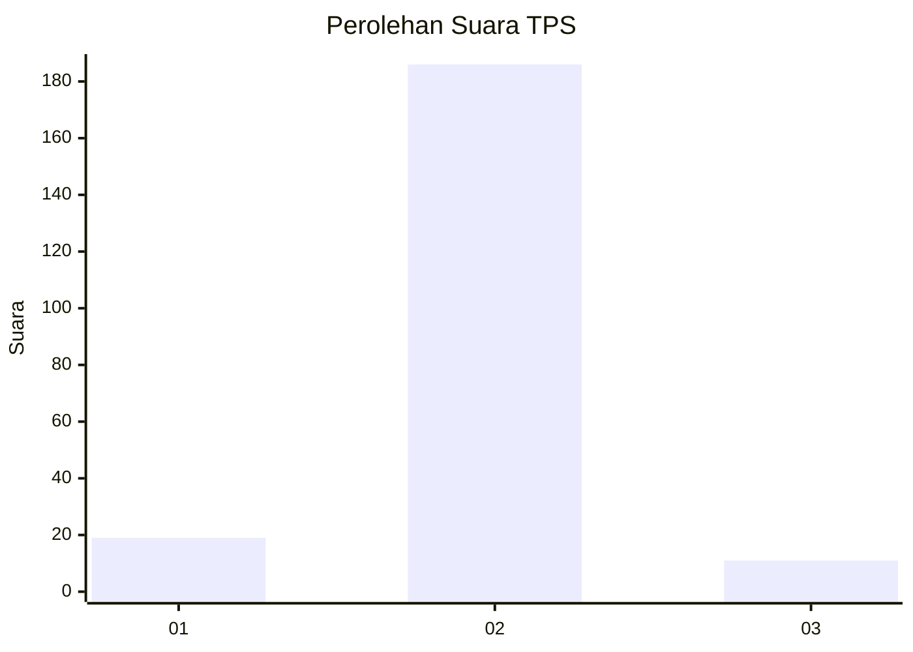
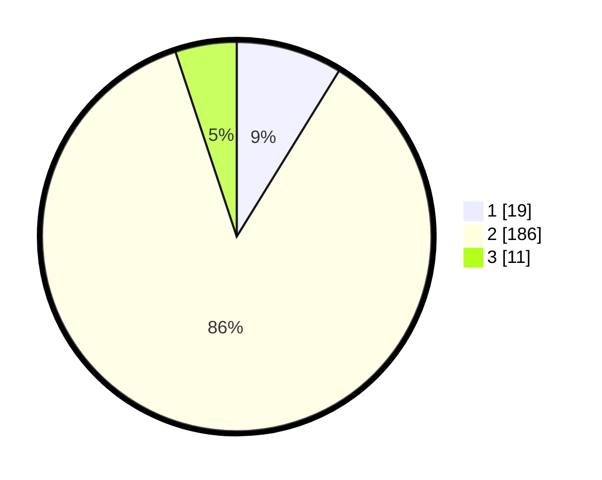

# Hasil

## Grafik

## Tabel

| No. | Nama Paslon    | Suara | Suara (raw) | Persentase |
|:--- |:-------------- | -----:| -----------:| ----------:|
| 1   | ANIES MUHAIMIN | 19    | [19][p-1]   | 8,80       |
| 2   | PRABOWO GIBRAN | 186   | [186][p-2]  | 86,11      |
| 3   | GANJAR MAHFUD  | 11    | [11][p-3]   | 5,09       |

[p-1]: https://github.com/gigit-pemilu/pemilu-2024-91-papua/blob/main/pilpres/hitung-suara/sub/91-papua/sub/03-jayapura/sub/08-nimbokrang/sub/2002-benyom-jaya-i/sub/003-tps/sub/paslon-1.txt
[p-2]: https://github.com/gigit-pemilu/pemilu-2024-91-papua/blob/main/pilpres/hitung-suara/sub/91-papua/sub/03-jayapura/sub/08-nimbokrang/sub/2002-benyom-jaya-i/sub/003-tps/sub/paslon-2.txt
[p-3]: https://github.com/gigit-pemilu/pemilu-2024-91-papua/blob/main/pilpres/hitung-suara/sub/91-papua/sub/03-jayapura/sub/08-nimbokrang/sub/2002-benyom-jaya-i/sub/003-tps/sub/paslon-3.txt

## Foto C Plano

https://sirekap-obj-formc.kpu.go.id/04ea/pemilu/ppwp/91/03/08/20/02/9103082002003-20240215-015734--0b368447-a196-443f-92ef-1f75aafc3a93.jpg

https://sirekap-obj-formc.kpu.go.id/04ea/pemilu/ppwp/91/03/08/20/02/9103082002003-20240215-015842--338266fd-a9d6-48c7-839d-3e256413440e.jpg

https://sirekap-obj-formc.kpu.go.id/04ea/pemilu/ppwp/91/03/08/20/02/9103082002003-20240215-015933--88e459cc-5649-40e5-aae5-3a49ea7bb0b4.jpg

## Metadata

| Key        | Value               |
| ---------- | ------------------- |
| Time Stamp | 2024-02-25 13:00:00 |

