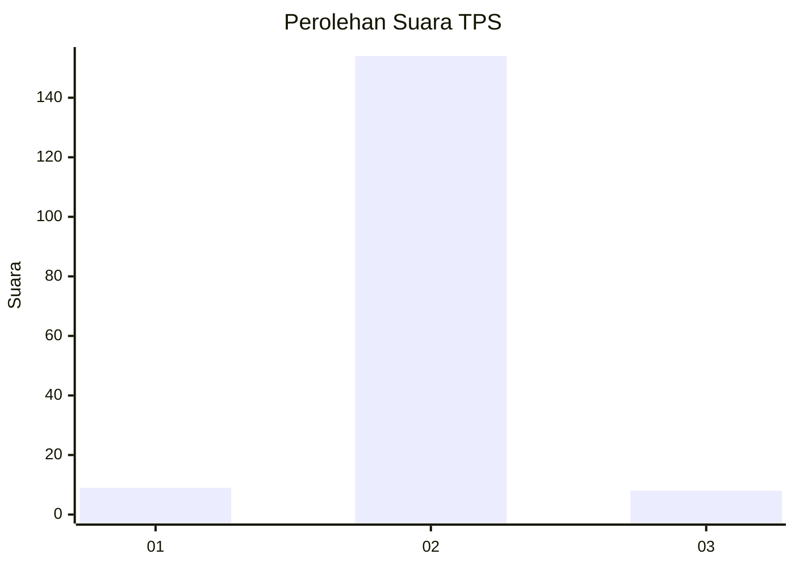
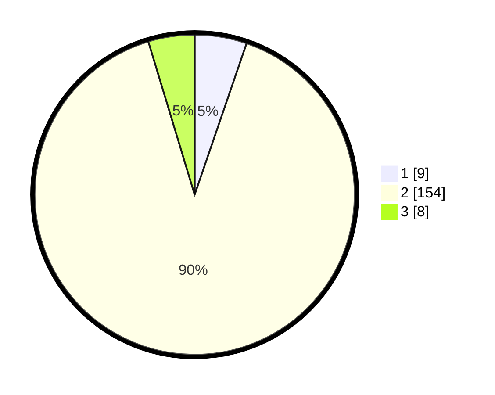

# Hasil

## Grafik

## Tabel

| No. | Nama Paslon    | Suara | Suara (raw) | Persentase |
|:--- |:-------------- | -----:| -----------:| ----------:|
| 1   | ANIES MUHAIMIN | 9     | [9][p-1]    | 5,26       |
| 2   | PRABOWO GIBRAN | 154   | [154][p-2]  | 90,06      |
| 3   | GANJAR MAHFUD  | 8     | [8][p-3]    | 4,68       |

[p-1]: https://github.com/gigit-pemilu/pemilu-2024-91-papua/blob/main/pilpres/hitung-suara/sub/91-papua/sub/03-jayapura/sub/08-nimbokrang/sub/2002-benyom-jaya-i/sub/006-tps/sub/paslon-1.txt
[p-2]: https://github.com/gigit-pemilu/pemilu-2024-91-papua/blob/main/pilpres/hitung-suara/sub/91-papua/sub/03-jayapura/sub/08-nimbokrang/sub/2002-benyom-jaya-i/sub/006-tps/sub/paslon-2.txt
[p-3]: https://github.com/gigit-pemilu/pemilu-2024-91-papua/blob/main/pilpres/hitung-suara/sub/91-papua/sub/03-jayapura/sub/08-nimbokrang/sub/2002-benyom-jaya-i/sub/006-tps/sub/paslon-3.txt

## Foto C Plano

https://sirekap-obj-formc.kpu.go.id/a5c0/pemilu/ppwp/91/03/08/20/02/9103082002006-20240215-072255--01a6d6b9-b053-4802-a616-b22adeea3111.jpg

https://sirekap-obj-formc.kpu.go.id/a5c0/pemilu/ppwp/91/03/08/20/02/9103082002006-20240215-072345--b7634c5d-b20b-4530-aa3b-03fd8a2032b0.jpg

https://sirekap-obj-formc.kpu.go.id/a5c0/pemilu/ppwp/91/03/08/20/02/9103082002006-20240215-072524--95589e15-7702-4171-a595-f13ffac6e322.jpg

## Metadata

| Key        | Value               |
| ---------- | ------------------- |
| Time Stamp | 2024-02-25 13:00:00 |

