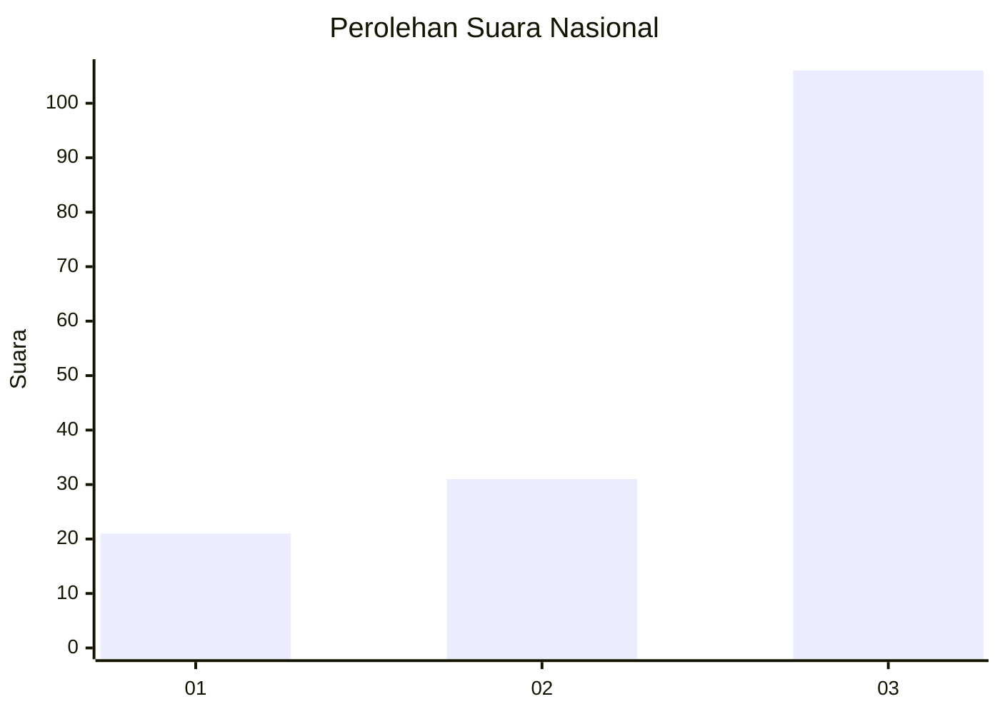
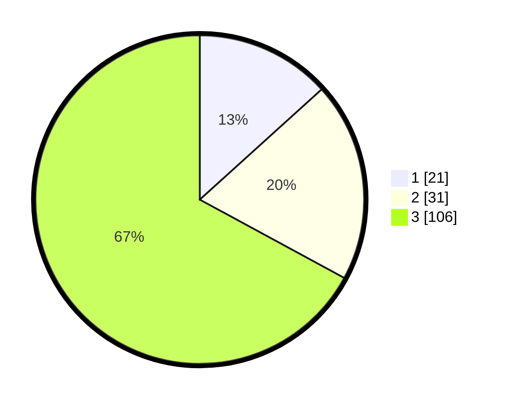

# Hasil

## Grafik

## Tabel

| No. | Nama Paslon    | Suara | Suara (raw) | Persentase |
|:--- |:-------------- | -----:| -----------:| ----------:|
| 1   | ANIES MUHAIMIN | 21    | [21][p-1]   | 13,29      |
| 2   | PRABOWO GIBRAN | 31    | [31][p-2]   | 19,62      |
| 3   | GANJAR MAHFUD  | 106   | [106][p-3]  | 67,09      |

[p-1]: https://github.com/gigit-pemilu/pemilu-2024/blob/main/pilpres/hitung-suara/sub/91-papua/sub/03-jayapura/sub/08-nimbokrang/sub/2004-berab/sub/002-tps/sub/paslon-1.txt
[p-2]: https://github.com/gigit-pemilu/pemilu-2024/blob/main/pilpres/hitung-suara/sub/91-papua/sub/03-jayapura/sub/08-nimbokrang/sub/2004-berab/sub/002-tps/sub/paslon-2.txt
[p-3]: https://github.com/gigit-pemilu/pemilu-2024/blob/main/pilpres/hitung-suara/sub/91-papua/sub/03-jayapura/sub/08-nimbokrang/sub/2004-berab/sub/002-tps/sub/paslon-3.txt

## Foto C Plano

https://sirekap-obj-formc.kpu.go.id/b164/pemilu/ppwp/91/03/08/20/04/9103082004002-20240215-013235--9fc5222f-ec21-4778-8983-0e23890c97ff.jpg

https://sirekap-obj-formc.kpu.go.id/b164/pemilu/ppwp/91/03/08/20/04/9103082004002-20240215-013647--0640ca13-9b09-4154-a12d-ed6aba43f8bc.jpg

https://sirekap-obj-formc.kpu.go.id/b164/pemilu/ppwp/91/03/08/20/04/9103082004002-20240215-013431--68977d55-888e-4055-9148-1babb67a4c3a.jpg

## Metadata

| Key        | Value               |
| ---------- | ------------------- |
| Time Stamp | 2024-02-25 13:00:00 |

