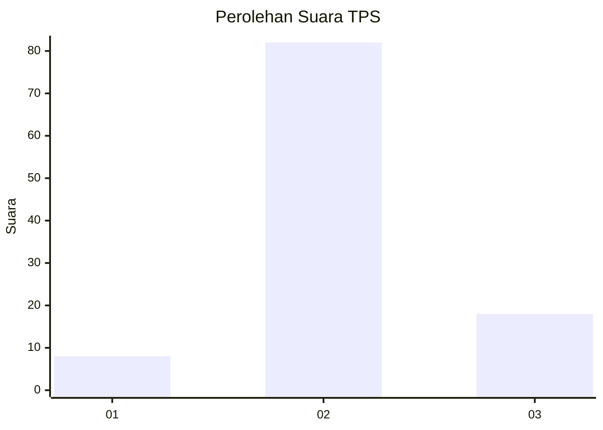
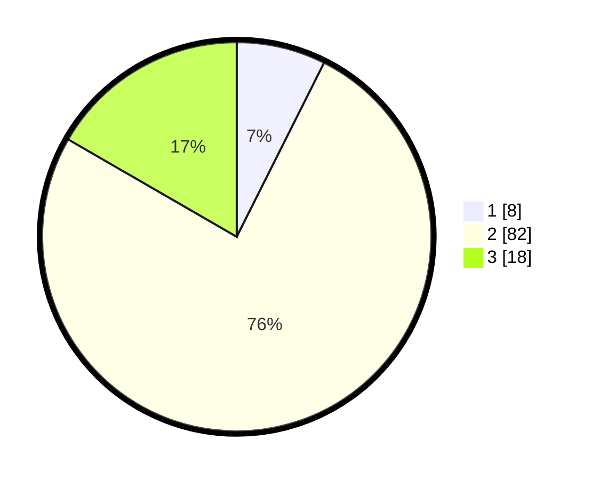

# Hasil

## Grafik

## Tabel

| No. | Nama Paslon    | Suara | Suara (raw) | Persentase |
|:--- |:-------------- | -----:| -----------:| ----------:|
| 1   | ANIES MUHAIMIN | 8     | [8][p-1]    | 7,41       |
| 2   | PRABOWO GIBRAN | 82    | [82][p-2]   | 75,93      |
| 3   | GANJAR MAHFUD  | 18    | [18][p-3]   | 16,67      |

[p-1]: https://github.com/gigit-pemilu/pemilu-2024-91-papua/blob/main/pilpres/hitung-suara/sub/91-papua/sub/03-jayapura/sub/09-unurum-guay/sub/2002-ganusa/sub/901-tps/sub/paslon-1.txt
[p-2]: https://github.com/gigit-pemilu/pemilu-2024-91-papua/blob/main/pilpres/hitung-suara/sub/91-papua/sub/03-jayapura/sub/09-unurum-guay/sub/2002-ganusa/sub/901-tps/sub/paslon-2.txt
[p-3]: https://github.com/gigit-pemilu/pemilu-2024-91-papua/blob/main/pilpres/hitung-suara/sub/91-papua/sub/03-jayapura/sub/09-unurum-guay/sub/2002-ganusa/sub/901-tps/sub/paslon-3.txt

## Foto C Plano

https://sirekap-obj-formc.kpu.go.id/1188/pemilu/ppwp/91/03/09/20/02/9103092002901-20240219-123114--8da71973-c6e6-483e-9aef-04f5cb8163fb.jpg

https://sirekap-obj-formc.kpu.go.id/1188/pemilu/ppwp/91/03/09/20/02/9103092002901-20240219-093915--e9598b8c-b6f9-4c54-97f0-7b45ee0eb8de.jpg

https://sirekap-obj-formc.kpu.go.id/1188/pemilu/ppwp/91/03/09/20/02/9103092002901-20240219-093343--df603217-d547-461e-8a57-73d0d95be8d4.jpg

## Metadata

| Key        | Value               |
| ---------- | ------------------- |
| Time Stamp | 2024-02-25 13:00:00 |

